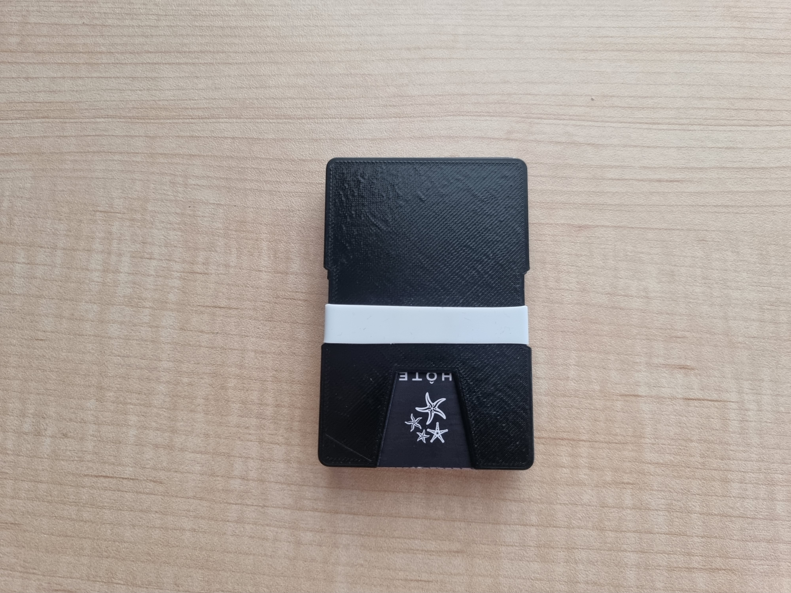
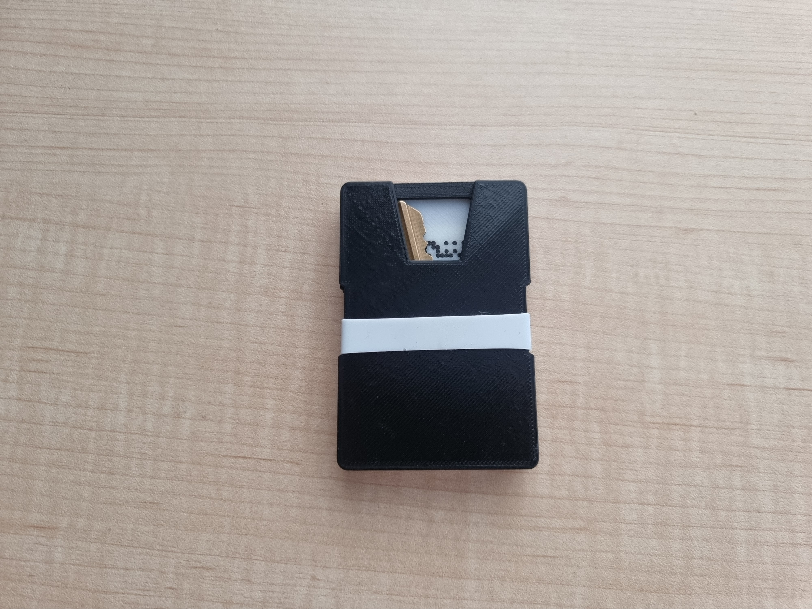
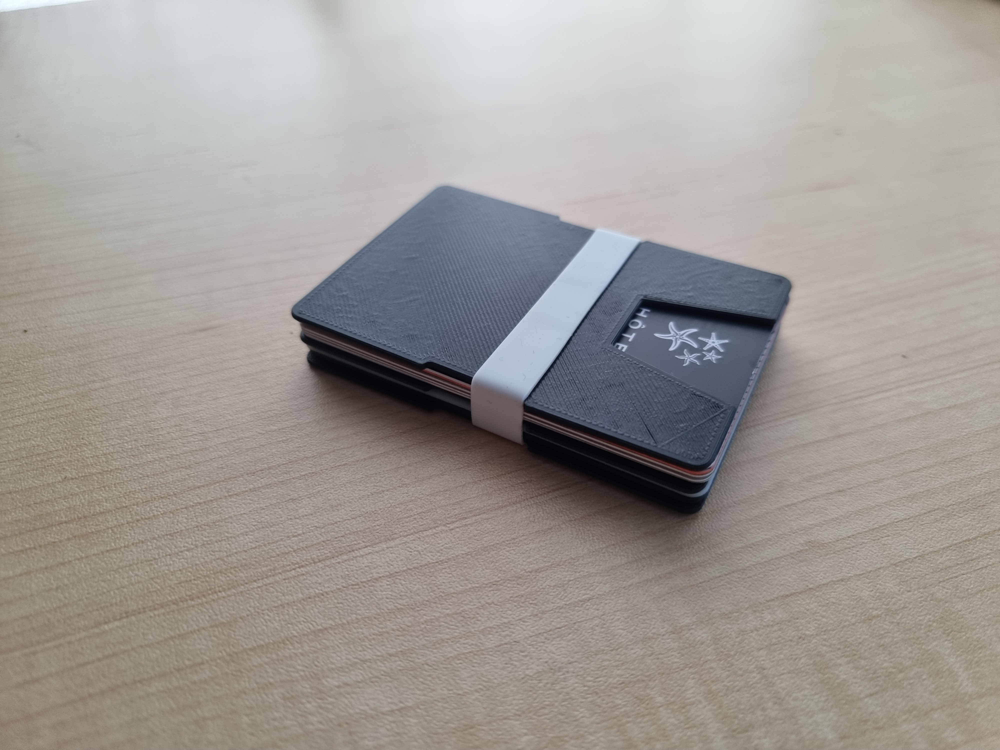
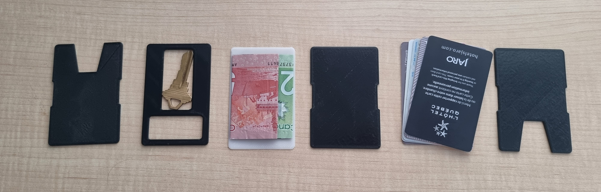

## Pocket Clutter

For the last few decades, smartphones have been getting continuously more and more capable, replacing many physical items people had to carry around. Think flashlights, debit and credit cards, cameras, and so on. Unfortunately, even today, some items are only valid in their physical form. Think drivers' licenses, physical keys, medical insurance cards, public transport cards, and so on.

I had no way to efficiently package all those inconvenient outdated items, and they often ended up just sitting in my pockets rambling about. This is where I realized I would have to fix the issue myself, at least until the world figured it would be a good idea to catch up.

## Wallets

The obvious solution to the issue was to use a wallet. However, after looking at some [existing](https://youtu.be/hP-KJceXrfc) [options](https://youtu.be/cw1WjMyWNPA), I wasn't satisfied. Most commercially available wallets were either fairly bulky or way too simple, and weren't modular at all. While I was researching, the more modern [ridge-like](https://ridgewallet.ca/) wallet style started peeking my interest. Wallets in this style were **very compact**, consisting of an elastic band holding together two or three metal plates sandwitching credit cards. Their main issue, though, is that they just were **not flexible** in the slightest; they held credit cards, and that was it. The search continued.

In the end, as things usually go, I decided to create my own wallet. I wouldn't use any fancy materials, as 3D printing would do the job just fine. My design goals were as follows:

- Hold credit cards, banknotes and a physical key
- Be modular, flexible, and all-around **versatile**
- Be **convenient** to use day-to-day

A few hours of 3D design and 3D printing later and I was done!

## A Custom Design

Instead of explaining how my wallet design works using words, below are images and a demo video that will hopefully speak for themselves. For anyone interested, the STL files for it are available [here](./3D%20Printed%20Wallet.zip), and the rubber band I used is made of silicone and is `24mm` in diameter, `13.5mm` wide and `1mm` thick.

#img

|  |  |  |
| ------------------------ | ------------------------ | ------------------------ |
|                          |                          |                          |

#demo

## Moving Forward

I believe that, in the not-so-distant future, wallets won't be a thing anymore. We will likely end up looking back back at wallets in the same way we currently look back at plastic keyboards on smartphones: inefficient, cumbersome and outdated. However, in the mean time, I am hoping this custom modular 3D-printed wallet will serve me well, and maybe even turn out to be useful to others.
