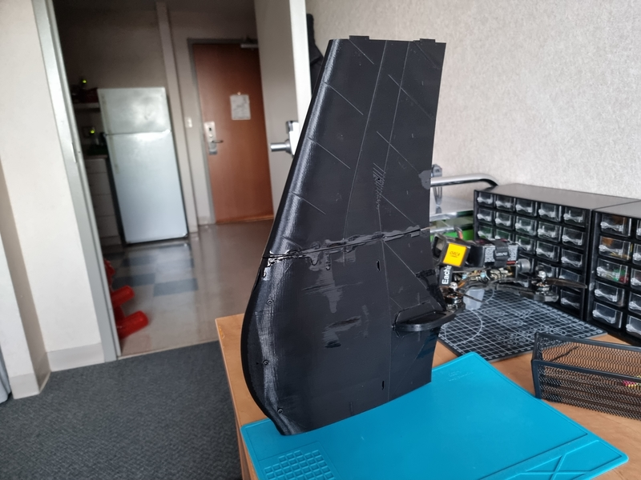
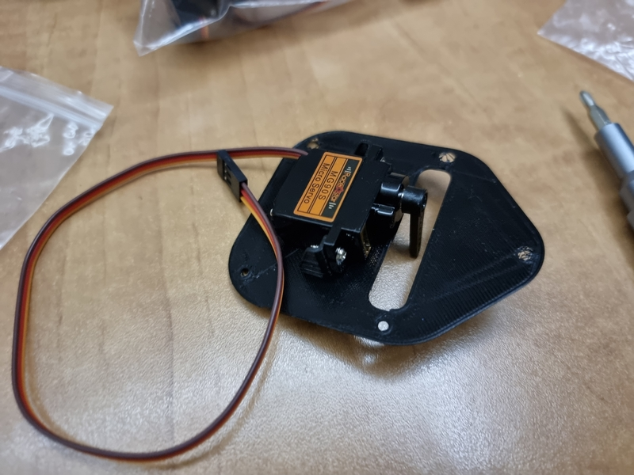
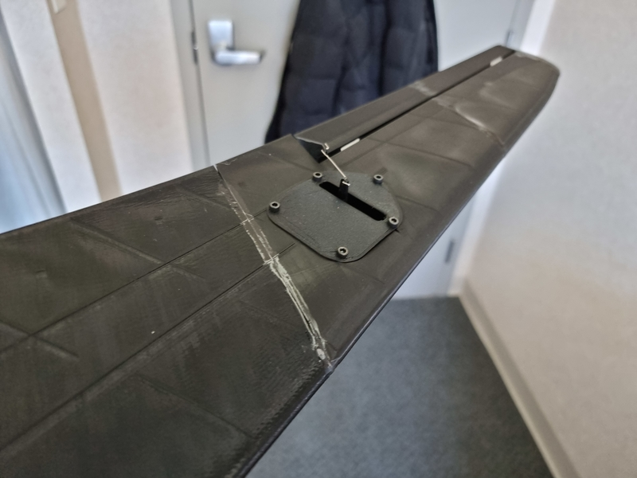
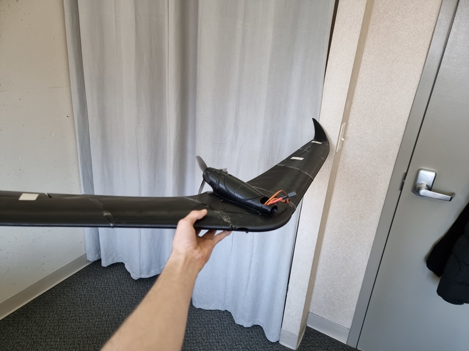
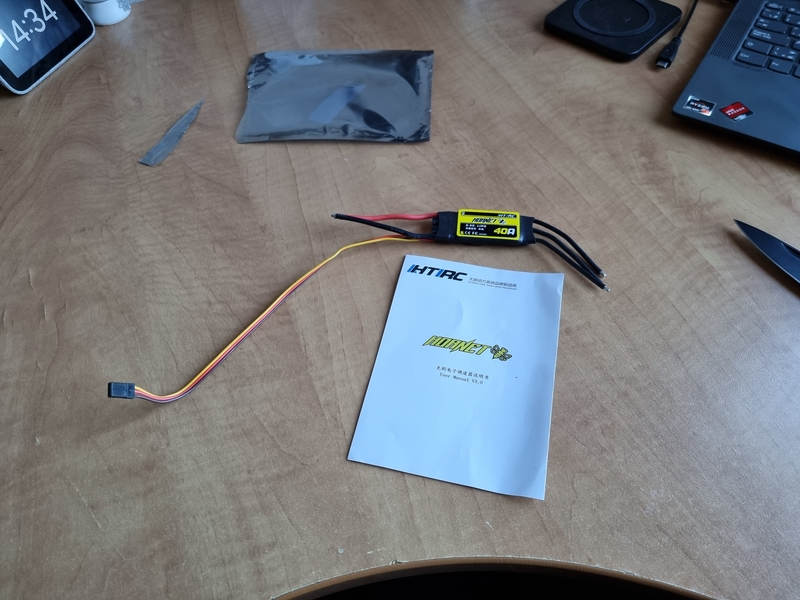
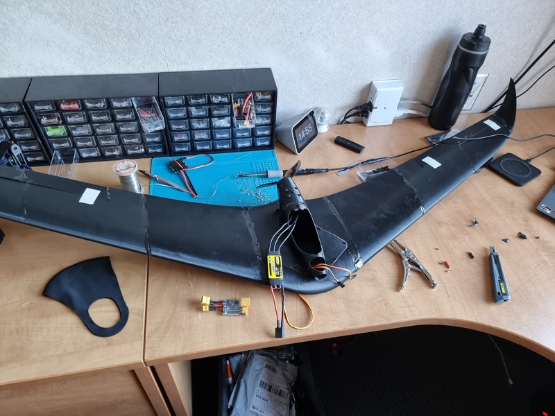
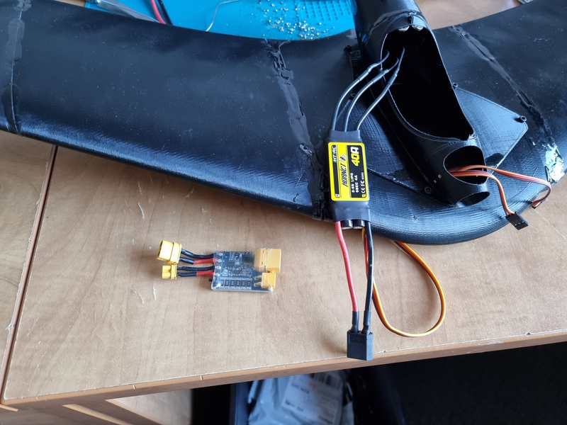
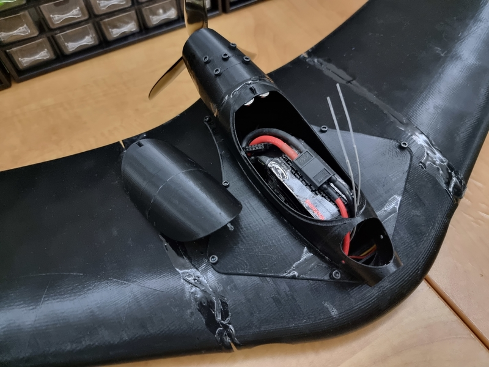

## Preface

About a month ago, some friends and I were talking drones and RC planes. Midway through the conversation, I realized I had almost all necesary electronic parts for building an RC plane from scratch: a spare motor and propellers for my [FPV Drone](../FPV-Racing-Drone), spare SG90 servos for my [Hexapod Robot](../Spider-Robot), an RC receiver, and a 3D printer to print all structural parts.

That's when I decided I would build an RC wing.

## Planning

After looking around the internet for a decent 3D design, I stumbled upon the [Eclipson Blackwing Sport](https://www.eclipson-airplanes.com/blackwingsport). My initial goal was to build a `0$` wing using junk parts I had laying around, but after seeing such a great design, I figured I would at least try to honor it by using higher-end parts.

With the `0$` budget having received an XP boost, I ordered a proper `40A 6S` ESC and high-performance Racerstar metal gear servos instead of using low-quality `SG90` ones. I also had to order an extra roll of black PLA filament as the whole wing requires at least `300g` of plastic, which I didn't have at the time.

## Building

While the electronic parts were in the mail, I started 3D printing the wing using my [Ender 3](https://www.creality3dofficial.com/products/official-creality-ender-3-3d-printer). After all the parts were printed, I used [Gorilla Glue](https://www.gorillatough.com/product/clear-gorilla-glue/) to assemble them together according to [Eclipson's official assembly guide](https://www.eclipson-airplanes.com/blackwingsport). Then, when I received all necessary electronic parts, I soldered them together and was left with a fully functionnal wing! Below are some pictures of the building process (which went surprisingly smoothly) followed by a comprehensive parts list for this wing build.

#img

|  |  |  |  |  |  |  |  |
| ---------------------------- | ---------------------------- | ---------------------------- | ---------------------------- | ---------------------------- | ---------------------------- | ---------------------------- | ---------------------------- |
|                              |                              |                              |                              |                              |                              |                              |                              |

#parts

- M3 caphead screw set
- [CNHL Black 1300mAh 6S LiPo](https://www.banggood.com/CNHL-Black-Series-1300mah-22_2V-6S-100C-Lipo-Battery-XT60-Plug-for-RC-Drone-FPV-Racing-p-1521640.html?cur_warehouse=CN&rmmds=search)
- [Emax Eco Series 2207 1700KV 6S](https://www.banggood.com/4PCS-Emax-ECO-Series-2207-1700KV-3-6S-Brushless-Motor-for-RC-Drone-FPV-Racing-p-1582953.html?akmClientCountry=CA&rmmds=cart_middle_products&cur_warehouse=CN)
- [Dalprop Cyclone T5045C](https://www.banggood.com/10Pairs-Dalprop-Cyclone-T5045C-Pro-5Inch-Propellers-Unbreakable-3-Bladed-for-FFPV-Racing-RC-Drone-p-1685298.html?rmmds=myorder&cur_warehouse=CN&ID=6287832)
- [HTIRC Hornet 2-6S 40A ESC](https://www.banggood.com/HTIRC-Hornet-2-6S-40A-Brushless-ESC-With-5V-or-4A-BEC-For-RC-Airplane-p-1091666.html?rmmds=myorder&cur_warehouse=CN)
- [FS-i6A 6CH Receiver](https://www.banggood.com/FlySky-FS-iA6-2_4G-6CH-AFHDS-Receiver-For-FS-i10-FS-i6-Transmitter-p-985684.html?rmmds=myorder&cur_warehouse=CN)
- 2x [Racerstar MG90S Servo](https://www.banggood.com/Racerstar-MG90S-9g-Micro-Metal-Gear-Analog-Servo-For-450-RC-Helicopter-RC-Car-Boat-Robot-p-1512852.html?rmmds=myorder&cur_warehouse=USA)
- `110mL` [Clear Gorilla Glue](https://www.gorillatough.com/product/clear-gorilla-glue/)
- XT60 Connector (not included with the ESC)
- Carpet Tape (for the control surfaces)
- Black PLA Filament (for all structural parts)

## Quick Demo

#demo
As it is currently winter in Canada, I decided not to fly my brand new wing for the moment. However, here's a quick demo video for the time being:

