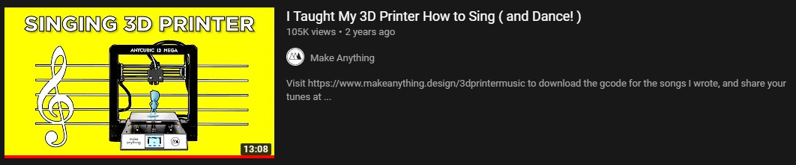

## What Got me Into This

This morning, I was scrolling through my YouTube recommended when I stumbled upon [the following video](https://www.youtube.com/watch?v=Bdf9NHAuO0w) by [Make Anything](https://www.youtube.com/channel/UCVc6AHfGw9b2zOE_ZGfmsnw):

In [this video](https://www.youtube.com/watch?v=Bdf9NHAuO0w), Devin teaches us how to encode music notes into a `.gcode` file to play it on a 3D printer! As soon as I saw this video, I knew I had to do it for myself. And this is how it all began!

## A Quick Demo

After a bunch of hassle, I managed to get a song to work! Here's a short video of my 3D printer, the [Ender 3](https://www.creality3d.shop/products/creality3d-ender-3-pro-high-precision-3d-printer), playing the _Zelda Titlescreen_ theme song:

#demo

## How it is Done

In [the YouTube video](https://www.youtube.com/watch?v=Bdf9NHAuO0w) that got me interested in all this, Devin mentions [this _midi2gcode_ website](https://www.ultimatesolver.com/en/midi2gcode) to encode a `MIDI` file automatically into `gcode`, but for some reason decides to do the `gcode` encoding by hand. However, I decided to use it anyway to save time. However, I still needed a `MIDI` file to use as a base melody.

> Advantages of MIDI include small file size, ease of modification and manipulation and a wide choice of electronic instruments and synthesizer or digitally-sampled sounds. A MIDI recording of a performance on a keyboard could sound like a piano or other keyboard instrument; however, since MIDI records the messages and information about their notes and not the specific sounds, this recording could be changed to many other sounds `...`.
>
> [Wikipedia](https://en.wikipedia.org/wiki/MIDI#Extensions)

#try

As stated by the definition, the `MIDI` format encodes information about the notes like the frequency and the amplitude instead of actual soud, which means [the _midi2gcode_ website](https://www.ultimatesolver.com/en/midi2gcode) can easily transform it into 3D printer instructions!

Next, I needed an actual `MIDI` file containing some _Zelda_ music to feed into the website. I chose one from [khinsider.com](https://www.khinsider.com/midi/nes/legend-of-zelda), called `title-screen-4-.mid`. Then, I downloaded it and fed it into the [the _midi2gcode_ website](https://www.ultimatesolver.com/en/midi2gcode) with the following parameters:

- Axes: `Z`, `Y`, `X`
- Channels: `1 + 2 + 3`
- Steps per mm: `400`, `80`, `80`
- Work Area: `0 to 200 mm` for all axes

Finally, I downloaded the `.gcode` file, and, after modifying the extension, it was ready to feed into my 3D printer!

## Conclusion

I had a lot of fun making this useless project work, and I am very happy with how it turned out! I will definetly never regret the moment when I took the decision not to replace the very loud, low-quality stepper drivers in my [Ender 3](https://www.creality3d.shop/products/creality3d-ender-3-pro-high-precision-3d-printer)!
