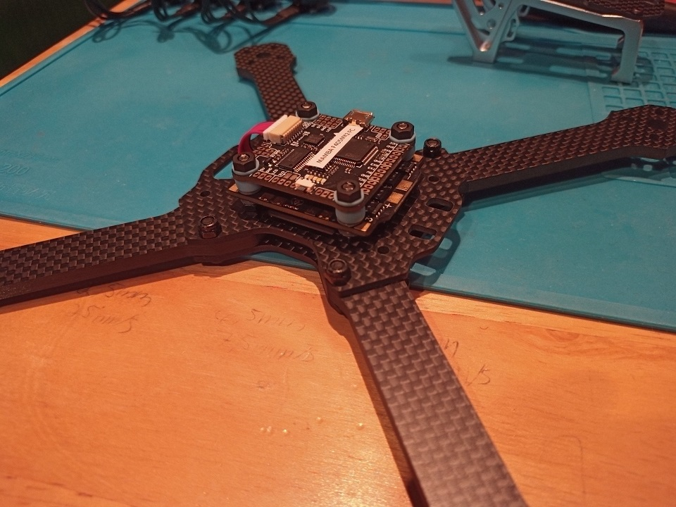
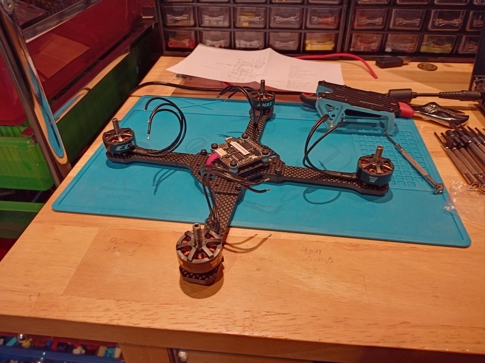
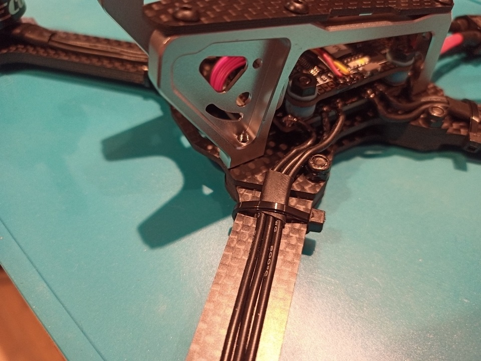

This post is about a [5-inch Drone](../5-inch-Drone-Parts/) that I am building for the IB's Personnal Project. If you want more information about it, dont't forget to check out the [previous post](../5-inch-Drone-Parts/)!

#img

## Building Images

Here are some images of the drone while I was building it:

|  |  |  |  |  |  |  |  |  |  |  |  |  |  |  |  |  |  |
| ---------------------------------------------- | ------------------------------------------------ | ------------------------------------------------- | --------------------------------------------------------- | ------------------------------------------------ | ----------------------------------------------------------------- | --------------------------------------------- | --------------------------------------------------------------- | ------------------------------------------------------------------ | ------------------------------------------------------------- | ----------------------------------------------------------- | --------------------------------------------------------------- | ---------------------------------------------------------------- | ------------------------------------------------------------ | -------------------------------------------------------------- | --------------------------------------------- | ----------------------------------------------- | ---------------------------------------------------------------------- |
|                                                |                                                  |                                                   |                                                           |                                                  |                                                                   |                                               |                                                                 |                                                                    |                                                               |                                                             |                                                                 |                                                                  |                                                              |                                                                |                                               |                                                 |                                                                        |

## Built Images

Here are some images of the drone in its fully built state:

|                                                |                                                |
| ---------------------------------------------- | ---------------------------------------------- |
|  |  |
|  |  |

## First Flights

Here is a short video of the drone performing its maiden flight (with no sound, unfortunately) followed by a demo of its performance on a 4S LiPo:

#demo

## Conclusion

This drone was **way** too easy to build. I expected to have to overcome many difficult problems to make it work, but it turns out the most complex issue took me `15` minutes to fix. The videos in this post are only featuring my drone on a _4S_ LiPo, which means that it will be about `150%` more powerful when I will receive my _6S_ battery. I can't wait to try it out!
