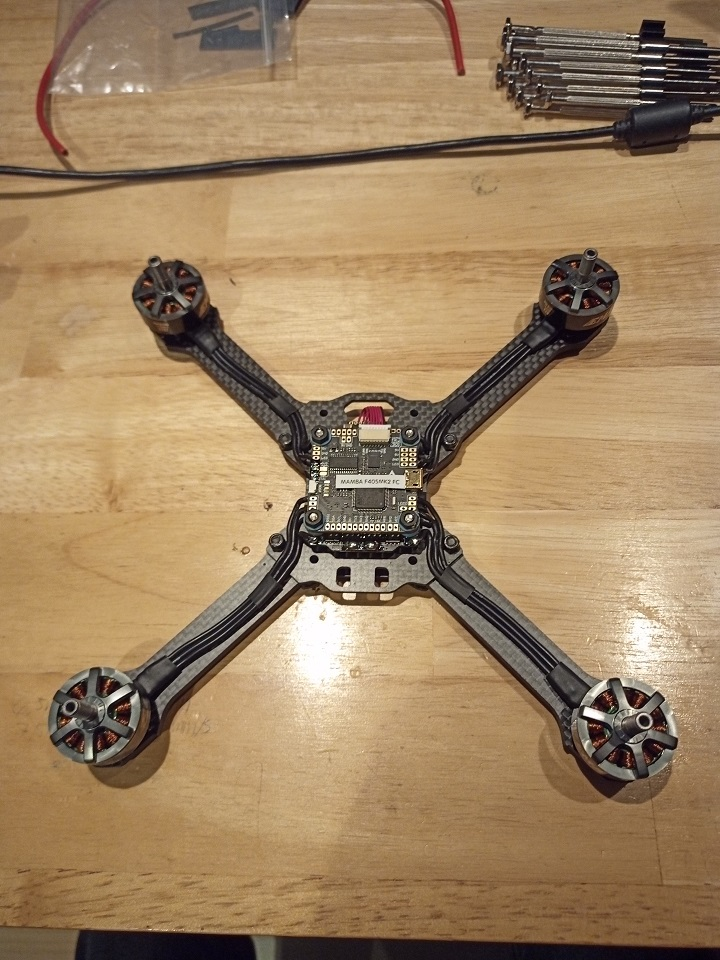
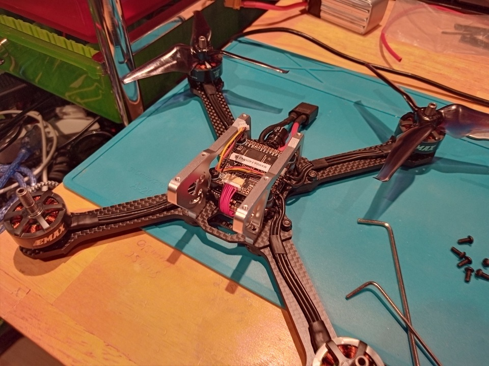

This post is about a [5-inch Drone](../5-inch-Drone-Mockup/) that I am building for the IB's Personnal Project. If you want more information about it, dont't forget to check out the [previous post](../5-inch-Drone-Mockup/)!

#img

## Building Images

Here are some images of the drone while I was building it:

|  |  |  |  |  |  |  |  |  |  |  |  |  |  |  |  |  |  |
| ---------------------------------- | ---------------------------------- | ---------------------------------- | ---------------------------------- | ---------------------------------- | ---------------------------------- | ---------------------------------- | ---------------------------------- | ---------------------------------- | ---------------------------------- | ---------------------------------- | ---------------------------------- | ---------------------------------- | ---------------------------------- | ---------------------------------- | ---------------------------------- | ---------------------------------- | ---------------------------------- |
|                                    |                                    |                                    |                                    |                                    |                                    |                                    |                                    |                                    |                                    |                                    |                                    |                                    |                                    |                                    |                                    |                                    |                                    |

## Built Images

Here are some images of the drone in its fully built state:

TODO <<<

> var path = '/pages/98772/';
> yield include('../../body/partial/mosaic/img.html', {
> srcs: [
>
> path + 'IMG_20201022_100526_7.min.jpg',
> path + 'IMG_20201022_100533_4.min.jpg',
> path + 'IMG_20201022_100537_8.min.jpg',
> path + 'IMG_20201022_100546_8.min.jpg',
> ]
> })

## First Flights

Here is a short video of the drone performing its maiden flight (with no sound, unfortunately) followed by a demo of its performance on a 4S LiPo:

#demo

## Conclusion

This drone was **way** too easy to build. I expected to have to overcome many difficult problems to make it work, but it turns out the most complex issue took me `15` minutes to fix. The videos in this post are only featuring my drone on a _4S_ LiPo, which means that it will be about `150%` more powerful when I will receive my _6S_ battery. I can't wait to try it out!
