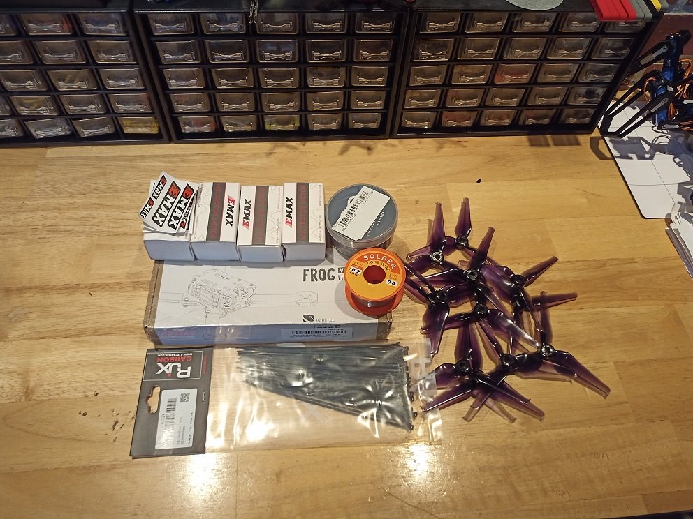
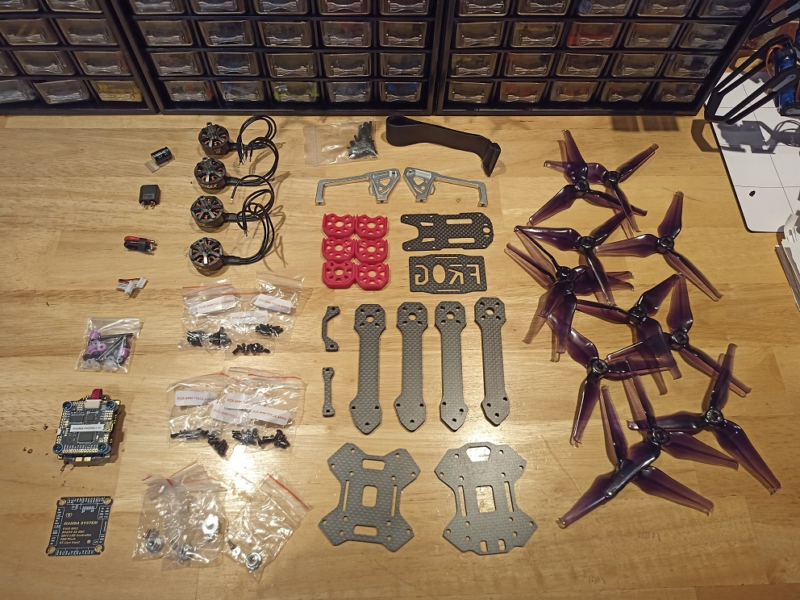
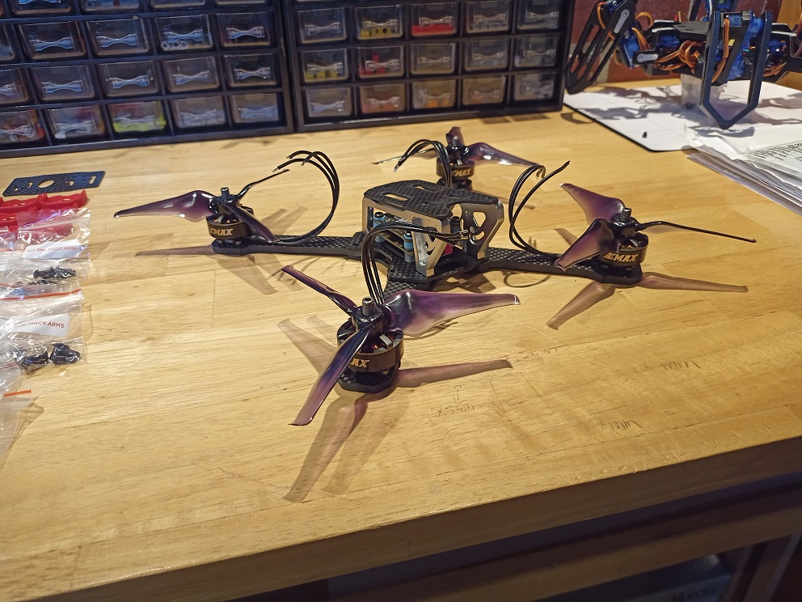
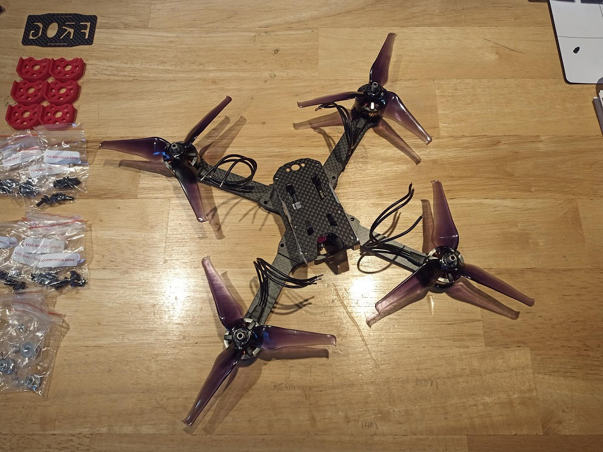
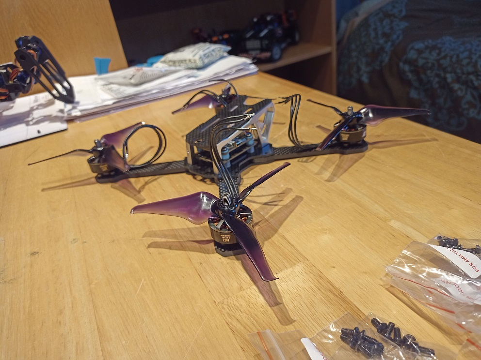
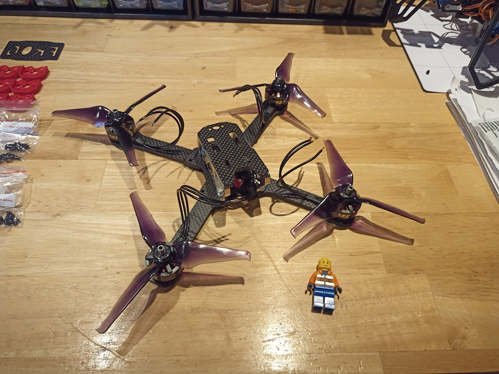
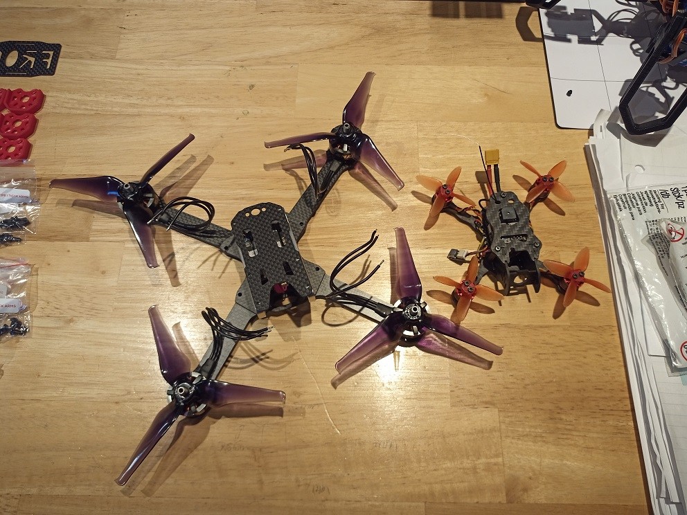

In the [previous post](../5-inch-Drone-Virutal-Prototype/), I wrote about what is a Personnal Project in the [IB program](https://www.ibo.org/) and showed you the parts I will use to make this drone. Don't forget to check it out!

## The Parts

A few days ago, I received almost all the parts necessary to build my 5-inch drone. This includes the **frame**, the **stack**, the **motors**, the **props**, and a bunch of zip ties. Of course, a few more parts need to arrive before I can start the assembly, notably the **receiver** and the **LiPo battery**. Here are a few photos of the parts I have received:

|                                    |                                    |
| ---------------------------------- | ---------------------------------- |
|  |  |

## The Mockup

Since I had received all of the main parts needed, I decided I would build a mockup of the drone. In order to do so, I layed them down one on top of each other to have an idea of what it would look like. I was surprised when I saw it for the first time: it was way larger than I thought it would be, measuring almost `30 cm` in length! Here are some photos of it, the last one comparing it to my [2-inch drone](../Racing-Drone/) (which you can read about [here](../Racing-Drone/)!):

#img

|  |  |  |  |  |
| ---------------------------------- | ---------------------------------- | ---------------------------------- | ---------------------------------- | ---------------------------------- |
|                                    |                                    |                                    |                                    |                                    |
