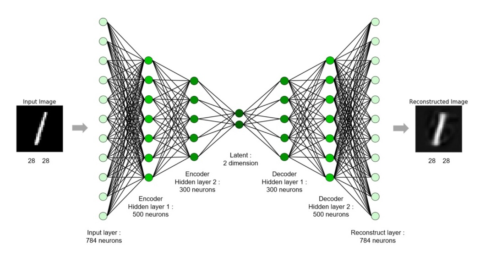

## Intro

_[AI Image Compression](AI%20Image%20Compression.py)_ is a program written in [Python](https://www.python.org/) that uses Artificial Intelligence (more specifically _Machine Learning_) to compress images ([click here](./AI%20Image%20Compression.py) to see the code!).

> Machine learning is an application of artificial intelligence (AI) that provides systems the ability to automatically learn and improve from experience without being explicitly programmed. Machine learning focuses on the development of computer programs that can access data and use it learn for themselves.
>
> [EXPERT SYSTEM](https://expertsystem.com/machine-learning-definition/)

I first got the idea for this project when a friend of mine showed me a neural network he made, capable of compressing handwritten characters to a ridiculously small amount of data. I couldn't help but wonder...

> And what if I used a similar approach to create an AI that could compress any image we throw at it?

There are many advantages for using [Machine Learning](https://en.wikipedia.org/wiki/Machine_learning) to compress images. For example, if the neural network is trained long enough, it could potentially compress images to even smaller file sizes and keep even more detail than standard methods. Moreover, if the AI is trained on a specific category of images, like logos, cartoon characters or landscapes, it could learn to compress some image features way more effectively.

#demo

## What it Can Do

Here is an example image, used as a source:

|     |                                |     |
| --- | ------------------------------ | --- |
|     |  |     |

The AI can then take this source image as an input, and compress it to a seemingly garbage-filled file, which looks nothing like the original image, but contains critical information. Then, it takes this file, which can be up to `16 times` smaller in size, and tries to reconstruct the image it started with as best as it can. Here are various [compression ratios](https://en.wikipedia.org/wiki/Data_compression_ratio) applied to the source image (compressed `256x, 128x, 64x, 32x, 16x, 8x, 4x, 2x and 1x` respectively):

[//]: # ''

|     |                                                                        |     |
| --- | ---------------------------------------------------------------------- | --- |
|     | `256x` <br> |     |
|     | `128x` <br> |     |
|     | `64x` <br>     |     |
|     | `32x` <br>      |     |
|     | `16x` <br>       |     |
|     | `8x` <br>         |     |
|     | `4x` <br>         |     |
|     | `2x` <br>         |     |
|     | `1x` <br>        |     |

## How it Works

This AI is a type of neural network called an _Autoencoder_.

> An autoencoder is a type of artificial neural network used to learn efficient data encodings in an unsupervised manner. The aim of an autoencoder is to learn a representation (encoding) for a set of data, typically for dimensionality reduction `...`. Along with the reduction side, a reconstructing side is learnt, where the autoencoder tries to generate from the reduced encoding a representation as close as possible to its original input, hence its name.
>
> [Wikipedia](https://en.wikipedia.org/wiki/Autoencoder)

Essentially, an encoder takes an input (the source image), which then goes through some kind of a _bottleneck_ (the compressed file), before passing this _latent representation_ to a decoder, which tries to reconstruct the original input as best as it can (the uncompressed image). Here is how it looks, visualized:



However, there are a few problems with this approach. First, a neural network can only have fixed-size inputs and outputs, which means that only one image size could be used. This is easily remedied by breaking up the input and output images into `16 x 16` chunks for the `red`, `green` and `blue` channels, which are also way more efficient to train with. Second, the number of neurons in the _latent_ part cannot really be modified either, which means that the [compression ratio](https://en.wikipedia.org/wiki/Data_compression_ratio) has to be fixed. This is why I created a new way of training autoencoders which allows us to modify the [compression ratio](https://en.wikipedia.org/wiki/Data_compression_ratio) on-the-fly! For each training step, do the following:

#code

```python
with `inp` as an input value...
initialize a `global loss` variable to `0`
set `enc` to the encoder prediction using `inp`
for `n` from `1` to the input size:
  keep the `n` first neuron values from `enc` and write `0` to the rest
  set `dec` to the decoder prediction using `enc`
  set `loss` to the loss function applied to `inp` and `dec`
  add `loss` multiplied by `n` to the `global loss` variable
calculate the gradients and apply them to the network weights using the `global loss` variable
```

Long story short, this way of training forces the AI to give more _importance_ to the first neurons in the latent representation, which means that the bottom neurons will only be used to encode smaller details in the source image. If we want a larger [compression ratio](https://en.wikipedia.org/wiki/Data_compression_ratio) in order to save more space, the program can simply ignore some of the bottom neurons when compressing. Of course, the image will lose some of its sharpness, but the resulting file will be significantly smaller.

## Conclusion

I had the idea to create this AI on `June 11th, 2020, at 8:52 AM`. I kind of forgot about the idea for a few days, but on `June 16th`, I figured out I would try programming it, simply trying to make a [proof of concept](./poc.png). For the next `5 days`, I got sucked in this project like never before: I was literally working on it as soon as I had free time. Then the `5th day`, on `June 19th`, I was done! I had created a full `400+ line` machine learning program in less than a week. This is one of the quickest project I ever made, and I am stoked that it actually works!
