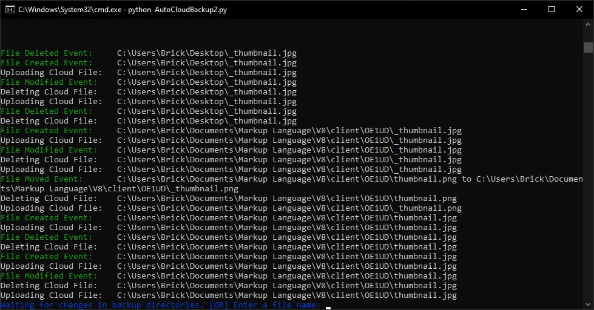

> **This post is outdated**
>
> Because of the internet bandwidth required for making frequent backups in the cloud, I decided to switch to a physical backup solution instead. This post was preserved nonetheless.

&nbsp;

&nbsp;

## What Got Me Into This

There is a quote I really like. Here goes:

> Many backup because they have seen the dark side of failing to do so, blessed are those that backup who have not seen!
>
> &#8212; T.E. Ronneberg

I never liked making backups. However, the day I lost _gigabytes_ of data because of a hard drive failure, I decided I would make backups of everything I do in the digital world. As soon as I program something... **Make a backup**. Whenever I do a school assignment... **Again, backup**. Because of that, I quickly ran into an annoying issue: my backups were all over the place: in USB sticks, in the cloud, in external hard drives... It was a mess. This is when I started looking for _cloud backup_ solutions.

## Why Would I Make my Own?

After looking at a bunch of _cloud backup_ solutions, I noticed that every option had one of the 3 following issues:

- They did not automatically backup files
- They used a proprietary cloud server
- They were not customizable enough

At this point, I gave up research and I decided I would to create [a program](./lol.html) that would be customizable, and that would automatically backup files to a well-known cloud server. Little did I know how life-changing [that program](./lol.html) would be...

## How it Works

I compared many cloud servers to use to backup my files. I ended up chosing [Google Drive](https://www.google.com/drive/) because of its ease-of-use and its low price. Personnally, I thing it has the best API for file transfer, which is the major reason why I chose it. Moreover, for a few bucks a month, you can have a `100 GB` virtual hard drive to backup anything you want!

The program uses a list of directories to backup and a list of directories that should be ignored by the program. For example, I told the program to backup the files in my `Documents` folder, but I also told it to ignore the `Virtual Machines` folder inside my documents to avoid copying gigabytes of data every time I boot up one of them.

> In computing, a virtual machine (VM) is an emulation of a computer system. Virtual machines are based on computer architectures and provide functionality of a physical computer. Their implementations may involve specialized hardware, software, or a combination.
>
> [Wikipedia](https://en.wikipedia.org/wiki/Virtual_machine)

As you can see, virtual machines may be gigabytes or even terabytes in size, so I needed to avoid making backups of them to prevent the litteral death of my WiFi network.

AutoCloudBackup then uses a python library called [Watchdog](https://pypi.org/project/watchdog/). It takes the already mentioned lists of directories and monitors them for file changes. As soon as it detects a `File Created`, `File Deleted`, `File Modified` or `File Moved` event, it calls custom functions to handle them. If you would like to force-backup files that are not necessarely in the specified lists of directories, you can also drag them and hit `Enter` to make a backup of them anyway!

Finally, the custom functions receive the paths of the files that have been modified and use the [Google Drive API v3](https://developers.google.com/drive/api/v3/about-sdk) to send them to [Google Drive](https://www.google.com/drive/) in order to make backups of them entirely automatically! It also logs all the operations it does for debugging purposes. Here is a screenshot of the software running:

#img

## Thank Got it's Over!

When I started this project, I did not anticipate how challenging it would be to make it work. Since it makes backups of the files over the internet, I wanted to minimize the amount of _back-and-forth_ communications between the client and the server. All the optimizations I needed to add in lead to many bugs that were a **hassle** to fix. Despite all this, I learned a lot about how the [Google Drive API](https://developers.google.com/drive/api/v3/about-sdk) works during this project, which will certainely be useful in the future. It was a great challenge that I managed to overcome!
