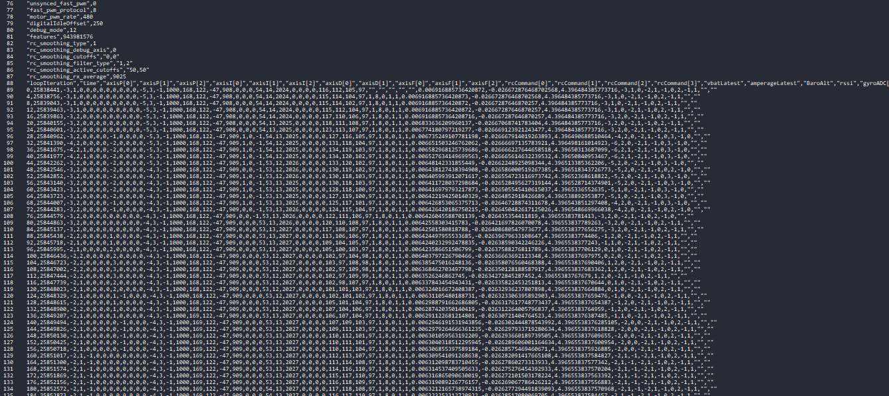

## The Problem

Ever since I got interested in FPV drones, I loved watching freestyle videos on the internet. However, it was really hard to know what the pilot was doing with the sticks, and I had no idea how most tricks were performed. There have been solutions to this problem, like sticking a [GoPro to record a video of your transmitter](https://youtu.be/OFnPqIaliqg?t=57), or using some editing magic to overlay the sticks using the [Betaflight Blackbox Explorer](https://github.com/betaflight/blackbox-log-viewer/releases):

However, this approach has a few problems:

- It doesn't look that good and is not customizale
- It takes up alot of space in the video
- It doesn't show enough information about the drone

## How I Solved it

Solving this problem was pretty easy. I found a way to take a `BFL` file from the drone itself, and export it to a `CSV` file, which is way easier to work with. Just [click here](./Blackbox%20Video%20Exporter/2_ESC_SENSOR_RPM_100MB.BFL.csv) to see the file for yourself! It looks a bit like this, at over `350 000` lines long:

[The program](https://github.com/Bricktech2000/Blackbox-Video-Exporter) I made can then take this file, and generate a video file from it. It contains a lot of information, like the `stick positions`, the `voltage`, the `power` used, the current `orientation`... The video it exports is thin but tall, which means that it can easily be added on the sides of the Gopro footage. Here is a demo showing what video it can produce:

#demo

#try

## How You Can Try it

If you would like to try this program for yourself, you can [click here](./Blackbox%20Video%20Exporter/index.html). The interface isn't that great, so feel free to read the `README.md` on [this project's Github](https://github.com/Bricktech2000/Blackbox-Video-Exporter) to get more information about the way to use it.

## Conclusion

Once I will have built my [5 inch drone](../5-inch-Drone-Parts/), I will certainly use this software if I ever upload freestyle footage. It will allow people to see a bunch of information, like the position of the sticks and the orientation of the drone. This program only took a few days to program, and I can't wait to try it on a real racing drone!
