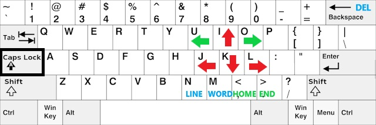

> **This post is outdated**
>
> I decided to learn Vim key bindings, meaning I don't use Caps Hotkeys anymore. This post was preserved nonetheless.

&nbsp;

&nbsp;

## Intro

This quote summarizes very well how useless the `CAPS LOCK` really is:

> For many of us living in the digital world, there is no need for the Caps Lock key at all. In fact, we find ourselves toggling the function accidently and then typing in ALL CAPS way too often--a frustration we would like to eliminate.
>
> [techrepublic](https://www.google.com/amp/s/www.techrepublic.com/google-amp/article/how-to-remap-the-caps-lock-key-and-avoid-future-frustration/)

Well, I am happy to tell you that I found the solution! _Caps Hotkeys_ is a software that allows you to use the `CAPS LOCK` key as a modifier key. This means that you can hold down the `CAPS LOCK` key and press on another key on your keyboard to send a new combination of key presses!

## How to Use it

If you intend to use this software on a Windows computer, you can directly download the program by [clicking here](./Caps%20Hotkeys.exe). However, I have not compiled the code to run under Linux since it uses `Win32` libraries to work. If you would like to take a look at the code for yourself, you can [click here](https://github.com/Bricktech2000/Caps-Hotkeys-V2) to see its Github repository!

> And how do on earth do I use it?

It is very simple: hold down the `CAPS LOCK` key and press on one of the following keys:



They are separated in a few categories. First, the **red** category is the for the well-known arrow keys. Second, the **green** category is for navigation: the green arrows allow you to navigate faster, just like if you held down the `control` key. Third, the **blue** category is for various other keys :`LINE` selects a line, `WORD` selects a word and `DEL` is the `delete` key. It might not seem like much, but these simple shortcuts make you save a bunch of time when writing, and even more so when programming.

## How it Works

> WARNING: this section is going to get very technical very quickly!

In order to register a hotkey in windows, you need to use the `RegisterHotKey` function:

```C++
BOOL RegisterHotKey(HWND hWnd, int id, UINT fsModifiers, UINT vk);
```

There are only two important parameters for this function. First, vk is the [virtual key code](https://docs.microsoft.com/en-us/windows/win32/inputdev/virtual-key-codes) of the key that will be pressed after the modifier key. For example, in the hotkey `CTRL + A`, the [virtual key code](https://docs.microsoft.com/en-us/windows/win32/inputdev/virtual-key-codes) would be equal to the letter `A`. Second, `fsModifiers` is a list of modifier keys that need to be held down, but it can only consist of the following: `ALT`, `CONTROL`, `SHIFT` or `WINDOWS`. As you can see, there is no way to register a hotkey using the `CAPS LOCK` key. To solve this problem, a simple hack is used: whenever the user holds down the `CAPS LOCK` key, the program holds down `CONTROL` and `ALT` in the background. This means that we are then able to register a hotkey using the [`RegisterHotKey`](https://docs.microsoft.com/en-us/windows/win32/api/winuser/nf-winuser-registerhotkey) function without any problem.

Once Windows tells the program that a hotkey was detected, _Caps Hotkeys_ looks up which key it needs to press. After that, it uses the `keybd_event` function to press on the corresponding key using a [virtual keyboard](https://en.wikipedia.org/wiki/Virtual_keyboard#:~:text=A%20virtual%20keyboard%20is%20a,in%20virtual%20or%20augmented%20reality). After that, the program's job is done. It really is that simple!

If you would like to take a more in-depth look at the code, you can [click here](https://github.com/Bricktech2000/Caps-Hotkeys-V2).

## Final Words

In this project, I learned a lot about how [hotkeys are registered](https://docs.microsoft.com/en-us/windows/win32/api/winuser/nf-winuser-registerhotkey) on Windows. I didn't even know that this was possible, and I am glad I now know how to do it! I have been using this program for the last few weeks, and it has really helped me to navigate through code way faster. I am very proud of this little piece of software!
