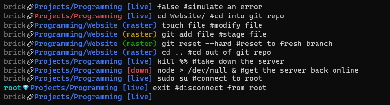
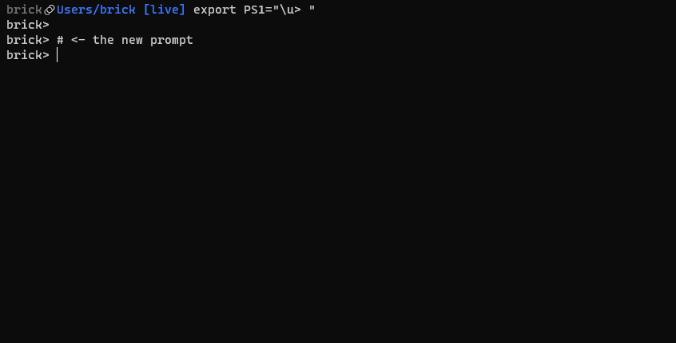

## Overview

This program is a simple script to change the Bash prompt on your terminal.

> The Bash prompt is the part of the terminal after which a user can enter a command. Most Linux distributions configure the Bash prompt to look something like `username@hostname:directory$`, but you can configure the Bash prompt to contain whatever you like.
>
> [HowToGeek](https://www.howtogeek.com/307701/how-to-customize-and-colorize-your-bash-prompt/)

Below is a a screenshot showcasing the key features of [this prompt](https://github.com/Bricktech2000/Clean-Bash-Prompt): the current username, the working directory and some extra info.
#screenshot



## How it Works

On the [Bash shell](<https://en.wikipedia.org/wiki/Bash_(Unix_shell)>), one can change the appearance of the prompt presented to the user by exporting an environment variable called `PS1`. For example, to create a very simple prompt consisting of your username followed by a `>`, you can simply type the following command right in your terminal:

```bash
export PS1="\u> "
```

In this minimal example, `\u` represents the current username and `>` is simply some ascii text to append to the end of it. In my case, since my username is _brick_, I get the following prompt:



After iterating on this idea for a few hours, I came up with [this very Bash prompt](https://github.com/Bricktech2000/Clean-Bash-Prompt). In my opinion, it is the best balance between cleanliness and efficiency. If anyone is feeling like reading gibberish, below is its source code:

```bash
export PS1='`status=$?; running=$({ pgrep -x $CLEAN_PROMPT_CHECK_PROC; } | wc -l); if [[ $UID -eq 0 ]]; then printf "\r\[\033[1m\033[38;5;007m\]\`whoami\` "; else printf "\r\[\033[1m\033[38;5;008m\]\`whoami\` "; fi; printf "\[\033[00m\]"; if [[ $status -gt 0 ]]; then printf "\[\033[91m\]"; else printf "\[\033[94m\]"; fi; printf "\`pwd | rev | cut -d '/' -f 2 | rev\`/\`pwd | rev | cut -d '/' -f 1 | rev\`\[\033[00m\]"; git branch --show-current &> /dev/null; if [[ $? -eq 0 ]]; then status=$(git status 2> /dev/null); if [[ $status =~ Changes\ not\ staged\ for\ commit: ]] || [[ $status =~ Untracked\ files: ]]; then printf "\[\033[1m\033[38;5;166m\]"; elif [[ $status =~ Changes\ to\ be\ committed: ]]; then printf "\[\033[1m\033[38;5;040m\]"; else printf "\[\033[1m\033[94m\]"; fi; printf " ($(git branch --show-current))"; elif [[ running -gt 0 ]]; then printf " \[\033[1m\033[94m\][live]\[\033[00m\]"; fi; if [[ running -eq 0 ]]; then printf " \[\033[1m\033[91m\][down]\[\033[00m\]"; fi; printf "\[\033[00m\] "`' && export PS2=' ' && export LS_COLORS='ow=01;34;40'
```

However, for everyone else, below is a commented version of the `PS1` environment variable exported in the command above. This is the script that creates the Bash prompt itself, including the text displayed and the colors used.
#code

```bash
status=$?; #get exit code of last command
running=$({ pgrep -x $CLEAN_PROMPT_CHECK_PROC; } | wc -l); #check if process CLEAN_PROMPT_CHECK_PROC is running
if [[ $UID -eq 0 ]]; #if root
    then printf "\r\[\033[1m\033[38;5;007m\]\`whoami\` "; #then print the current user in bold light gray followed by a space
    else printf "\r\[\033[1m\033[38;5;008m\]\`whoami\` "; #otherwise, print the current user in bold dark gray followed by a space
fi;
printf "\[\033[00m\]"; #reset color styles
if [[ $status -gt 0 ]]; #if the previous command returned a non-zero exit code (error)
    then printf "\[\033[91m\]"; #then print the current working directory in red
    else printf "\[\033[94m\]"; #otherwise, print the current working directory in blue
fi;
printf "\`pwd | rev | cut -d '/' -f 2 | rev\`/\`pwd | rev | cut -d '/' -f 1 | rev\`\[\033[00m\]"; #print the actual current working directory and reset color styles
git branch --show-current &> /dev/null; if [[ $? -eq 0 ]]; #if `git` is installed and the current directory is a git repository
    then status=$(git status 2> /dev/null); #then get the current branch and print it in bold and in the right color
    if [[ $status =~ Changes\ not\ staged\ for\ commit: ]] || [[ $status =~ Untracked\ files: ]]; then printf "\[\033[1m\033[38;5;166m\]"; elif [[ $status =~ Changes\ to\ be\ committed: ]]; then printf "\[\033[1m\033[38;5;040m\]"; else printf "\[\033[1m\033[94m\]"; fi;
    printf " ($(git branch --show-current))"; #print the actual branch
    elif [[ running -gt 0 ]]; #if the current directory is not a git repository and the CLEAN_PROMPT_CHECK_PROC process is running
        then printf " \[\033[1m\033[94m\][live]\[\033[00m\]"; #then print a bold blue `[live]`
    fi;
if [[ running -eq 0 ]]; #if the CLEAN_PROMPT_CHECK_PROC process is not running
    then printf " \[\033[1m\033[91m\][down]\[\033[00m\]"; #then print a bold red `[down]`
fi;
printf "\[\033[00m\] " #reset color styles
```

#try

If you wish to try out this prompt for yourself, go on [this project's github](https://github.com/Bricktech2000/Clean-Bash-Prompt) and follow the instructions in the `README`!

## Final Words

As soon as I became aware that it was possible to [customize my Bash prompt](https://www.youtube.com/watch?v=C92eaq_bZR8), I knew I had to do so. However, it was quite a challenge to make it work because of the deeply nested escape sequences I had to use. What's worse, forgetting a simple `\` could turn my terminal into a very confusing colorful mess. Despite all that, I now have a shameless way to flex every time someone logs into my server!
