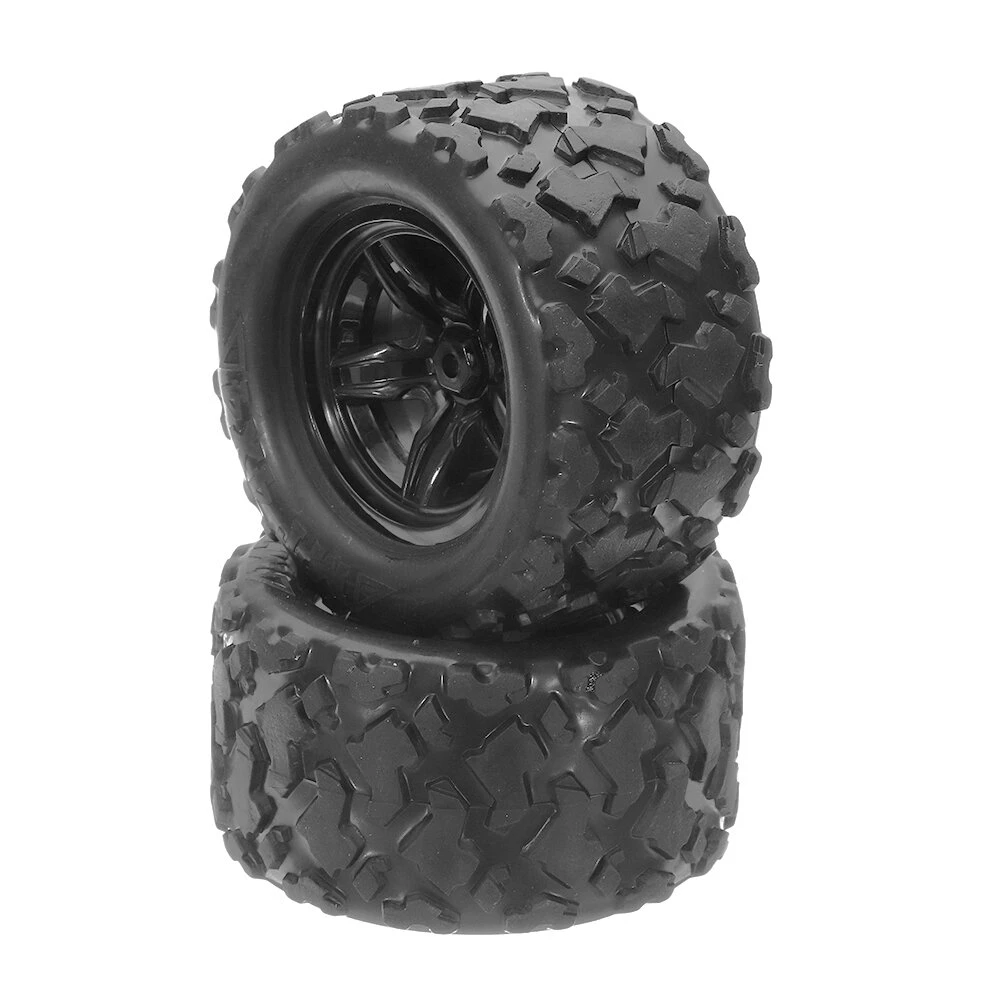
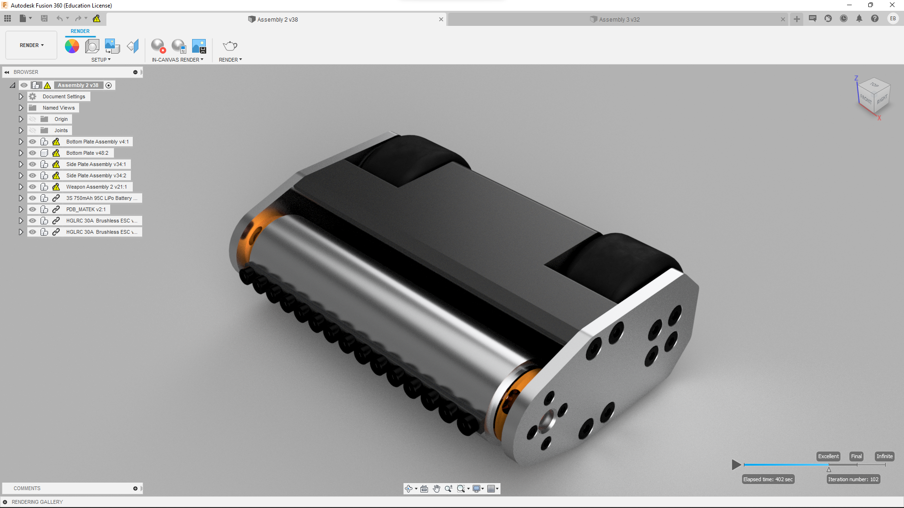
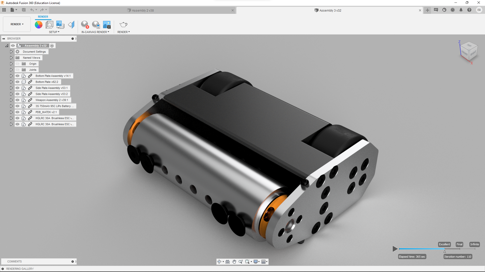
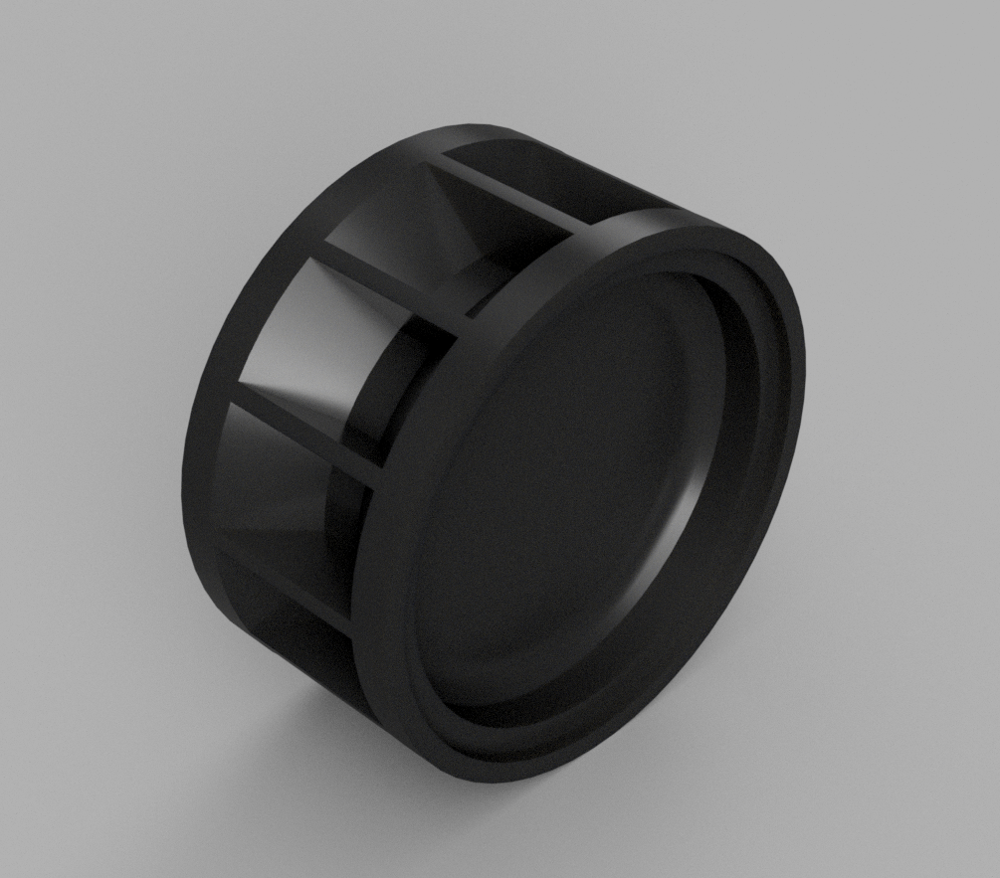
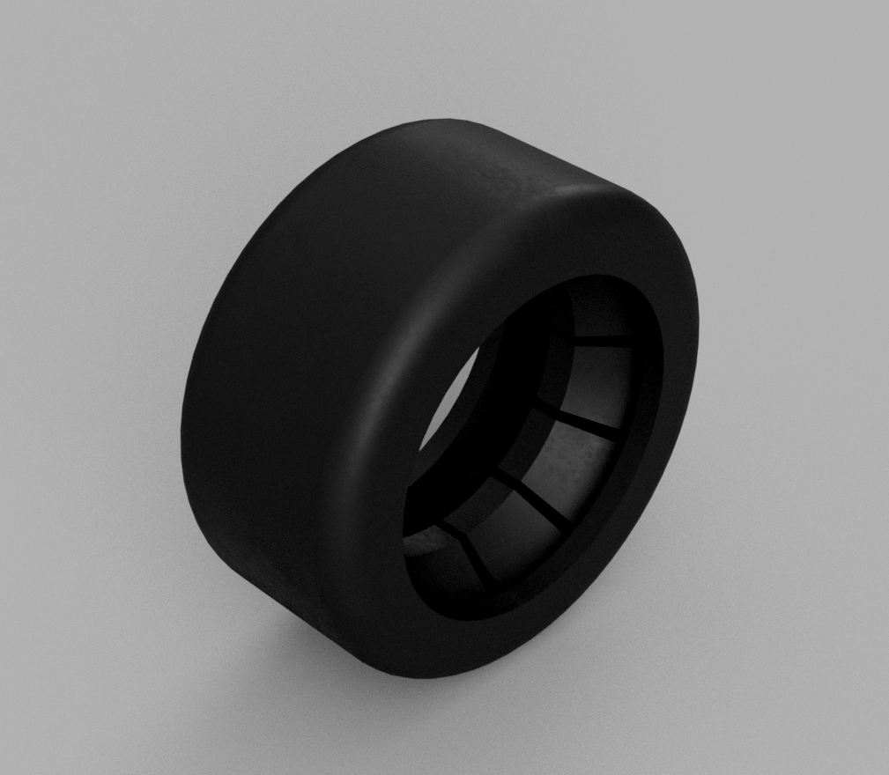
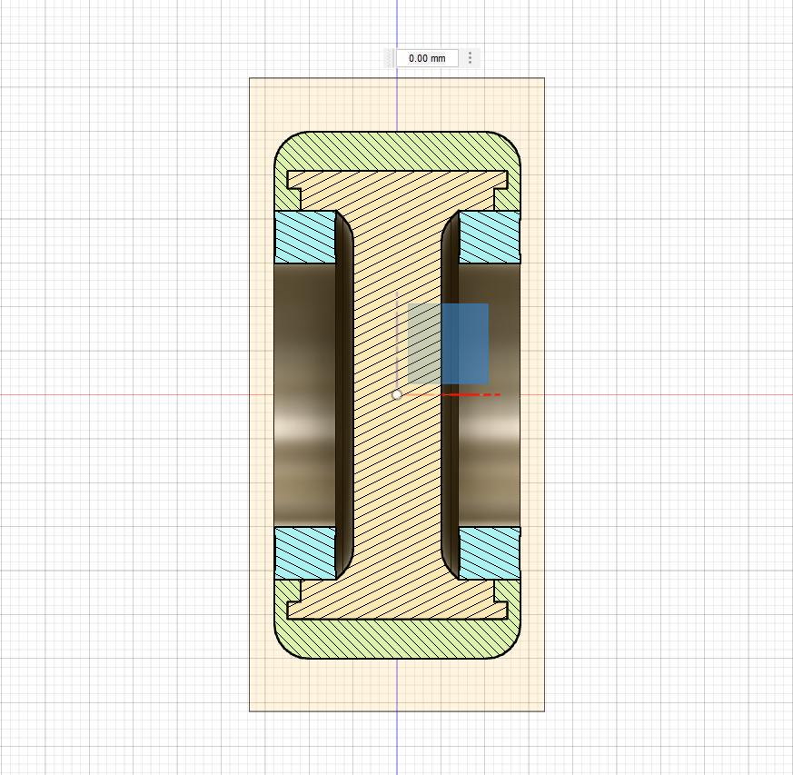
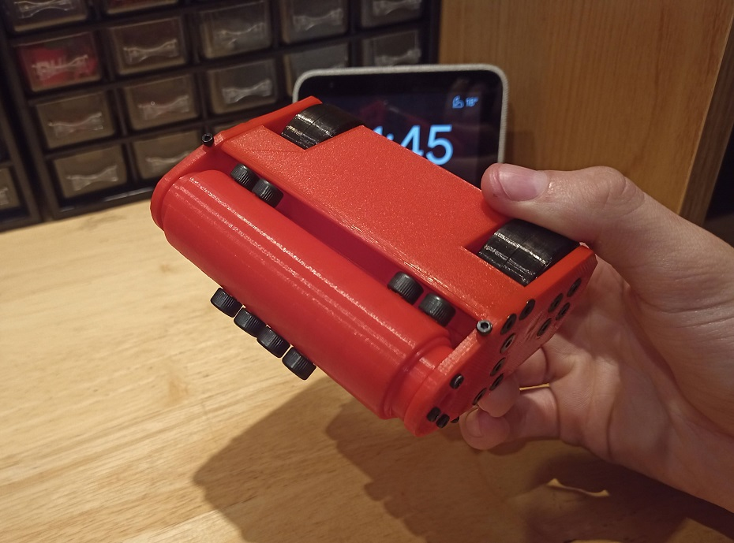

## A Flawed Design

About 4 months ago, I designed a [Beelteweight Combat Robot](../Beetleweight-Combat-Robot/). Dont hesitate to [click here](../Beetleweight-Combat-Robot/) to read more about it!

Unfortunately, after staring at this design a bit, I realized it had a huge flaw: the whole thing was based on the dimensions of some random [low-quality wheels](https://www.banggood.com/2Pcs-HS-18301-18302-18311-18312-RC-Car-Wheel-For-1-or-18-Crawler-RC-Car-p-1351106.html?akmClientCountry=CA&cur_warehouse=CN) I had found on Banggood:

What's worse, they were terrible as combat robot wheels because the tire was made out of thin rubber instead of [dense foam](https://www.robotmarketplace.com/products/wheels_main.html). This meant they would explode instantly upon getting hit by the opponent's weapon.

A few days later, I stumbled upon [a video](https://youtu.be/U-_xxI6qvlg) from [Team Just 'Cuz Robotics](https://www.youtube.com/channel/UCsoZN2VwWJbJ30y2e2sfmnw). It explained how to mold custom rubber wheels for combat robots using _polyurethane_ and `3D printed` molds. After seing how easy it was, I thought:

> Let's redesign my combat robot to take advantage of custom wheels!

## Redesigning the Robot

Since I was no longer limited to specific dimensions, I could now design the wheels **exactly** how I wanted them. I decided to make them slightly smaller, which made the whole robot thinner and narrower, thereby improving its durability. Here is a render of the [older design](../Beetleweight-Combat-Robot/) followed by a render of the newer one:
#renders

|                       |                       |
| --------------------- | --------------------- |
|  |  |

In addition, the wheels were designed in a way that prevents the tires from peeling away from the hubs. Here is a render of said hub followed by a render of the tire itself and by a cross section of the wheel assembly:
#wheels

|                      |                     |                               |
| -------------------- | ------------------- | ----------------------------- |
|  |  |  |

Since the whole robot was now narrower, the weapon wasn't as wide as before. Since its mass was now way lower, it could be thickened substantially to keep its moment of inertia similar.

> The moment of inertia `...` of a rigid body is a quantity that determines the torque needed for a desired angular acceleration about a rotational axis `...`. It depends on the body's mass distribution and the axis chosen, with larger moments requiring more torque to change the body's rate of rotation.
>
> [Wikipedia](https://en.wikipedia.org/wiki/Moment_of_inertia)

Because of this, the kinetic energy `KE` stored in the weapon at a given rotational rate would be almost identical, but the weapon itself would be more rigid and less prone to bending. After a bit of tinkering, I noticed I could change the outer diameter `OD` of the weapon disk to `44.45 mm` without affecting its physical properties. This measurement is exactly equivalent to `3¾"`, meaning a standard imperial `7075` aluminum bar could be relatively easily machined to press-fit on the [weapon motors](https://www.aliexpress.com/item/4000896324917.html?spm=a2g0o.cart.0.0.46f03c00wseQoI&mp=1) perfectly.

## 3D Printing a Scale Model

After having redesigned most of the robot's chassis, I figured I would 3D print a `60%` scale replica just for the fun of it.

> But why did you chose a 60% scale?

I had to run some very complex math to figure all of this out. First, I divided `3` by `5`, which equals exactly `60%`. That's... that's it. Basically, this means all the `M5` screws on the robot would be replaced by `M3` screws on the replica. Enough talking, here is the final product:
#scale

## Conclusion

At this point in time, I am basically ready to start building the robot. I know how to mold the wheels, how to laser cut the side armor plates and how to machine the weapon disk. I will keep staring at the design for a little while to make sure it will work as intended, after which I should start building it!
