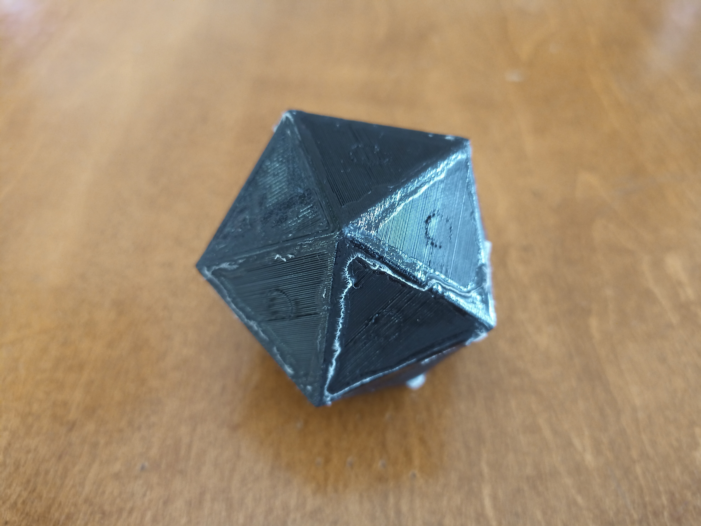
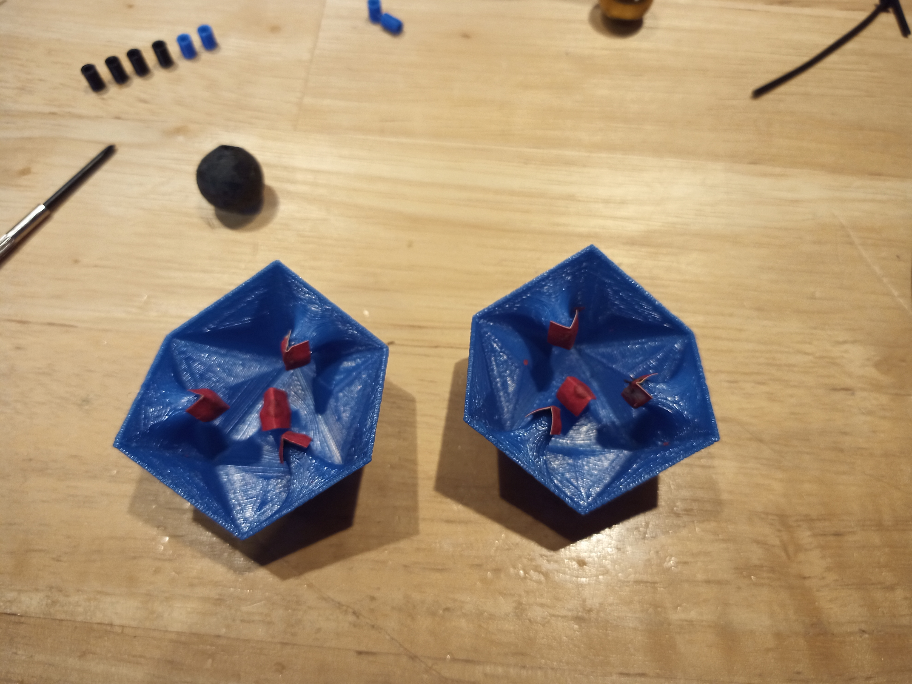
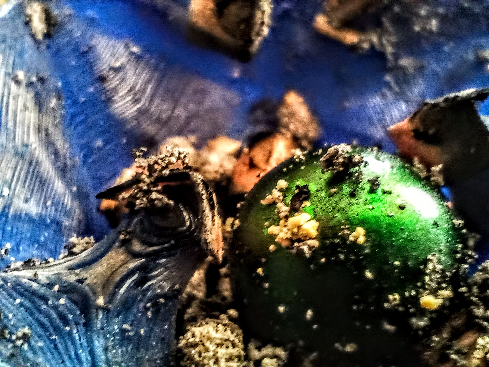
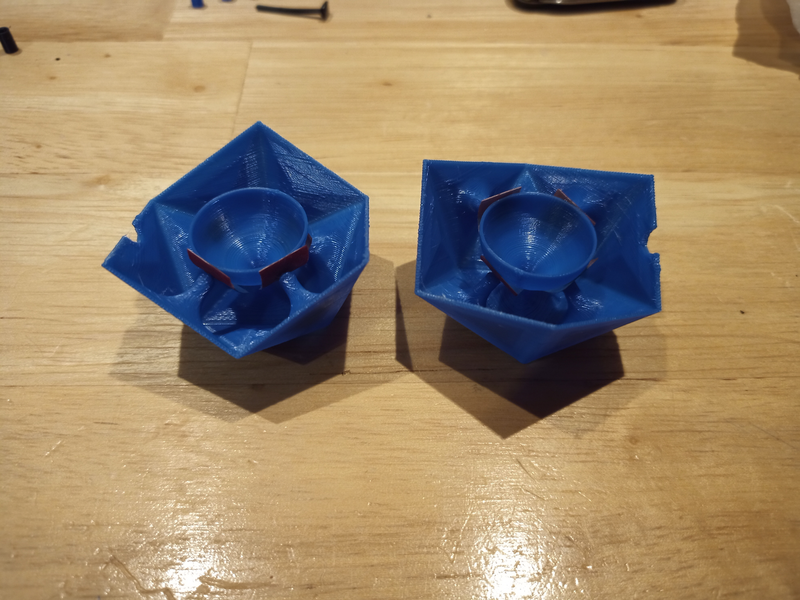
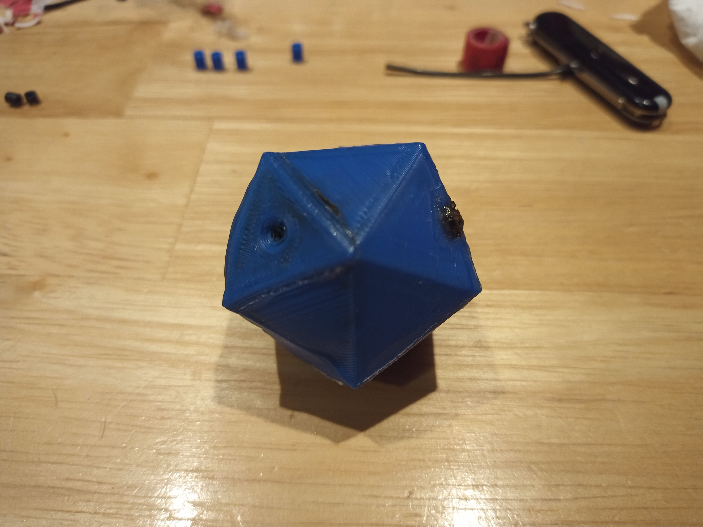

## The Idea

About a year ago, I wanted to try to build a small [grenade](https://en.wikipedia.org/wiki/Grenade). I have no idea what made me want to build it, but it wasn't to harm anyone. I simply wanted to see if I would be able to make one to learn a bit more about how 3D printing and [contact explosives](https://en.wikipedia.org/wiki/Contact_explosive) worked.

Unfortunately, I couldn't find any remanence of the first design I made. The only thing I remember is that I knew it wouldn't work before even printing it, so I decided to give up on the project. However, a few moths ago, I decided I would give another go at this project. Here is a list of the prototypes I made before arriving at the final version:

## The First Prototype

#prototype1

Above is a photo of the first concrete prototype I made, about 4 months ago. How it worked is very simple. It consists of the following components:

- A hollow `20-face` shell (an _icosahedron_) which is made to rip apart into 20 sharp triangles when the explosive detonates.
- A `15mm` steel sphere with [gun caps](https://www.google.ca/search?q=paper+gun+caps&safe=strict&tbm=isch) all around it that make a spark when they hit the outer shell.
- Some explosive gas (i.e. _hydrogen_) that fills the shell, which is ment to explode whenever the [gun caps](https://www.google.ca/search?q=paper+gun+caps&safe=strict&tbm=isch) make a spark.

Long story short, after one throws the grenade, it hits the floor, at which point the [gun caps](https://www.google.ca/search?q=paper+gun+caps&safe=strict&tbm=isch) around the steel sphere hit the shell, which makes a spark, which makes the explosive gas detonate, which makes the whole thing explode. However, one problem killed the whole design: the explosive gas slowly leaked from the grenade, which was not completely airtight since it was [3D-printed](https://en.wikipedia.org/wiki/3D_printing).

## The Second Prototype

#prototype2

Above is a photo of the second grenade prototype I made a few days ago (without the steel sphere or the explosive). This prototype consists of the following:

- A shell consisting of 8 tiny spikes with [gun caps](https://www.google.ca/search?q=paper+gun+caps&safe=strict&tbm=isch) superglued on them, which hold the sphere in the center.
- A `15mm` steel sphere which sits in the middle, ready to hit the [gun caps](https://www.google.ca/search?q=paper+gun+caps&safe=strict&tbm=isch) to make a small spark.
- Explosive powder that fills the shell (eg. _black powder_, _flash powder_...) which will detonate when the [gun caps](https://www.google.ca/search?q=paper+gun+caps&safe=strict&tbm=isch) make a spark.
  This prototype is very similar to the first one, but it has one key difference: it can use a solid explosive, like [flash powder](https://en.wikipedia.org/wiki/Flash_powder).

> Flash powder is a pyrotechnic composition, a mixture of oxidizer and metallic fuel, which burns quickly and if confined produces a loud noise.
>
> [Wikipedia](https://en.wikipedia.org/wiki/Flash_powder)

The idea is that the [flash powder](https://en.wikipedia.org/wiki/Flash_powder) fills up the whole grenade, and it explodes when the steel sphere in the center hits a [gun cap](https://www.google.ca/search?q=paper+gun+caps&safe=strict&tbm=isch). There was only one problem: if the shell was more than half-filled with explosive powder, the steel sphere wouldn't be able to move at all, which means that the [gun caps](https://www.google.ca/search?q=paper+gun+caps&safe=strict&tbm=isch) would never make any sparks. However, I still wanted to try it out, so I filled a quarter of it up with match heads, and then went outside to see if the ignition mechanism would work. Here is the demo, but keep in mind that I used match heads (which burn) instead of a real explosive (which actually explodes):

#demo

And here's a macro photo of the insides after the "explosion" (if you can even call it that):

## The Third Prototype

#prototype3

Above is a photo of the third prototype I made (without the steel sphere or the explosive). It is very similar to the second one, consisting of the following:

- A shell consisting of 8 small spikes and an inner plastic sphere with [gun caps](https://www.google.ca/search?q=paper+gun+caps&safe=strict&tbm=isch) superglued between them.
- A `15mm` steel sphere sitting inside the inner plastic sphere, ready to hit it in order to set off the [gun caps](https://www.google.ca/search?q=paper+gun+caps&safe=strict&tbm=isch).
- Explosive powder that fills the shell (eg. _black powder_, _flash powder_...) which will detonate when the [gun caps](https://www.google.ca/search?q=paper+gun+caps&safe=strict&tbm=isch) make a spark.

The advantage of this prototype over the second one I made is that the steel sphere can freely move inside the grenade (inside the inner plastic sphere). The steel sphere is not in direct contact to the [gun caps](https://www.google.ca/search?q=paper+gun+caps&safe=strict&tbm=isch), but that is not a problem since the inner plastic sphere is very thin and flexible. When the steel sphere hits the inner plastic sphere, it sets off one of the [gun caps](https://www.google.ca/search?q=paper+gun+caps&safe=strict&tbm=isch), which in turn sets off the explosive powder. I also did a test by replacing the explosive for match heads, and it worked perfectly! Here is a picture of the grenade after it had caught fire:

Unfortunately, I have not decided which explosive powder I will use yet. As soon as I figure it out, I will make an update to this post so you can see the grenade explode for real! See you there!
