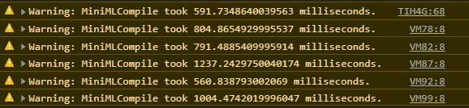

> **This post is outdated**
>
> This website now uses Cloudflare as a proxy and DDoS protection layer instead of a NodeJS library. Moreover, it is now hosted on an old HP laptop rather than on a Raspberry Pi and uses a custom version of Markdown for its posts instead of MiniML. This post was preserved nonetheless.

&nbsp;

&nbsp;

## The Problem

When I ported this website to a Raspberry Pi (which you can see a post about [here](../Raspberry-Pi-Server/)), I noticed that sometimes, an internal function I made called `MiniMLCompile` would take a fairly long time to execute. Because of that, I put in place a warning displayed in the client console when the function took more than `500 ms` to execute... and it turns out that it pretty much always does:



I ignored the fact that it took that long to load pages because I figured the traffic on the website was low enough that it wouldn't cause any problems. I knew that a [DoS](https://en.wikipedia.org/wiki/Denial-of-service_attack) attack could be performed very easily, but I was too lazy to implement a protection.

> In computing, a denial-of-service attack (DoS attack) is a cyber-attack in which the perpetrator seeks to make a machine or network resource unavailable `...`. Denial of service is typically accomplished by flooding the targeted machine or resource with superfluous requests in an attempt to overload systems and prevent some or all legitimate requests from being fulfilled.
>
> [Wikipedia](https://en.wikipedia.org/wiki/Denial-of-service_attack)

But then, a few days ago, I decided to program a very simple, `50-line` program in `JavaScript` to send DoS attacks to a victim ([click here](./Website%20DoS.js) to download it!). When I sent a test attack to my server, it was down in `30 seconds` by sending it `4 requests / second`. Yes, you read that right, that's **four requests per second**... So I figured:

> Yeah actually, let's implement DoS protection

## The Solution

It turns out, it is incredibly easy to implement DoS protection on a NodeJS server. Here's the code needed:

#code

```javascript
var Ddos = require('ddos');
//...
var ddos = new Ddos({
  burst: 25, // req
  limit: 75, // req
  maxcount: 100, // req
  maxexpiry: 10, // s
  checkinterval: 1 / 1, // per s
  testmode: false,
  errormessage:
    'Sorry, but an error occured.\nOur DoS protection service has detected unusual activity from your system. Please try again later.',
});
app.use(ddos.express);
```

Essentially, it uses a [DoS protecion library](https://www.npmjs.com/package/ddos) which limits the amount of requests that can be performed from each host. When too many requests are performed by a single _IP address_ in a very short amount of time, it blocks the machine until the requests stop during `10 seconds` and displays an error message.

#try
You can try it out by spamming the `F5` key to refresh this page as quickly as you can. After a few refreshes, you will get a `429 Too Many Requests` error and will have to wait a few seconds without refreshing the page to get off the list of blocked hosts.

## Conclusion

This system isn't flawless, but I think it does the job for now. For example, if someone with a very powerful computer sends a few million requests per second, then the [Raspberry Pi](../Raspberry-Pi-Server/)'s network card will probably become the bottleneck, and no software-based solution will work. Despite that, I learned a bunch about how DoS protection works by looking at the [library](https://www.npmjs.com/package/ddos)'s source code when something wasn't working right. One day, maybe I'll even program my own!
