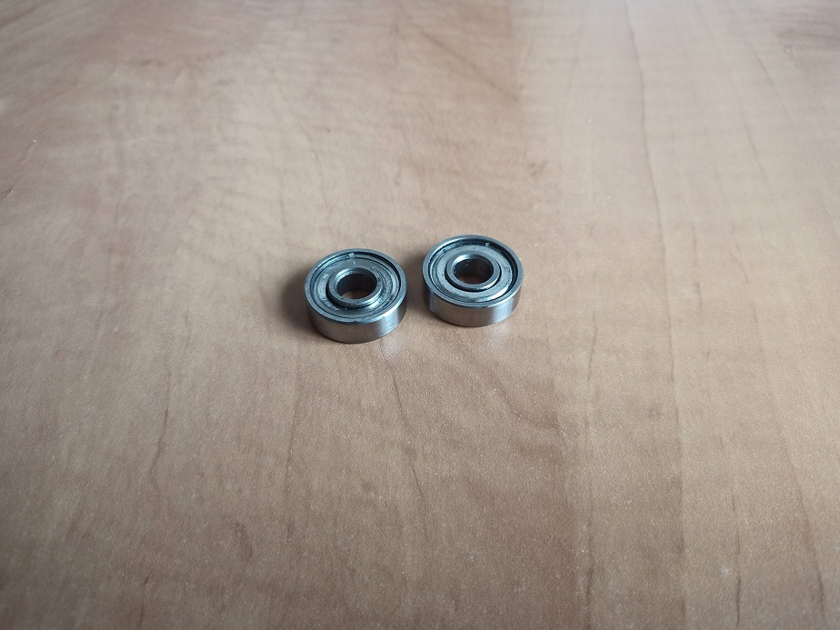
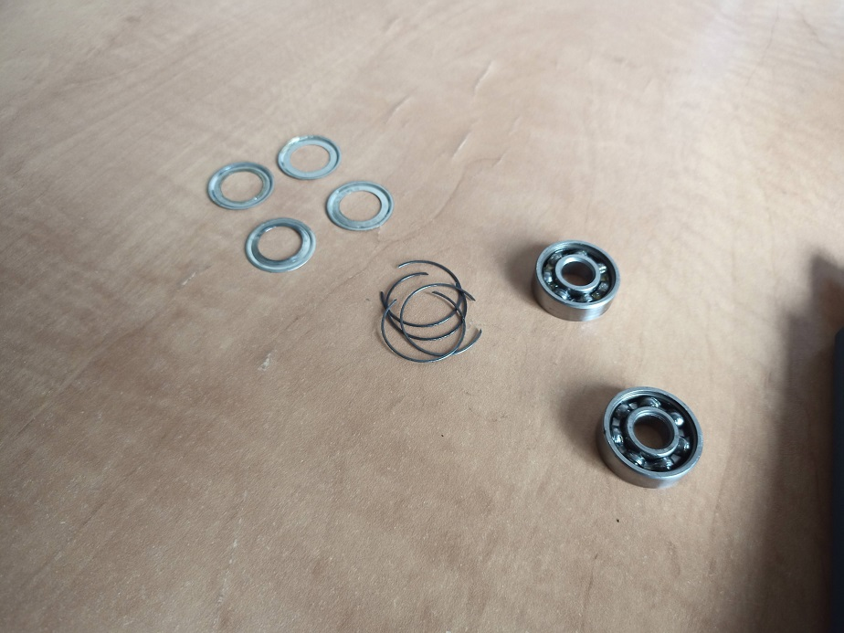
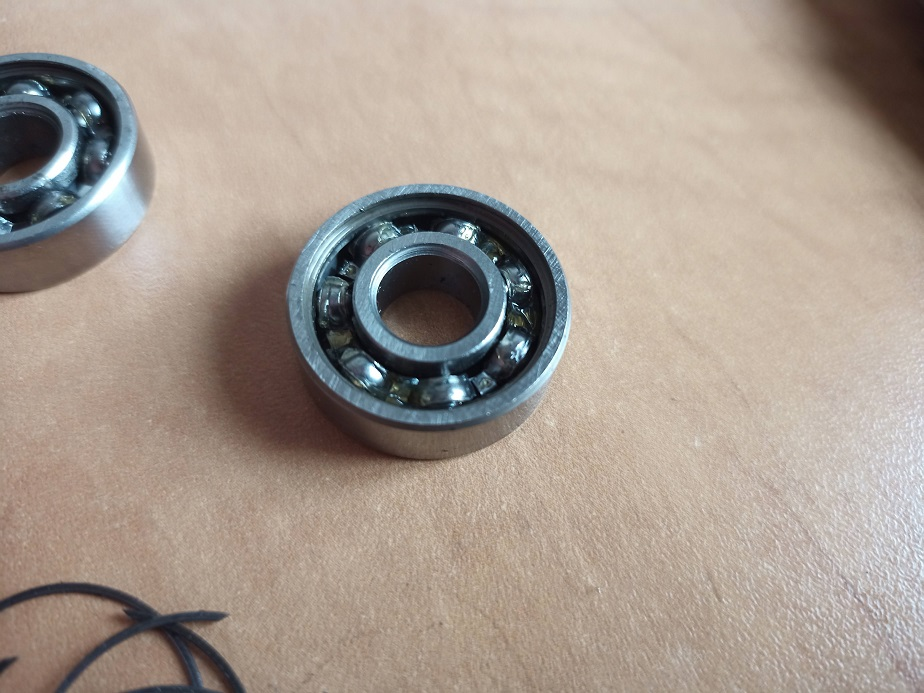
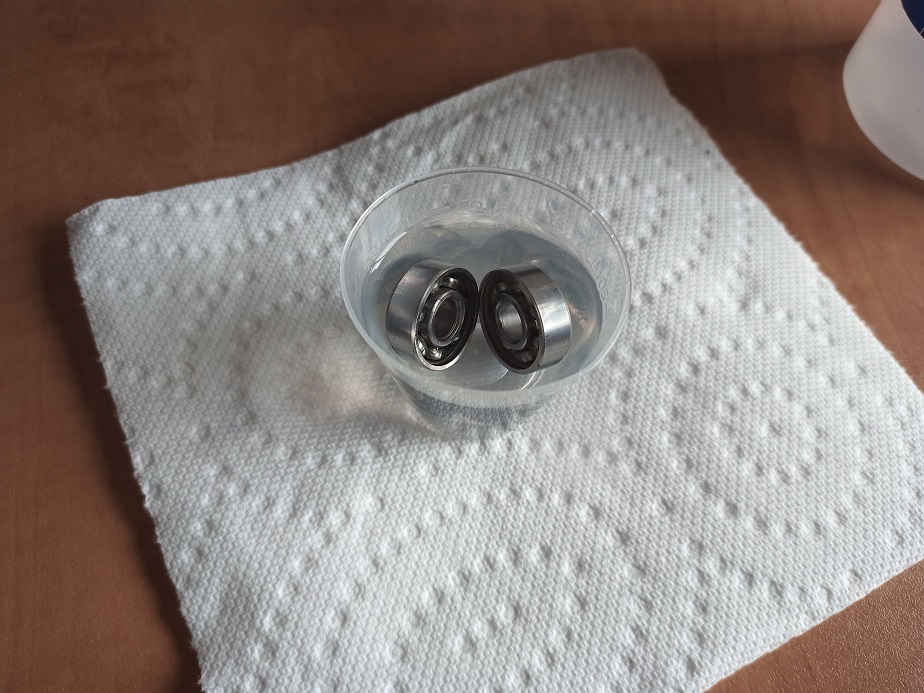

## Some Backstory

Yesterday, I stumbled upon [a video](https://www.youtube.com/watch?v=mZ1hF_-cubA) from [Make Anything](https://www.youtube.com/channel/UCVc6AHfGw9b2zOE_ZGfmsnw) in which he was showcasing a double pendulum he made. Below is a screenshot from said video.

What's awesome about double pendulums is that their movement seems **completely random** at a first glance, even though they are entirely deterministic. This behavior can be explained by a principle called _the butterfly effect_.

> The butterfly effect, an underlying principle of chaos, describes how a small change in one state of a deterministic nonlinear system can result in large differences in a later state (meaning that there is sensitive dependence on initial conditions).
>
> [Wikipedia](https://en.wikipedia.org/wiki/Chaos_theory)

I vaguely remember having tried to make such a contraption a few years ago, but since I didn't have access to a [3D printer](https://www.creality.com/goods-detail/ender-3-3d-printer) back then, I had to resort to metal rods and hot glue. As you might guess, it didn't work out at all.

However, now that I have way more experience with engineering as a whole, I figured I would give it another go.

## How I Built It

After a few design iterations in [Fusion 360](https://www.autodesk.ca/en/products/fusion-360/personal), I landed on a design I was happy with. Note that the `608` skateboard bearings aren't included in the screenshot below for simplicity's sake.

Once I was done 3D printing [all the parts](./Double-Pendulum.zip), it was time to assemble them. However, before doing so, it is essential to soak the ball bearings in some isopropyl alcohol to remove any heavy grease from the factory. Then, I let them dry off and I lubricated them with `WD-40`, a lighter lubricant. Below are some photos of this process.

|                                                           |                                                                    |
| --------------------------------------------------------- | ------------------------------------------------------------------ |
|  |  |
|     |   |

I also 3D printed [a special part](./Double-Pendulum.zip) to mount the pendulum directly onto the wall, which worked surprisingly well. After assembling the whole thing, it functioned perfectly! Below is a quick video showcasing the final result.

#demo

## Final Words

This project is fairly simple, but in my opinion, it is well worth it. Trying to make the pendulum move in the same way twice is **realistically impossible**, which I think is what makes it so mesmerizing to watch.

> The legend says its creator still gives it a nudge from time to time
