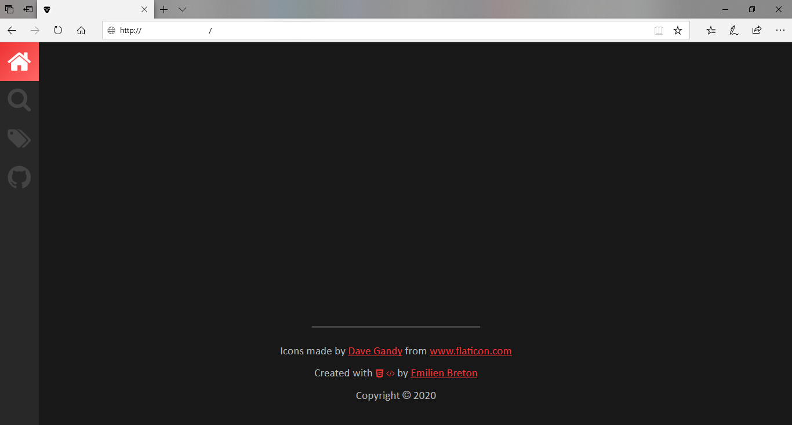

In this article, we will discuss why [Internet Explorer](https://en.wikipedia.org/wiki/Internet_Explorer) is so unfamous among _web developpers_, and the future of [Edge Legacy](<https://en.wikipedia.org/wiki/Microsoft_Edge#Spartan_(2014%E2%80%932019)>).

## IE, Our Worst Nightmare

Here is the a normal day in the life of a _front-end developper_: You program an **awesome page** on your favorite browser, and everything works perfectly. Then, you test it on [Chrome](https://en.wikipedia.org/wiki/Google_Chrome), then [Firefox](https://en.wikipedia.org/wiki/Firefox), then [Edge](<https://en.wikipedia.org/wiki/Microsoft_Edge#Anaheim_(2019%E2%80%93present)>), and everything still looks just like you intended it. But then, you open it up on [Internet Explorer](https://en.wikipedia.org/wiki/Internet_Explorer)... and **everything** breaks: your dynamic `JavaScript` code, your `CSS Grid` layout, your `button`s, your `link`s...

The next few days, you spend about twice as much time trying to make your website work on [Internet Explorer](https://en.wikipedia.org/wiki/Internet_Explorer). After having written double the code just to make it compatible with this dreaded browser, you can _finally_ continue programming... And then everything starts all over again.

#demo-ie

[This very website](/) is not compatible with [Internet Explorer](https://en.wikipedia.org/wiki/Internet_Explorer) at all. It displays a simple message to let the user know about it:

> Sorry, but this website doesn't support Internet Explorer.
> [Open in Edge](<javascript:void(0)>)

However, if you bypass the message and manage to see the website, it will look something like this:

No comments.

## What About Edge Legacy?

[Edge Legacy](<https://en.wikipedia.org/wiki/Microsoft_Edge#Spartan_(2014%E2%80%932019)>) is a browser that is _tons_ better than [IE](https://en.wikipedia.org/wiki/Internet_Explorer). However, in my opinion, it will slowly become the next [Internet Explorer](https://en.wikipedia.org/wiki/Internet_Explorer), as Microsoft will eventually shift their time ressources to developping the new [Edge](<https://en.wikipedia.org/wiki/Microsoft_Edge#Anaheim_(2019%E2%80%93present)>) browser, and slowly history will repeat itself. Fortunately, Microsoft is trying its best to force users to upgrade to the new [Edge](<https://en.wikipedia.org/wiki/Microsoft_Edge#Anaheim_(2019%E2%80%93present)>), as you have probably noticed if you have used a Windows computer in the last few months... but [Edge Legacy](<https://en.wikipedia.org/wiki/Microsoft_Edge#Spartan_(2014%E2%80%932019)>) still has a greater market share than the new one, and it has its flaws.

#demo-edge

For example, here is how this website looks on it:

It looks heaps more promising than on [Internet Explorer](https://en.wikipedia.org/wiki/Internet_Explorer), but the [Home page](/) is still not displaying properly. I spent about an hour tracking down the root cause of this problem, and eventually found that [Edge Legacy doesn't support `Asynchronous Generator Functions`](https://github.com/microsoft/ChakraCore/issues/2720), which are the building blocks of this very website. Unfortunately, I will not be adding support for [Edge Legacy](<https://en.wikipedia.org/wiki/Microsoft_Edge#Spartan_(2014%E2%80%932019)>), since it would require a full rewrite of the code in order to make it work. As you can see, websites are already starting to break on this browser, and I feel like it will get worse as time goes on.

## Moving Forward

I really hope that [Edge Legacy](<https://en.wikipedia.org/wiki/Microsoft_Edge#Spartan_(2014%E2%80%932019)>) will die before long, so it doesn't have time to become the next [Internet Explorer](https://en.wikipedia.org/wiki/Internet_Explorer). Can you imagine the nightmare if it was to become as unfamous as IE? I guess all we can do is wait and pray...
