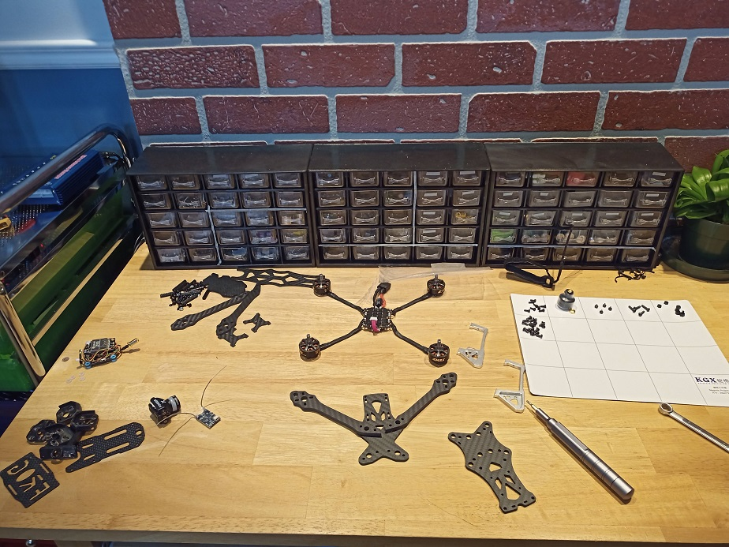
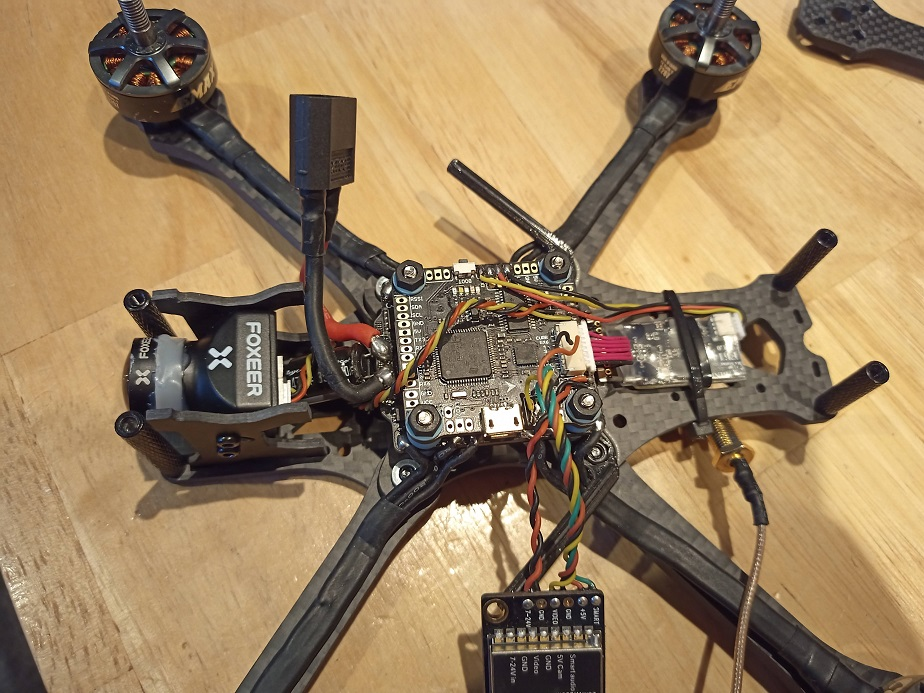
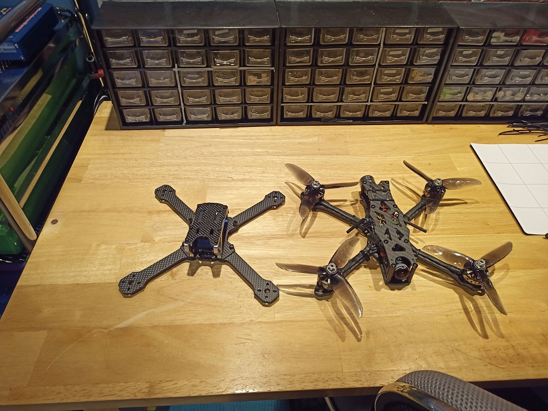
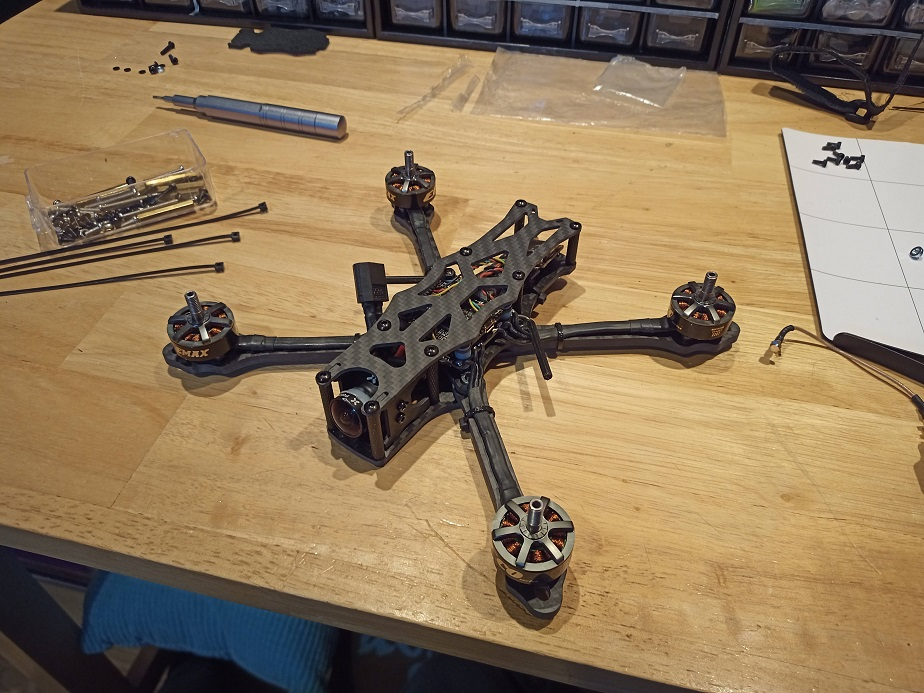
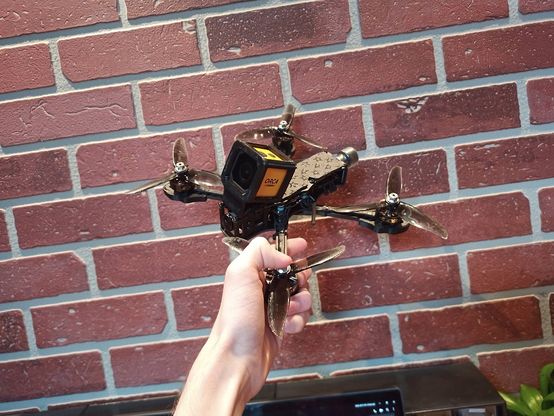

## The problem

About a month ago, I started having issues with [my drone](../FPV-Drone-HD-Footage/)'s LiPo battery. Since it was mounted on the bottom of the drone, it could get damaged during minor crashes or during landing. One day, its performance went from amazing to terrible, probably caused by a cell that got damaged by getting into contact with the ground. A few days later, the LiPo took a huge hit when I crashed the drone straight into concrete. When I landed it, it was smelling kinda funny... and the lithium layers inside the battery cells were exposed. I do not have any video of this, but I had to short the two battery terminals to make it go off in a controlled manner rather than in an [unexpected spontaneous explosion](https://www.youtube.com/watch?v=hg3r2erRrfw) while driving back home.

I didn't think it would be such a big deal to use a frame with an underslung battery, but it turns out it was. In order to fix this problem, I knew I had to order [a new frame](https://www.banggood.com/STEELE-5-220mm-Wheelbase-5mm-Arm-Thickness-Carbon-Fiber-X-Type-5-Inch-Freestyle-Frame-Kit-Support-Caddx-Vista-HD-System-for-RC-Drone-FPV-Racing-p-1720420.html?cur_warehouse=CN&rmmds=search).

## Choosing a Frame

I had three criteria for the new frame I wanted to buy. In order to fit my needs, it had to:

- look decent
- have a top-mounted battery
- be fairly cheap

After comparing a few options, I decided to go with a clone of the [ImpulseRC Apex](https://impulserc.com/collections/apex/products/apex-fpv-frame) on banggood. Here is a [link to it](https://www.banggood.com/STEELE-5-220mm-Wheelbase-5mm-Arm-Thickness-Carbon-Fiber-X-Type-5-Inch-Freestyle-Frame-Kit-Support-Caddx-Vista-HD-System-for-RC-Drone-FPV-Racing-p-1720420.html?cur_warehouse=CN&rmmds=search). By choosing such a clone, I knew I would get a good-looking and proven design while still paying a low price. Moreover, the _Apex_ is designed for a top-mounted battery, which is perfect for my needs. Here is a picture of the frame I chose:

#img

## Transfering the Electronics Over

The next step was to transfer all the electronics from the previous frame to the new one. However, since it is slimer and longer than the frame I was using before, I had to mount the [VTX](https://www.banggood.com/Eachine-TX805-5_8G-40CH-25-or-200-or-600-or-800mW-FPV-Transmitter-TX-LED-Display-Support-OSD-or-Pitmode-or-Smart-Audio-p-1333984.html?rmmds=search&ID=512671&cur_warehouse=USA) and the [receiver](https://www.banggood.com/1_7g-Fli1414CH-Mini-Receiver-Compatible-Flysky-AFHDS-2A-w-RSSI-Output-for-FS-i6-FS-i10-Turnigy-I6S-p-1302715.html?akmClientCountry=CA&rmmds=cart_middle_products&cur_warehouse=CN) to the rear of the drone instead of on the top of the stack. I then had to _design and 3D print_ a new antenna mount, which was way easier for this second frame than for [the first](../5-inch-Drone-Build/) one. Below are some pictures of the drone.

#build

|  |  |  |  |  |
| -------------------------------------------------------------- | -------------------------------------------------------------- | ----------------------------------------------------------------------------- | ---------------------------------------------------------------- | -------------------------------------------------------------------- |
|                                                                |                                                                |                                                                               |                                                                  |                                                                      |

## Some Flight Demos

Along with the frame, I also received the `4` LiPo batteries I had ordered. For this reason, I decided to go back to my town's primary school to take some shots during the golden hour. Below is a short flight of my drone on this new frame followed by a few accidental crashes... enjoy!

#demo

#crash

## Moving Forward

Even though this is an awesome upgrade from the older frame, there are still a bunch of problems to take care of. For instance, after [crashing a few times](https://youtu.be/oxRzuhUiJCs), two of the the low quality aluminum standoffs that came with the frame stripped right out. The new frame did protect the _LiPo batteries_ way better than the older one did, but they still got ejected **twice** during flight. After a bit of investigation, I noticed that the battery pad wasn't sticky anymore since it was covered in dust. However, after cleaning it with some [isopropyl alchool](https://en.wikipedia.org/wiki/Isopropyl_alcohol), it looked just like new again! Finally, there are lots of vibrations in the final HD footage. I thought this was a major issue with the new frame, but I then remembered that the motors didn't actually try to counteract the lower frequency oscillations like they should've... which basically means that the HD camera is the issue, and not the drone itself. This is awesome news!

Anyways, I am incredibly satisfied with the durability of the _freestyle_ frame I switched to. I will keep you updated on the project!
