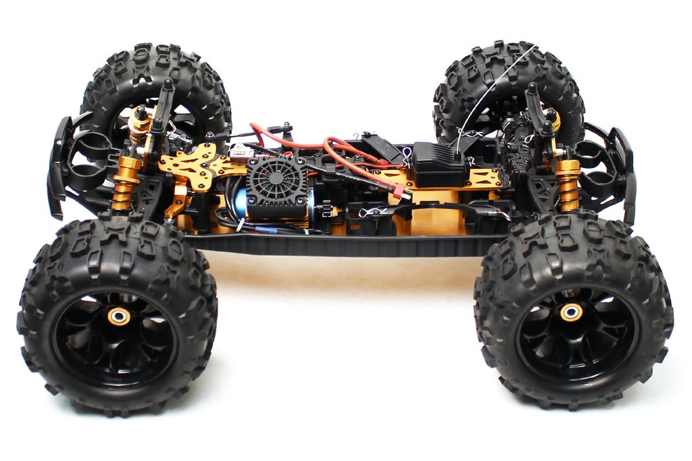
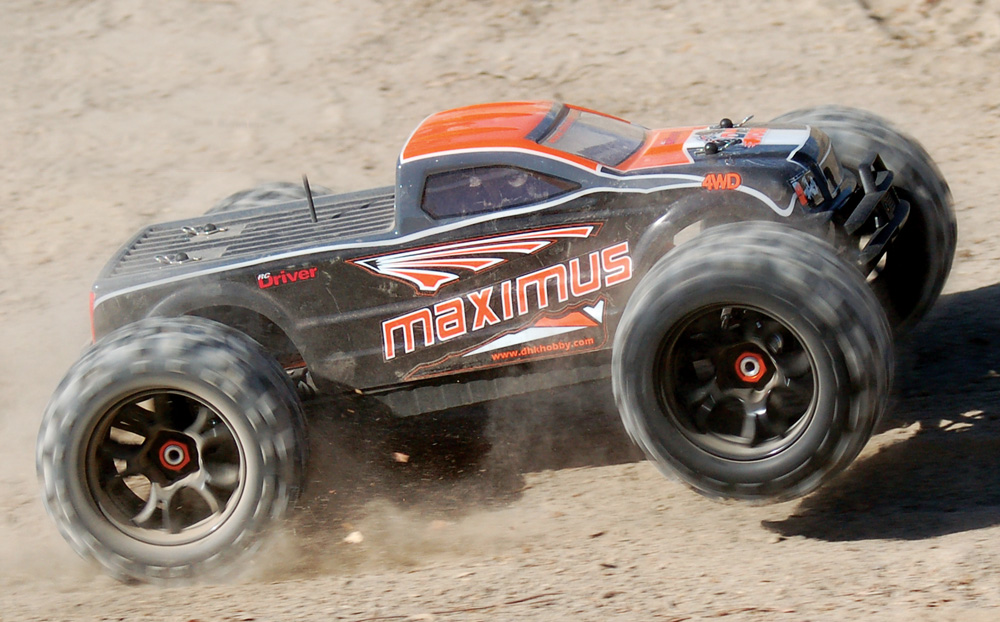
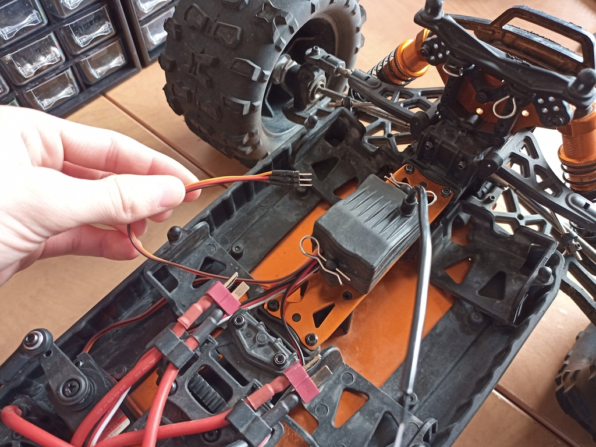
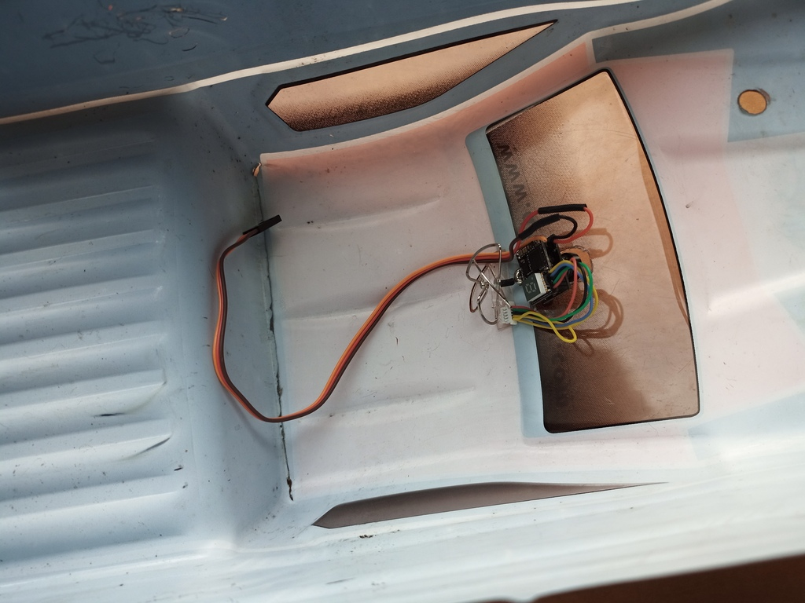
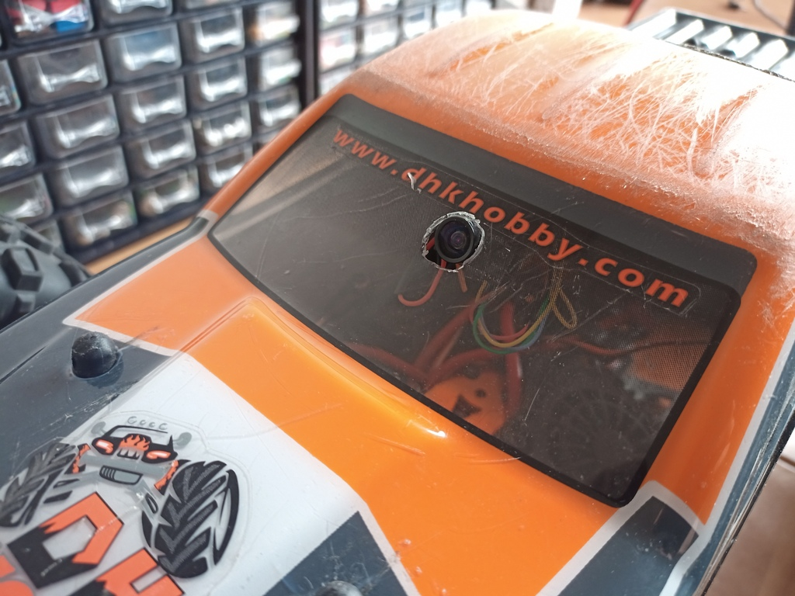

## The Idea

About two months ago, I bought a `1:8` scale RC car, the [DHK Maximus](https://www.banggood.com/DHK-8382-Maximus-1-8-120A-85KM-H-4WD-Brushless-Monster-Truck-RC-Car-p-1160581.html?cur_warehouse=CN&rmmds=search). Below are a few pictures of this car.

|                                                  |                                                               |
| ------------------------------------------------ | ------------------------------------------------------------- |
|  |  |

Then, one morning, I remembered I had an extra drone [camera and VTX combo](https://www.banggood.com/Eachine-TX03-NTSC-Super-Mini-0-or-25mW-or-50mW-or-200mW-Switchable-AIO-5_8G-72CH-VTX-600TVL-1-or-3-Cmos-FPV-Camera-p-1104884.html?cur_warehouse=CN&rmmds=search) which I never ended up using. As you likely already know, I built an [FPV racing drone](../FPV-Racing-Drone/) from scratch about a year ago... and so I thought:

> Why wouldn't I make my RC car FPV-capable?

## How I Built It

Counterintuitively, adding FPV to an RC car is surprisingly easy. I used the [Eachine TX02](https://www.banggood.com/Eachine-TX03-NTSC-Super-Mini-0-or-25mW-or-50mW-or-200mW-Switchable-AIO-5_8G-72CH-VTX-600TVL-1-or-3-Cmos-FPV-Camera-p-1104884.html?cur_warehouse=CN&rmmds=search), which includes both a camera and a video transmitter. This way, all it neads to function is a `5V` constant voltage supply, and, as it turns out, pretty much all hobby-grade RC cars use a `5V` receiver. With this in mind, I cut a servo cable to length and I plugged it straight into my RC car's receiver:

Then, I made a hole large enough for the camera lens through the car's body and I used some high-quality [double-sided tape](https://www.scotchbrand.com/3M/en_US/scotch-brand/products/catalog/~/Scotch-Mount-Clear-Double-Sided-Mounting-Tape/?N=4335+3289430110+3294529207&rt=rud) to stick it in place. Here's how that looks:

|                                                              |                                                         |
| ------------------------------------------------------------ | ------------------------------------------------------- |
|  |  |

After connecting the cables together, it worked flawlessly! This is slightly beside the point of this post, but I thought I'd include this tip for anyone looking to buy this car: **locking the center differential drastically improves its performance.** Anyways, below is a demo video of me driving it around on campus through the newly installed FPV system!

#demo

## The Limits

Unfortunately, this system isn't perfect. The main issue is that the transmitter-receiver combo that came with the [DHK Maximus](https://www.banggood.com/DHK-8382-Maximus-1-8-120A-85KM-H-4WD-Brushless-Monster-Truck-RC-Car-p-1160581.html?cur_warehouse=CN&rmmds=search) has a very short range, meaning that the signal to the car often cuts out when it is more than `50` meters away. Because of this, I still prefer driving it around with my goggles off to be able to have a better view of what's going on around the car. Regardless, I can now say that I own an [FPV RC car](https://www.banggood.com/Eachine-TX03-NTSC-Super-Mini-0-or-25mW-or-50mW-or-200mW-Switchable-AIO-5_8G-72CH-VTX-600TVL-1-or-3-Cmos-FPV-Camera-p-1104884.html?cur_warehouse=CN&rmmds=search)!
