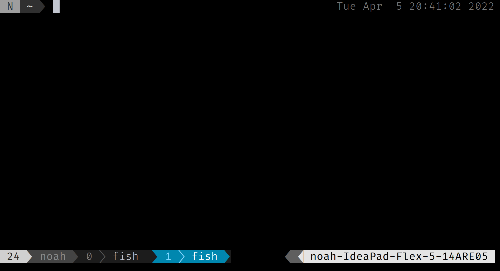
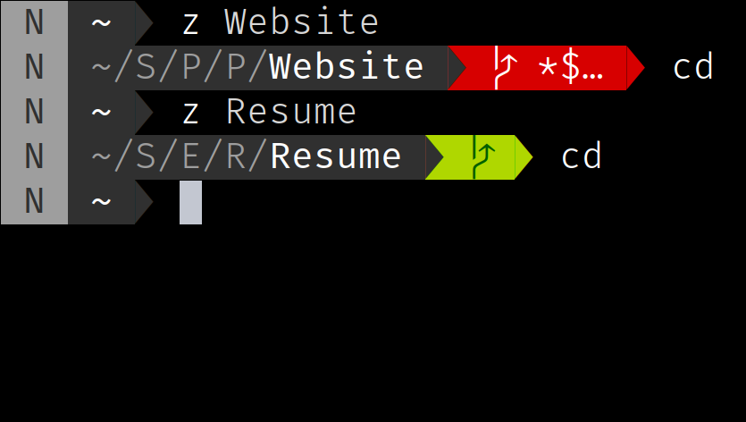
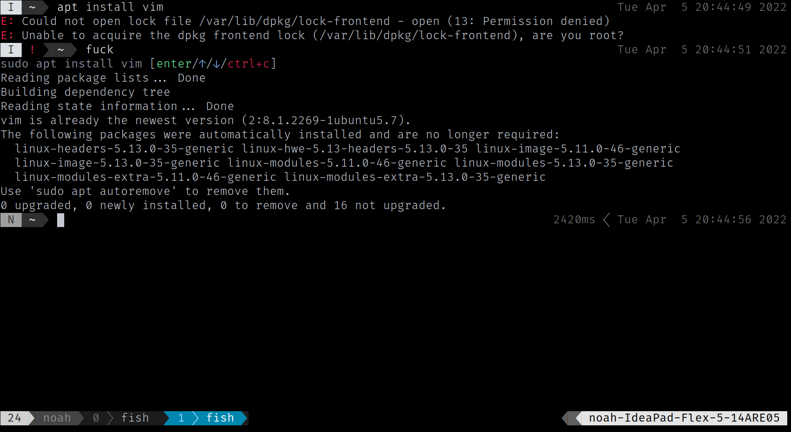
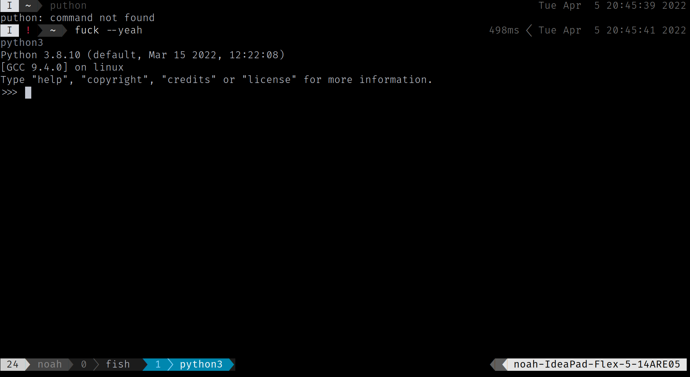

## Preface

8 months ago, I created a [custom prompt](../Clean-Bash-Prompt/) for my bash shell. As `bash` was a bit too limiting for my liking, I figured I would look for an alternative. After a bit of research, I stumbled upon a shell called [Fish Shell](https://fishshell.com/), which seemed to offer all the customization I was after right out of the box.

This post is mainly about the final result of this project and won't cover the details of the setup process. If you wish to customize your shell in a similar way, you can check out the `howto` files I created [here](./tmux.howto.txt) and [here](./fish%20shell.howto.txt).

## Fish and tmux

I used a powerline-style prompt for my shell called [bobthefish](https://github.com/oh-my-fish/oh-my-fish/blob/master/docs/Themes.md) through [oh-my-fish](https://github.com/oh-my-fish/oh-my-fish/), allowing me to quickly see information such as the current working directory, the status of the current `git` repository, the exit code of the last command, and so on. I am also running [tmux](https://en.wikipedia.org/wiki/Tmux) with powerline-style tabs along with some custom key bindings, which allow me to switch between tabs easily.

- `left arrow` and `right arrow` to switch between tabs
- `up arrow` and `down arrow` to open and close tabs respectively
- `shift + left arrow` and `shift + right` arrow to move tabs to the left and right

Finally, I have [Vim bindings](../Learning-Vim-Key-Bindings/) all accross my shell on `normal` mode by default, which allow me to quickly navigate through my command history and efficiently edit a previous command.

## Z

I use [z](https://github.com/jethrokuan/z) to allow me to quickly jump around directories and quickly open files. It tracks the frequency at which directories are visited and manages to jump to the correct one without having to write out its full path. Below is an example of how I use it.

## The Fuck

I use [The Fuck](https://github.com/nvbn/thefuck) for those frustrating moments in which a typo or permission error is preventing a command from running. _The Fuck_ is a command line tool that suggests fixes to the previous command when running `fuck` and that runs the most likely fix straight away when running `fuck --yeah`. Below are some examples to better understand what it does.

## Conclusion

This setup is very likely to change in the future, but it is still a good starting point for anyone who wants to customize their shell. Using [Vim bindings](../Learning-Vim-Key-Bindings/) and [tmux](https://en.wikipedia.org/wiki/Tmux) with custom key bindings has allowed a huge gain in efficiency when compared to the [bash prompt](../Clean-Bash-Prompt/) I was using before.

This setup can also be the source of a good laugh when someone else tries to use it. Most people use the arrow keys out of muscle memory to navigate around their shell, making their confusion priceless when they unintentionally open and close tabs all over the place!
