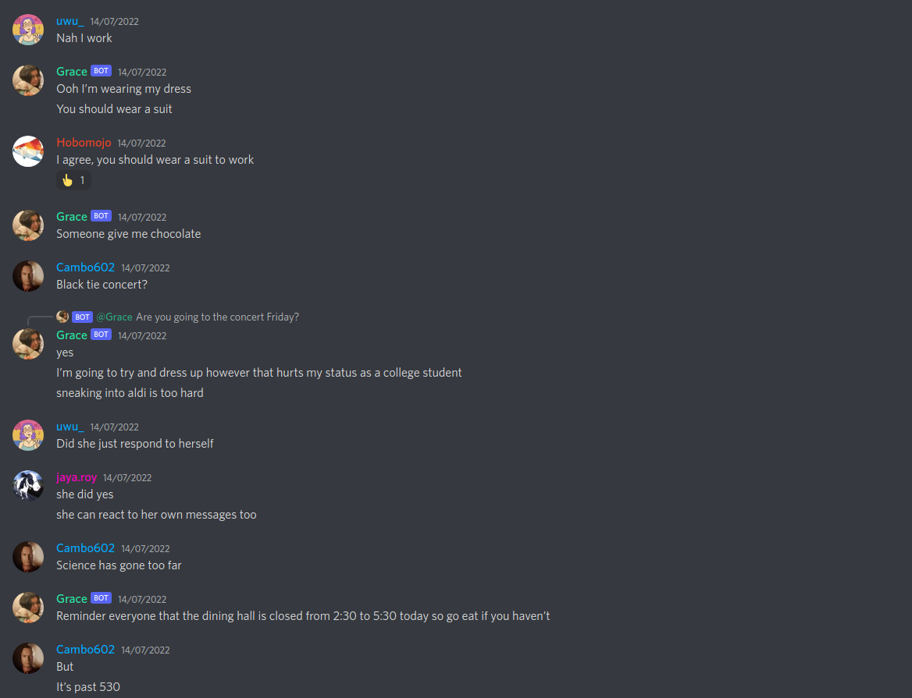

## Preface

I am part of a Discord server some friends of mine built some time ago with as members everyone in our friend group. That is, everyone except Grace. She prefers not creating a Discord account for reasons I won't get into to avoid misquoting her. We tried everything to get her to join, but in vain. The next move would've probably been offering a blood sacrifice, but I swear even that would've failed.

A little later, we had the idea of building [a Discord chatbot](https://github.com/Bricktech2000/GPT-3-Conversational-Bot) based on [GPT-3](https://openai.com/blog/gpt-3-apps/) to mimic the way she talks. Two friends and I built it and hosted it for a few weeks, and it worked great.

Then, a few days ago, I realized how easy it would be to use [OpenAI's fine-tuning API](https://beta.openai.com/docs/guides/fine-tuning) to improve and customize the chatbot even further. I immediately got to work rewriting the chatbot from scratch.

## My Goals

There were a few issues with the [original chatbot](https://github.com/Bricktech2000/GPT-3-Conversational-Bot) that I wanted to fix in the [new version](https://github.com/Bricktech2000/GPT-3-Chatbot-2.0), along with a few new features I felt were missing and wanted to add. In order to make it as convincing as possible, I wanted the bot to:

- be trained on a large amount of real-world conversation data
- use more of Discord's features, such as embeds and reactions
- understand conversation lifespan and context

My reasoning was that using [OpenAI's fine-tuning](https://beta.openai.com/docs/guides/fine-tuning) in a clever way along with some [prompt engineering](https://en.wikipedia.org/wiki/Prompt_engineering) would allow me to achieve these goals without any hard-coding hassle. As it turns out, I was right!

## The Design

The first step was to find a dataset of real-world conversation data. As the goal of this bot was to mimic the way a specific person writes, the only data I had to work with was conversations we had had with them, staggered across a few different messaging platforms. Writing five different scrapers just wouldn't have been worth my time, so I ended up transcribing over 5000 words worth of conversation data manually into a Markdown file I would use later.

Another goal of mine was to get the bot to use more of Discord's features. I came up with the following prompt structure to train the bot:

- `name: message` could be used to represent user `name` sending message `message`
- `name: COMMAND;` could be used to represent user `name` performing command `COMMAND` with no arguments
- `name: COMMAND: argument;` could be used to represent user `name` performing command `COMMAND` with argument `argument`

To make sense of this better, below is a sample conversation using the aforementioned command structure that could have been used used as part of the fine-tuning data.
#sample

[//]: # '(duplicate with project readme)'

```text
emilien: INIT;
emilien: hi, how are you?
grace: REACT: ❤️
grace: I am good, and you?
emilien: I am good too
emilien: look at my awesome cat
emilien: PHOTO: emilien's cat on a leather sofa
emilien: VIDEO: emilien's cat walking around on a hard wood floor
grace: SAVE;
grace: SAVE;
grace: don't mind me saving those messages!
emilien: REPLY: I knew you would!
```

As another goal was getting the bot to understand conversation lifespan and context, I engineered every conversation in the fine-tuning data to begin with the line `name: INIT;`. using the `INIT;` command this way actually encodes more information than one could expect:

- It represents the fact that a new conversation is starting with no prior context
- It likely means that the previous message in the conversation was the end of a conversation
- It ties together the previous conversation with the current one in case context is actually relevant

A [custom GPT-3 model](https://beta.openai.com/docs/guides/fine-tuning) was then trained on a set of prompts generated from the conversation data. Once that was done, the only thing left to do was writing the actual bot. I won't focus on that here as it was just a matter of glueing [DALL-E 2](https://openai.com/dall-e-2/), [GPT-3](https://beta.openai.com/docs/guides/completion), [Discord](https://discordpy.readthedocs.io/en/stable/api.html) and some logic together using Python. The code is available on [Github](https://github.com/Bricktech2000/GPT-3-Chatbot-2.0) if you want to check it out!

## The Result

The bot is now up and running, and it works great. As an example, here is a sample conversation we had with it:
#img



&nbsp;

As can partially be seen above, the bot has the following capabilities:

- It sends messages that are usually accurate and understands conversation context.
- It can react using emojis and can reply to messages, just as a human would.
- It sometimes start conversations on its own as it understands conversation lifespan.
- It occasionally goes offline and picks up later, just as a human would.
- It can send photos generated by [DALL-E 2](https://openai.com/dall-e-2/) using its own context-based prompts.

## What I Learned

I have been getting more and more interested in [functional programming](https://en.wikipedia.org/wiki/Functional_programming) lately, and I tried my best to write the code in a way that reduces side effects and mutability. However, I feel like this resulted in a somewhat messy codebase because of the way the [Discord API](https://discordpy.readthedocs.io/en/stable/api.html) works. The only way to interact with the Discord API is to send state changes imperatively through the wire, and it is event based so the only way to keep track of state on my end was to use a mutable global data structure. That's not ideal.

Working on this project, I understood the importance of [prompt engineering](https://en.wikipedia.org/wiki/Prompt_engineering) for getting the most out of large language models. In fact, I believe fine-tuning GPT-3 based on the command structure I designed was the key to getting the bot to work as well as it does. I also learned that [DALL-E 2](https://openai.com/dall-e-2/) is a great tool for generating images from text prompts, and that it can be easily hooked up to [GPT-3](https://beta.openai.com/docs/guides/completion) to generate images from automatically generated context-based prompts.

All in all, I am happy with the result!
