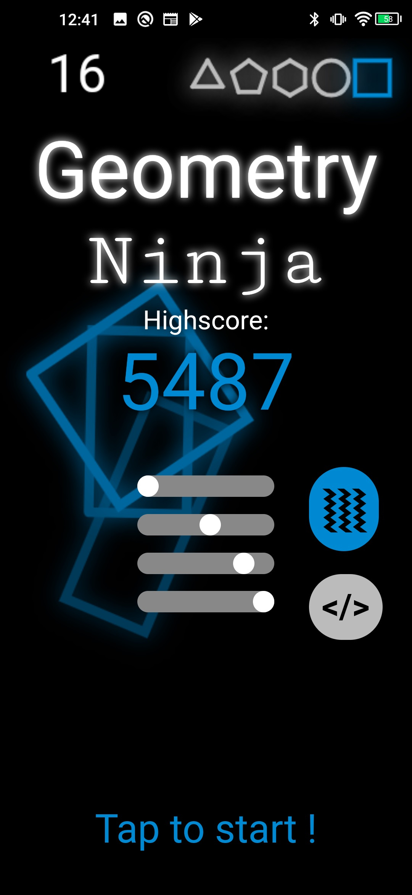

## Intro

In Febuary this year, I really wanted to create an android app, and I started to get really interested in games such as [Fruit Ninja](https://fruitninja.com/) and [Beat Saber](https://store.steampowered.com/app/620980/Beat_Saber/). I had just got my new andoid phone, the [Umidigi F2](https://www.umidigi.com/page-umidigi_f2_overview.html), so I decided I would program a game in `HTML`, `Javascript` and `CSS` right on my phone. After only one week of coding, I had a fully-working web game that looked really cool! I then ported it into [Android Studio](https://developer.android.com/studio), and I created an app out of it.

If you want to download the APK file to try it yourself, simply [click here](app-release%20Geometry%20Ninja%206.apk)! If you do not own an android device and would still want to try it out, you can [click here](./index2.html) for the web version!

## Demo

Here's a video demo of me playing the game:

#demo

## How to play

When you open up the app, you will be greated with the following title screen:

It contains the following things:

- Your highscore
- 4 sliders: the top 3 control the color of the game while the bottom one controls the graphics type used (for performance improvement)
- A _vibration enable_ button: it enables or disables the vibration in the game
- A debug button (`</>`): it enables me to debug the game more easily, it is not essential to the gameplay.
- A _Tap to Start_ button

When you click said _Tap to Start_ button, it starts the game! Just drag your finger on the screen to cut the polygons in half!

> Wait, so that's it? Is it really that simple?

Actually... not so fast. In fact, many types of polygons exist, and they are unlocked when you reach a certain number of points (they are unlocked if they are colored):

- **Rectangle**, unlocks at 0 points: _Worth 1 point when cut_
- **Circle**, unlocks at 100 points: _The game ends if cut_
- **Hexagon**, unlocks at 250 points: _Worth 50 points when cut_
- **Pentagon**, unlocks at 500 points: _If cut, will increase the amount of circles on screen for a limited time_
- **Triangle**, unlocks at 1000 points: _When cut, Slows down the game 8x and gives you 5x point bonus for a limited time_

## Conclusion

When had the idea to create a game, I had one goal in mind:

> I'll program an android game to learn a bunch about app development!

It turns out that I have learned nothing about android app development, because I programmed the game in `HTML` and then ported it to android using [Android Studio](https://developer.android.com/studio). Despite that, I will continue to program small apps in the future, because it was a lot of fun!
