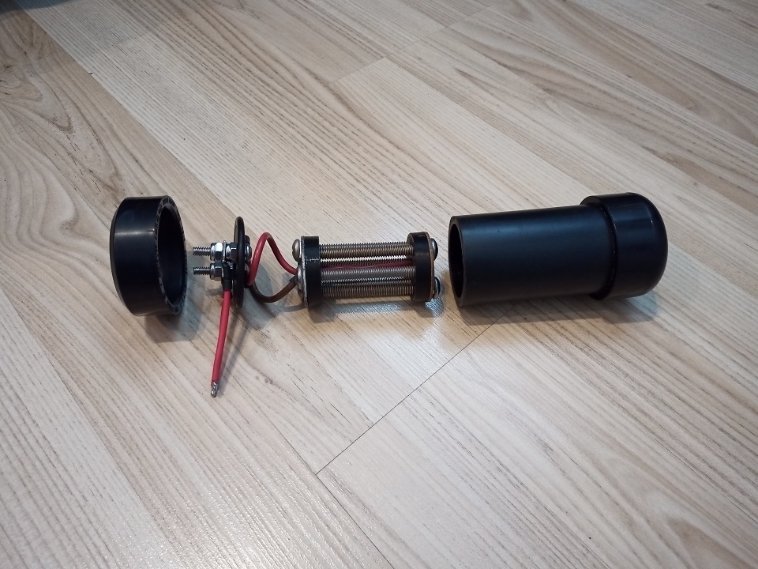

## The idea

A few weeks ago, I was browsing my _YouTube recommended feed_, trying to find new stuff to learn. Then, I stumbled upon this video:

It showcases a very simple _HHO Generator_, which uses screws to [electrolize](https://en.wikipedia.org/wiki/Electrolysis_of_water) water. This very simple contraption can generate `100 ml` of explosive [_HHO_](https://en.wikipedia.org/wiki/Oxyhydrogen) gas per minute.

When I saw this video for the first time, I new I had to build one. I immediately got to work thinking about how I would make my own. After a few trips to the hardware store and `30 $` well spent, I was ready to start building!

## No, it isn't magic

The principle behind such a machine is very simple. Water consists of [_hydrogen_](https://en.wikipedia.org/wiki/Hydrogen) and [_oxygen_](https://en.wikipedia.org/wiki/Oxygen), which are tightly bonded together. However, with a lot of energy, one can seperate water molecules into a very explosive gas, consisting of _dihydrogen_ and _dioxygen_. Here is the chemical formula for this reaction, called [_water electrolysis_](https://en.wikipedia.org/wiki/Electrolysis_of_water):

[//]: # 'https://lingojam.com/SubscriptGenerator'
[//]: # 'https://smalltext.io/'
[//]: # '2 H₂O₍ₗ₎ → 2 H₂₍₉₎ + O₂₍₉₎'

<pre><code>2 H2O(l) → 2 H2 (g) + O2 (g)</code></pre>

Then, when a tiny amount of energy is transfered to this [HHO](https://en.wikipedia.org/wiki/Oxyhydrogen) gas, it releases way more energy in a very short amount of time, which in turn causes its distictive [powerful explosion](#demo).

#img

In order to understand better, here is a picture of the inside of the generator:

Almost all of it is made out of _stainless steel_ or _aluminum_, so that it doesn't [oxidize](https://en.wikipedia.org/wiki/Rust). However, I counldn't find stainless washers at the hardware store, so I had to use steel ones. Unfortunately, this means that they were vulnerable to [oxidization](https://en.wikipedia.org/wiki/Rust), which explains why they rusted. At least, since they are not ment to be in electrical contact with the water, this is not that big of a deal at all.

In order for this generator to work, three of the screws are connected to the positive end of a battery, and the three other ones are connected to the negative side. Using screws is a very clever way to build such a powerful generator: they have about twice the surface area of metal rods because of their threads. Once I connect a very powerful battery to both terminals, the [_electrolysis_](https://en.wikipedia.org/wiki/Electrolysis_of_water) can start!

#parts

## Parts used

For anyone wondering, here is a list of the parts I used to make this generator:

- 6x `1/4 by 2-1/2` stainless machine screws
- 2x `1-1/2 od 13/32 id 1/16 thick` steel washers
- 6x `12-10 AWG #8-#10 stud` spade terminals
- 2x `10-24 X 1` stainless machine screws
- 4x `10-24` stainless machine nylon nuts
- `160 mm` of `10 AWG` brown and red wire
- `10 mm od by 60 mm l` heat shrink
- `1-1/2` ABS tubing
- `1-1/2` permanent cap
- `1-1/2` permanent cap with `1"` hole
- `40 mm id by 3.5 mm w` O-ring
- `5 mm od by 750 mm l` flexible tubing
- about `1h` of 3D printing

#demo

## Now for the real show

Here is a demo of the explosion of a small cup containing [HHO](https://en.wikipedia.org/wiki/Oxyhydrogen) gas, which was made using my generator:

## Conclusion

This is not a dangerous machine at all, but it does generates [a very unstable explosive gas](https://en.wikipedia.org/wiki/Oxyhydrogen). I would love to encourage everyone to build such a generator, but it is simply too much of a hassle in my opinion. I had a lot of issues regarding air leaks, and they were time consuming to fix. [_HHO Generators_](https://en.wikipedia.org/wiki/Oxyhydrogen) also need a lot of power to work properly, and it is very hard to find a power supply or a battery capable of outputting it. However, if you do not mind spending a bit of time on the desing, it is totally worth it in the end!
