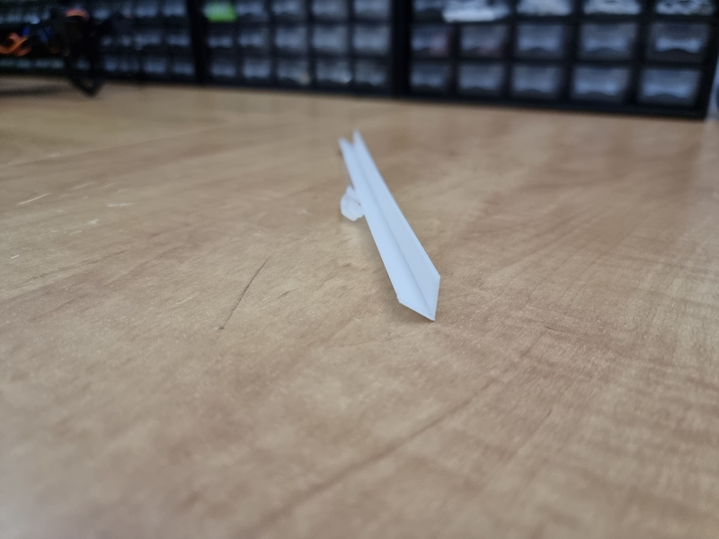
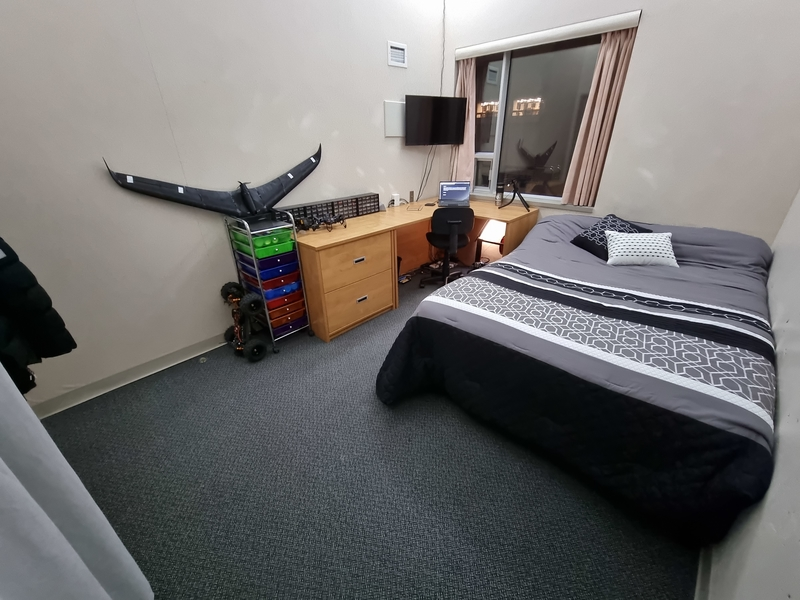
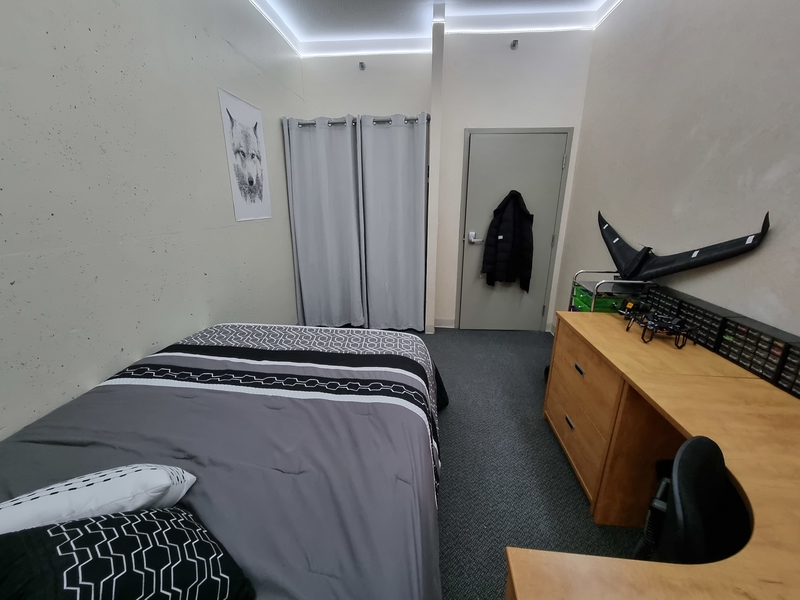
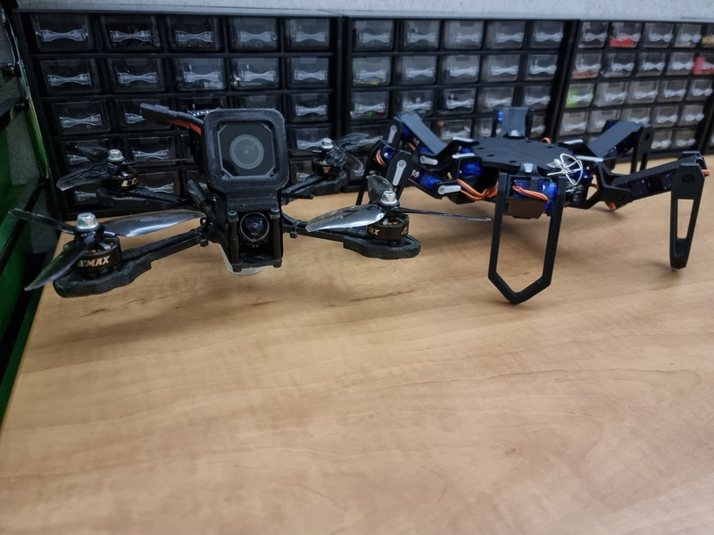

## The Issue

As some of you may know, I moved into the [90U residence](https://www2.uottawa.ca/campus-life/housing/compare-residence/90-university) at [uOttawa](https://www2.uottawa.ca/en) in September of last year. Unfortunately though, as I quickly discovered, the rooms in 90U don't have a ceiling light source, meaning I had to get my own desk lamp to keep the room bright at night. The issue with desk lamps is that they usually aren't that bright, and if they are, then they also cast harsh shadows anywhere you look.

This was a major inconvenience for me, as the shadows made it annoying to write, take pictures, or work on projects at night. At this point, I knew I needed a way to remedy this problem.

## The Solution

As the title clearly states, the solution to the issue I had was to install LED strips &mdash; but not so fast. The core problem I was trying to solve was the harsh shadows caused by the point light source emitted by a desk lamp. For this reason, naively tapeing low-density commercial RGB LED strips [on the wall](./no.html) would not do much more than making the lighting solution even harder on the eyes.

This is when I came up with the idea for this project:

> Let's angle the LED strip towards the wall.

This might seem counterintuitive, but by directing the harsher light at the wall-to-ceiling edges of the room, I would transform the top `~10cm` of the wall and the white ceiling into a huge room-wide [softbox](https://en.wikipedia.org/wiki/Softbox). In theory, this would mean that the large light source would prevent harsh shadows from even forming in the first place.

After a little while prototyping and a few hours 3D printing on my [Ender 3](https://www.creality3dofficial.com/products/official-creality-ender-3-3d-printer), I was left with roughly 15 meters of 3D printed LED strip channels, which you can download the files for [here](LED%20Strip%20Channel%20v19.stl). Here is what a single `10cm` section looks like:

As I didn't fancy blinding colors, I focused on getting bright white high-density LED strips. [The ones](https://www.banggood.com/5M-Non-Waterproof-Cool-White-3528-SMD-300-LED-Strip-Light-DC12V-for-DIY-Indoor-Home-Car-Christmas-Decorations-Clearance-Christmas-Lights-p-77079.html?rmmds=myorder&cur_warehouse=CN) I ended up buying were about `10$/5m` at a `60 LED/m` density, which means the total cost for installing a strip all around the ceiling edge was only `30$`. They are also `12V` strips, which means their brightness wouldn't suffer as much over the `15m` distance they had to cover. It is worth noting that they do not come with a power supply as they are meant for enthusiasts, but a quick look through my electronic parts is all I needed to find a suitable power supply for the job.

## The Result

#result
After mounting the strips and the channels with some [Gorilla mounting tape](https://www.gorillatough.com/product/tough-and-clear-mounting-tape/), I was done! Below are a few pictures of the finalized installation, which I took when it was pitch-black outside.

## Final Thoughts

I am still impressed by the fact that this whole project cost me only `30$`, excluding the supplies I already owned. It proved to be an enormous quality-of-life improvement, to the point where I forget it is even dark outside. Even though this lighting installation will likely have to be dismantled next year, I am stoked with the result!
