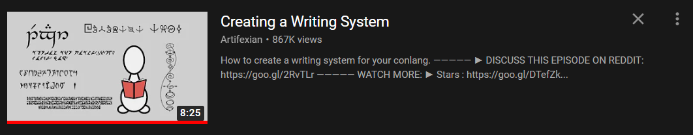
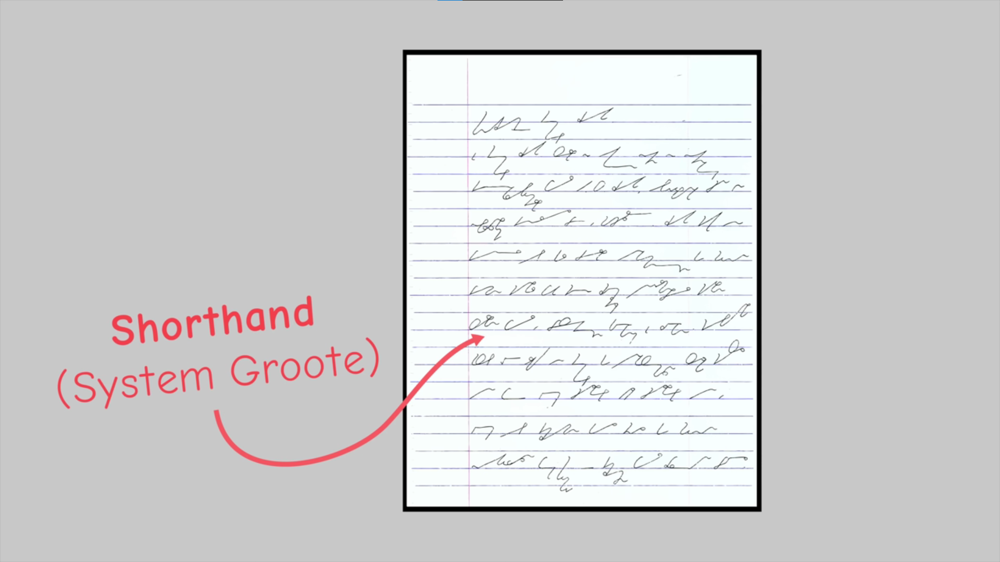
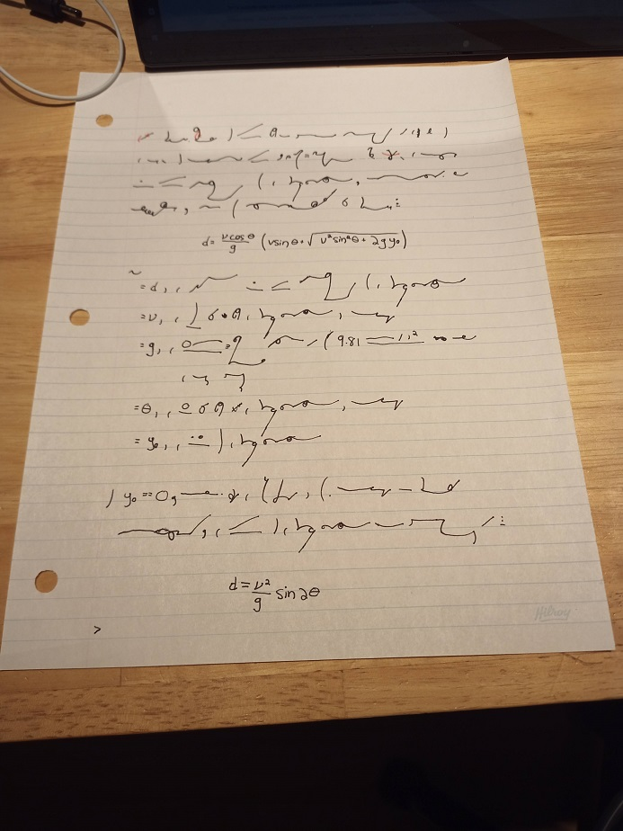
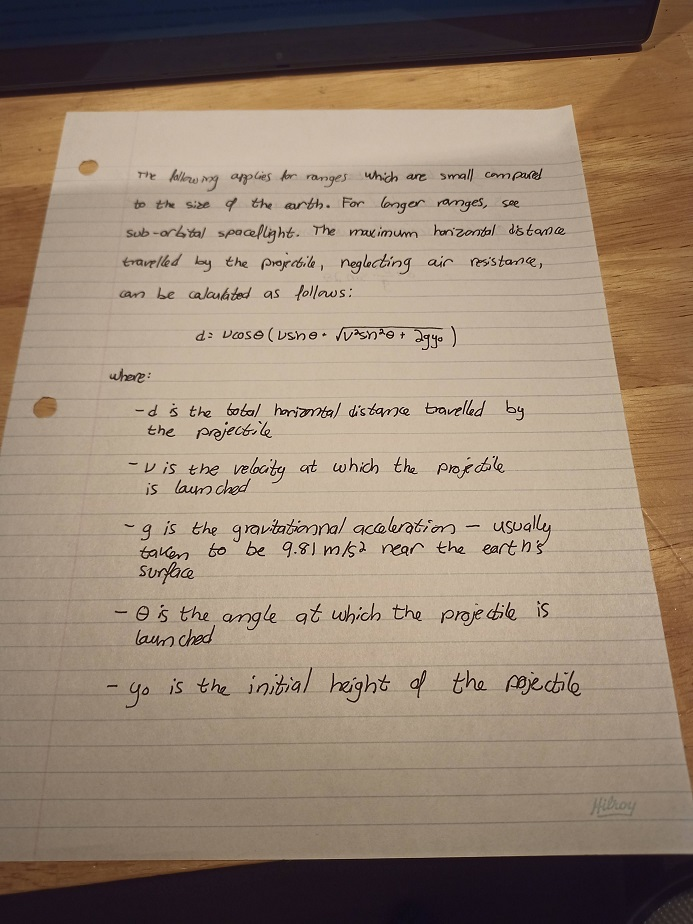
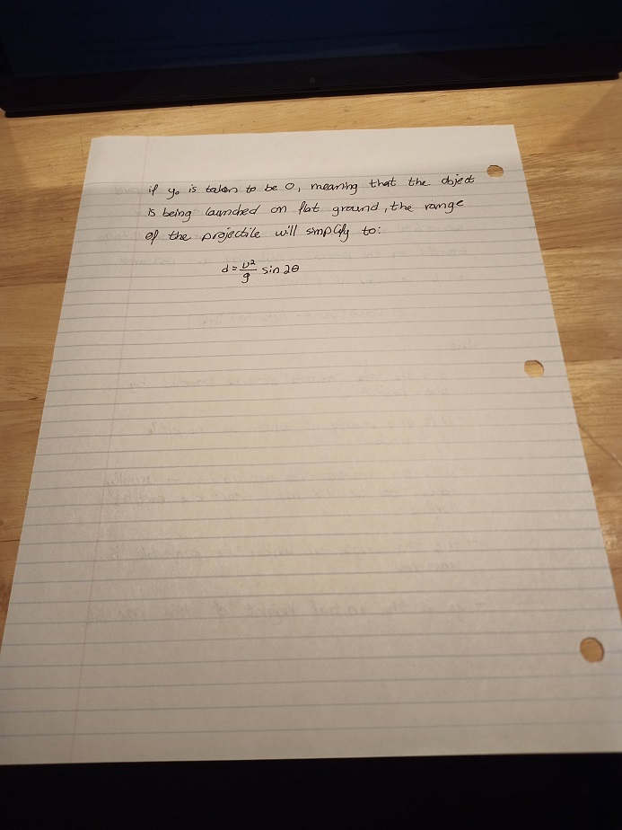

## Discovering Shorthand Systems

Yesterday, I stubled upon the following video from [Artifexian](https://www.youtube.com/channel/UCeh-pJYRZTBJDXMNZeWSUVA):

In this video of his, [Artifexian](https://www.youtube.com/channel/UCeh-pJYRZTBJDXMNZeWSUVA) talks about choosing a _type of script_, a _writing medium_ and a set of _orthographic rules_ to create an interesting writing system for [conlangs](https://en.wikipedia.org/wiki/Constructed_language). At `3:25`, mentions the following very briefly:

> But what happens to a cursive script when speed is the most important factor?

As he does, he shows the following picture for only a few short seconds:

As soon as I saw this script, I was amazed at how awesome it looked. I knew had to research this _shorthand_ mystery futher, and so that's exactly what I did.

## What is Shorthand?

At this point, you are probably wondering what _shorthand_ even is. Here is a very nice definition of it:

> Shorthand is an abbreviated symbolic writing method that increases speed and brevity of writing as compared to longhand, a more common method of writing a language. The process of writing in shorthand is called stenography `...`.
>
> [Wikipedia](https://en.wikipedia.org/wiki/Shorthand)

Essentially, _shorthand_ systems allow the writer to write at a ridiculously fast speed when compared to traditionnal _longhand_ systems like the [roman alphabet](https://en.wikipedia.org/wiki/Latin_alphabet). After some more research, I stumbled upon a system called _[Gregg Shorthand](https://www.theatlantic.com/technology/archive/2014/06/yeah-i-still-use-shorthand-and-a-smartpen/373281/)_, which seemed to be one of the most popular among writers. For the next few days, I went on and learned how to write in _Gregg_.

## Learning Gregg Shorthand

#vid

Learning basic Gregg Shorthand was surprisingly easy. Here is a list of the video lessons I took in order to learn basic Gregg:

- _Learn Gregg Shorthand (Full Course)_, [episodes `0 - 10`](https://www.youtube.com/playlist?list=PL8ZpRe8iZdaGlvTJVM3unnYmPhGWXkpwL)
- _Gregg shorthand for personal note taking_, lessons [`1.1`](https://www.youtube.com/watch?v=zqACi8UZllI), [`1.2`](https://www.youtube.com/watch?v=I8uvgqDZkP4), [`3, 4, 5`](https://www.youtube.com/watch?v=I8uvgqDZkP4)

#text

And Here is a list of the written material I used to do so, linked in [Google Drive link](https://drive.google.com/drive/u/0/folders/0B7wM_t2b-48gSHJrLW55bGFmODA) in [this video](https://www.youtube.com/watch?v=zqACi8UZllI)'s description:

- [Gregg Manual](https://drive.google.com/file/d/0B7wM_t2b-48gRnZUcDY0WjhBR1k/view?usp=sharing), for learning the alphabet along with very simple words
- [Gregg Dictionnary](https://drive.google.com/file/d/0B7wM_t2b-48gQXJPXzVLcUlOWXc/view?usp=sharing), for abbreviations on longer words
- [Gregg Manual](https://drive.google.com/file/d/0B7wM_t2b-48ga3lBS2FUXzJabWM/view?usp=sharing) and its [answer key](https://drive.google.com/file/d/0B7wM_t2b-48gNFBMNThlekVUSUE/view?usp=sharing), for writing short phrases more efficiently

#showcase

## What I Managed to Achieve

After a complete day of learning, I managed to memorize all the letters of the _Gregg Alphabet_ and a few short phrases such as _the_, _is_, _I will be_, and so on. I write at about four words per minute, but I know I will get better as time goes on. Here is a picture of a [Wikipedia article](https://en.wikipedia.org/wiki/Range_of_a_projectile) I transcribed in Gregg, followed by its translation back into the roman alphabet:

|                                      |                                      |
| ------------------------------------ | ------------------------------------ |
|  |  |

I will very likely continue using Gregg for a lot of everyday tasks, such as personnal notes and `TODO` lists. Even though I will never be able to write at [hundreds of words per minute](https://www.youtube.com/watch?v=spTN48-YCTk), I really love how cryptic this script looks and how impressive a fluent writer can be.
