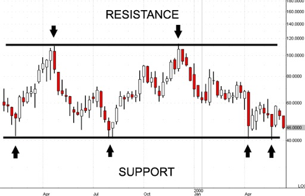
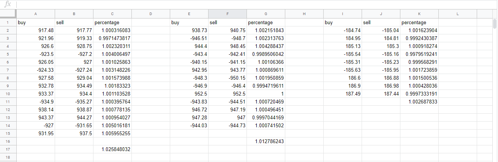
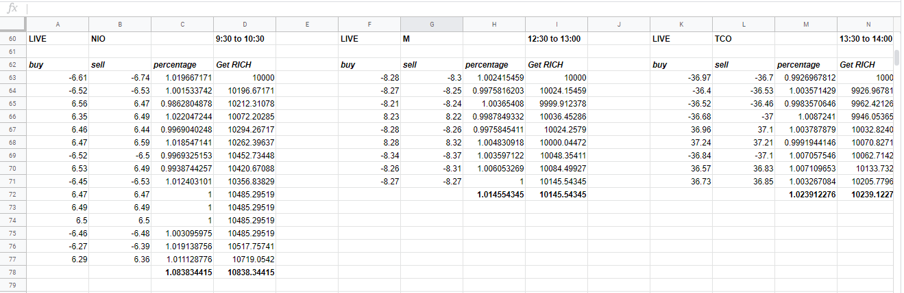
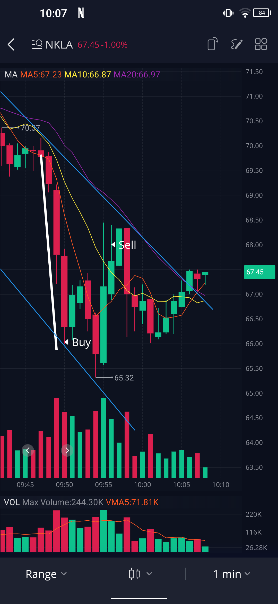
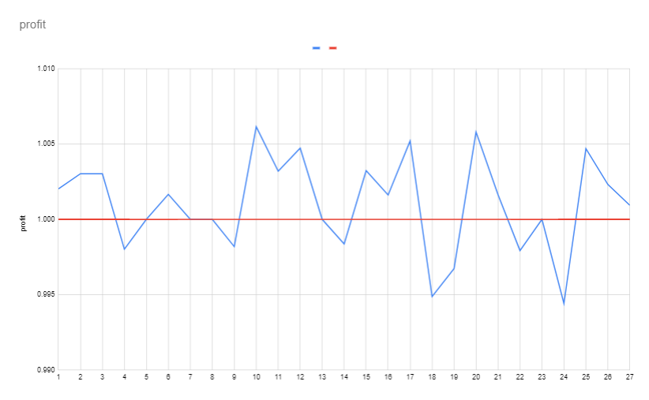

> **This post is outdated**
>
> This post represents my experience on paper trading stocks back in June of 2020. The methods used are very risky and naive as I didn't have a proper understanding of investing back then. This post was preserved nonetheless.

&nbsp;

&nbsp;

## June 8th

A few months ago, I was watching videos of people talking about strategies for the stock market. I got very intrigued because of how easy it looked to buy and sell shares at the right time. A recurring theme in those videos was the _support_ and _resistance_ lines:

> In stock market technical analysis, support and resistance are certain predetermined levels of the price of a security at which it is thought that the price will tend to stop and reverse. These levels are denoted by multiple touches of price without a breakthrough of the level.
>
> [Wikipedia](https://en.wikipedia.org/wiki/Support_and_resistance)

_Support_ and _resistance_ lines look something like this in a chart:



They are incredibly useful because they tell you where the price is likely going to bouce back, and if the price doesn't do so and crosses the lines instead, it is very likely that it will continue going in the same direction for a little while. However, I couldn't for the life of me figure out how to put these lines at the correct places in a trading chart. But this morning, everything changed: I don't know how, but I was actually able to easily identify the [support and resistance](https://en.wikipedia.org/wiki/Support_and_resistance) lines in a chart! This is the moment I decided I would learn more about the stock market.

## June 9th

Today, I practiced trading in my head. To do so, I went on the 1-minute chart on [Investing.com](https://investing.com) and I used the `right arrow` key to advance through time while making predictions about the stock's price. After a whole day of doing predictions in my head, I think I am ready to take note of the price of the stock when I buy or sell shares in order to see if I am able to make a profit.

This evening, I opened up a [Google Sheets](https://sheets.google.com) spreadsheet to take note of all my buy and sell decisions. To my surprise, I was actually making a (very small) profit!



## June 10th

This morning, I decided I would use live stock data from [Investing.com](https://investing.com) to make practice trades instead of advancing through time manually. I also thought it might be a good idea to find stocks with high volatility instead of just picking random ones (silly me...). So before the markets opened today, I went on [Stock Fetcher](https://www.stockfetcher.com/) and entered the following filter:

```python
show stocks where Average Day Range(20) is largest
  and Price is below 100
  add column Average Day Range(20)
```

After a few seconds, I was greeted with 5 of the most volatile stocks in the last 20 days! I used these stocks to do the trading instead of using random ones, and it made a huge difference! Here are my results, with `10000$` as a starting budget (look at the number in bold to see my profits!):


## June 11th

This morning, I wanted to practice trading using a paper trading account:

> A stock market simulator is a program or application that attempts to reproduce or duplicate some or all the features of a live stock market on a computer so that a player may practice trading stocks without financial risk. Paper trading (sometimes also called "virtual stock trading") is a simulated trading process in which would-be investors can 'practice' investing without committing real money.
>
> [Wikipedia](https://en.wikipedia.org/wiki/Stock_market_simulator)

It simulates the process of buying and selling shares very accurately. In order to find the most active stocks with a resonnable share price and a large enough volume, I entered the following filter on [Stock Fetcher](https://www.stockfetcher.com/):

```python
show stocks where Average Day Range(20) is largest
  and Average Volume(20) is above 2000000
  and Price is above $5
  add column Average Day Range(20)
  add column Average Volume(20)
```

Then from 9:30 to 10:30, I paper traded with an app called _Webull_. During this 1-hour trading session, I earned literally nothing. In the first 15 minutes, I earned about `100 000$` from `1 000 000$`, which corresponds to about 10% profit. This is considered a very large number in stock terms. Then, decided to sell short in order to benefit from the stocks going in a downwards trend. But then, when I wanted to buy back the stocks I sold, the app was telling me that I had `-21 000` dollars in my account when I should have more than `2 000 000$`. This totally threw me off: I had a negative balance and a negative number of shares! When I finally figured out how to buy shares back, it was already too late and I had lost literally every penny of profit I had previously made.

At about 10 o'clock, I successfully predicted that the stock was going to go up by a large amount. Because of that, I made another `80 000$` in profit! I now had `1 080 000$` in my account. But again in the last 25 minutes, since I had no idea what was the difference between _market_ and _limit_ orders, I slowly lost all the profit I had managed to make. I ended the session with `997 033$`, which is basically exactly the amount I started with.

## June 12th

Last evening, I was starting to question [Stock Fetcher](https://stockfetcher.com). When using the filter I made (`show stocks where Average Day Range(20) is largest`), I noticed that the `Average Day Range` was not actually that large. In fact, it ranged from `5%` to `10%`, which is not that impressive. Because of that, I decided to go take a read in the [Stock Fetcher User Guide](https://www3.stockfetcher.com/download/sfuserguide2_0.pdf) to see if there is an official way to sort the stocks it gives as an output. I found the following:

> By default StockFetcher returns stock screen results in order of highest to lowest volume. `...` Additionally, using the sort column feature, you can have the initial filter results arrive using the sorting you want.

So basically, my last two [Stock Fetcher](https://stockfetcher.com) filters were totally useless... This is why I decided to create a new one! Here it is:

```python
show stocks where 1
  and Average Day Range(20) is above 0
  and Average Volume(20) is above 2000000
  and Price is above $5
  and add column Average Day Range(20)
  and add column Average Volume(20)
  and sort column 5 descending
```

I used this new filter this morning to find `DGLY`, the company I decided to do some trading with. This was an adventure... Basically, after buying `2000` shares, I wanted to obviously sell them back. However, the app only let me sell about `20` at a time. After a bunch of trouble, I finally managed to sell all `2000` shares... only the app was still showing that I had not sold any. Therefore, I did the same thing once again in order to sell the remaining shares. However, when I went back in my portfolio, I owned `-2000` shares, meaning I had sold `2000` shares short. This was a tricky situation, because if I didn't buy back the `2000` shares for cheap, I would be in very severe virtual debt (one click away from the `RESET PORTFOLIO` button, but let's not talk about that). Thankfully, everything went fine and I ended up with `128.64$` profit, which is not that bad.

In a few days, I will try to learn some more _day trading_ strategies, which should help me to earn a bunch of virtual profit!

## June 15th

Today, I watched a bunch of videos about _day trading_ for beginners like [this one](https://www.youtube.com/watch?v=YcIBa_XQapo) and [this one](https://www.youtube.com/watch?v=txWaMpSzHhM). I learned that commisionless brokers such as _Robinhood_ are not ideal because the time needed to execute a trade will be way longer than if another broker was used. Then, from 11:00 to 11:45, I traded a bit on the `NKLA` stock. Thankfully, nothing too "interesting" happeend, and I ended up with `135.90$` of profit. This is not that bad considering it was 11 o'clock instead of 9:30 when I started trading, which means that the volatility of the stock was way lower, and therefore profit is trickier to make.

At 15:15 today, I got a notification telling me that the `NKLA` stock went up by `5%`, so I decided to sell short on the peak of the rise. Unfortunately, I didn't make as much profit as I could've because the stock continued to rise a bit after I sold short and it didn't dip as much as I would've wanted, but I still managed to make a `51.81$` profit in a few minutes!

## June 16th

This morning, in exactly 9 minutes, I made `262.35$` of profit, which represents `2.5%` of my account value. This is one of the best trades I ever made! To explain better, here's a screenshot of the `NKLA` stock from the _Webull_ app:



Unfortunately, since I tuned in at 9:49 (clever me thought that taking a shower at 9:20 was a good idea), I missed the big dip (thick white line in the image above). If I had sold short on the top of that line, I would've certainly made way more profit, but oh well...

At this point, you may be asking yourself:

> But How did you make all that profit?

In fact, it was very simple. At 9:50, before buying shares (see _buy_ in the image above), I studied the past stock prices and concluded that it was very unlikely that the price would go down any more than it already had. Because of that, I decided to buy `159` shares of the stock. The price went up a bit before going down again, but I held onto my `159` shares until the price went back up to the trendline resistance level (the thin blue line in the image above). Then, I sold everything for a few more cents per share (see _sell_ in the image above), which was enough to make a pretty decent profit!

This afternoon, I discovered a new stock called `JFIN`, which has a `Average Day Range(20)` of `36.40`. I decided to trade with it from 13:15 to 13:30 and made a single trade, which earned me `192.78$`! I now have `10 947.78$` in my paper trading accound, which is dangerously close to `1000$` of profit in total!

Actually, it's now 13:38 and I traded again on `JFIN`, and made another `221.26$`! In total up to now, I have made `1169.04$`! Everything is going too well, and I have a feeling that something will go south...

WHAT ON EARTH it's 13:58 and I just made another `151.12$`! I literally don't know what to think anymore... This is awesome!

alrigt me just losin me mind rn me just profit ahther `150.16$` me dreamin or wat? me think me goin crazzzzzy

kkk now me just list the profit me make cuz me cannot handle dis anymore:

- `78.40$`
- `114.30$`
- `-19.70$`
- `96.85$`
- `103.85$`
- `225.72$`

## June 17th

Yesterday, I managed to make a lot of profit! I ended up with more than `1500$` in one day, which is awesome! Anyway, this morning, I entered a new filter into [Stock Fetcher](https://www.stockfetcher.com/) in order to try to find better stocks to trade with. Here it is:

```python
show stocks where Price is above $5
  and Average Day Range(30) is above 10
  and Average Day Range(10) Less than 5 percent Above Average Day Range(30)
```

The first line ensures that the stock's price is above `5$`. The second makes sure that the stock is volatile and the third makes sure that the volatility is long-term, and not short-term. The results are then sorted by volume. This new filter has helped me to find the `UGAZ` stock, which I traded a bit with. However, I only managed to make a few hundred dollars this morning because I couldn't trade on the `JFIN` stock since its volume was way too low.

## June 22nd

Today, nothing too interesting happened. I made a few hundred dollars in 45 minutes, from 9:45 to 10:30, which means that my account is now at `13 001.80$`. I am very happy to have reached this milestone! I also found a new stock with June 17th's filter, `SAVE`. I should trade a bit more with it because it has one of the best volatilities and has the highest volume of the bunch. This will allow me to make small transactions very quickly, which is very important in _day trading_.

## June 23rd

Yesterday night, I wanted to try to plot the revenue I make in a graph to be able to visualize it. Here it is:



As you can see, the losses I make (below the red line) are usually smaller than the gains I make (above the red line). However, today was a very bad day and I was only able to make about `75$` in 45 minutes on `ERI`, `SAVE` and `UGAZ`. If you look from `15` to `27` on the `x` axis, representing the trades I made today, you will see that the losses I made were almost as large as the gains. This means that I lost about as much as I made, meaning I didn't make a very big profit.

## Updates Coming Soon!
