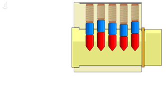

## A Long Journey...

For a few years now, I've been [lock picking](https://en.wikipedia.org/wiki/Lock_picking) (if you can even call it that) small padlocks with [paper clips](https://en.wikipedia.org/wiki/Paper_clip) and [hairpins](https://en.wikipedia.org/wiki/Hairpin). I used pliers to create tools by bending them in specific places, which I then used to open very small locks. However, a few months ago, I got fed up of DIY tools that kept bending and breaking. After a bit of shopping, I found a perfect [beginner kit](https://www.banggood.com/DANIU-Transparent-Practice-Padlocks-with-12pcs-Unlocking-Lock-Pick-Set-Key-Extractor-Tool-Lock-Pick-Tools-p-1168495.html?rmmds=myorder&cur_warehouse=USA) on [Banggood](http://banggood.com/), which was even recommended by _the lock picking god_ (also known as [The LockPickingLawyer](https://www.youtube.com/channel/UCm9K6rby98W8JigLoZOh6FQ)) in a [video of his](https://www.youtube.com/watch?v=YRPLGnR_6XI). It looks a bit like this:

According to [The LockPickingLawyer](https://www.youtube.com/channel/UCm9K6rby98W8JigLoZOh6FQ), the only downside of this kit was the _tension wrenches_, which bent really easily. Fortunately, it turned out that the [one I ordered](https://www.banggood.com/DANIU-Transparent-Practice-Padlocks-with-12pcs-Unlocking-Lock-Pick-Set-Key-Extractor-Tool-Lock-Pick-Tools-p-1168495.html?rmmds=myorder&cur_warehouse=USA) was a bit different, so I ended up receiving thick metal tension wrenches with my lock picking kit instead of the low-quality ones he got.

## How Lock Picking Works

[Lock picking](https://en.wikipedia.org/wiki/Lock_picking) is very simple in principle, but very hard in practice. In order to pick locks, you need two basic items:

- A [tension wrench](https://en.wikipedia.org/wiki/Lock_picking#Tension_wrench), used to put tension on and turn the core
- A _pick_, used to manipulate the pins of the lock

There are many types of _picks_, but they can be organized in two basic categories: [rake picks](https://en.wikipedia.org/wiki/Lock_picking#Rake_picks) (used to manipulate all the pins at once) and [hook picks](https://en.wikipedia.org/wiki/Lock_picking#Hook_pick) (used to set one pin at a time). It is a bit tricky to explain how they work together to open locks, so here is an awesome animation showing off _single-pin picking_:

#demo

In this animation, the _tension wrench_ is the `L`-shaped tool on the bottom, and the _pick_ is the curved tool on the top. In essence, because of tiny [manufacturing defects](https://en.wikipedia.org/wiki/Glossary_of_locksmithing_terms#shear_line) in the lock, only a single pin at a time is receiving all the torque created by the _tension wrench_ (represented by an orange zigzag line in the animation). It just a matter of finding that pin, then lifting it to the right height until it **clicks**, and moving on to the next one. After every pin clears the [shear line](https://en.wikipedia.org/wiki/Glossary_of_locksmithing_terms#shear_line), nothing is holding the core from turning and the lock opens!

## ...And Still a Long Way to Go

After a few hours of practice, I opened the door of my house for the first time. To be honest, this first attempt was just [lock](./lock.html) (sorry, I had to). I continued practicing for a bit more, and after about a few minutes, I opened it again... and then seconds later, again... and again... and again. I am now able to feel if I have overset a pin or if I have set it correctly, and I am not just waving my pick around anymore. However, I do still find it hard to open different locks, which need different amounts of tension, and skill. I still have a long way to go before being able to call myself a [lock picking expert](https://www.youtube.com/channel/UCm9K6rby98W8JigLoZOh6FQ)...
