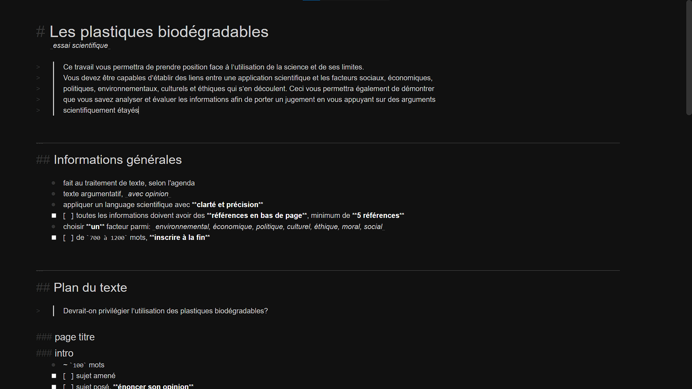

## An Overview

_[Markdown Inine Formatter](https://github.com/Bricktech2000/Markdown-Inline-Formatter)_ is a program that formats `markdown` code right in the editor itself.

> Markdown is a lightweight markup language for creating formatted text using a plain-text editor. John Gruber and Aaron Swartz created Markdown in 2004 as a markup language that is appealing to human readers in its source code form. Markdown is widely used in blogging, instant messaging, online forums, collaborative software, documentation pages, and readme files.
>
> [Wikipedia](https://en.wikipedia.org/wiki/Markdown)

Every post in this very website is programmed in `markdown`. It allows for very human-readable source code, which then gets compiled and styled for the end user. It is very similar to [Google Docs](https://www.google.ca/docs/about/) or [Microsoft Word](https://www.microsoft.com/en-ca/microsoft-365/word), but all the formatting is done in plain text instead of with the program's user interface. If you wish to see what `markdown` looks like, you can [click here](./index.md) to see this post's source code!

#screenshot

However, [Markdown Inine Formatter](https://github.com/Bricktech2000/Markdown-Inline-Formatter) is different to other editors because it formats the code in the editor itself as opposed to using a second intervace to do so. You can [click here](./Markdown-Inline-Formatter/index.html) to try it out for yourself! For anyone interested, here is a screenshot of some inline-formatted `markdown` code that I used to get a general overview of a school assignment:

## How it Works

This program is fairly simple. In order to allow the user to edit the formatted `markdown` code directly, it saves and restores the carret position while highlighting and formatting the source code using [Prism.js](https://prismjs.com/). Once formatted, the `CSS` code then styles all the `HTML` elements generated previously. Here are a few of its defining features (along with a **slight bit of humor**):

> - Inline formatting for markdown synatx
> - Awesome-looking scrollbar on dark theme
> - Half of the code yeeted from the internet
> - No `save` or `save as` option
> - Very crappy `undo` and `redo` shortcuts
> - Extremely buggy user interface
>
> &#8212; From the project's `readme`

## Moving Forward

I have literally no idea what this project could be used for. However, for the time being, I use it to plan out various assignments for school, such as _essays_ or _scientific research_. It is very convenient to be able to format text straight in the editor as oppsed to needing to use the user interface on [Google Docs](https://www.google.ca/docs/about/), for instance. Even though this project is a bodge of a bunch of code copied from the internet, It's awesome that it actually works!
