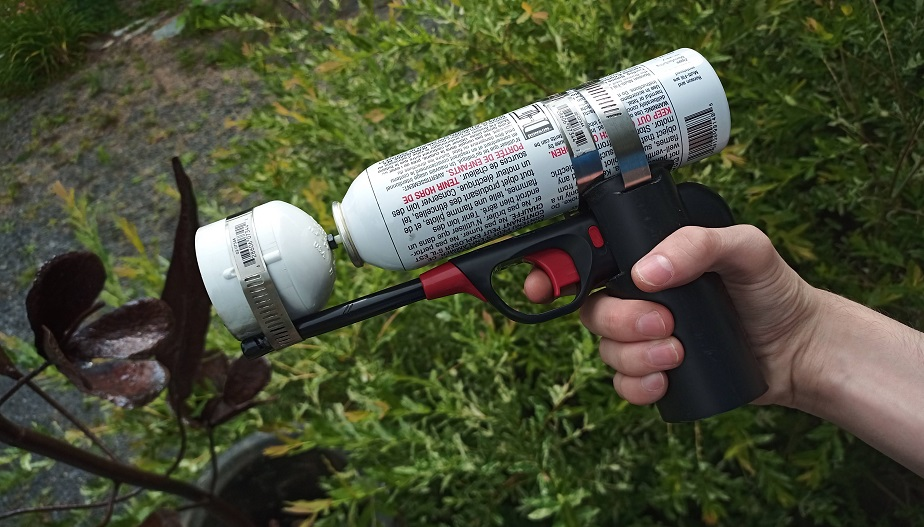

## The Idea

A few days ago, I was playing around with a can of [WD-40](https://www.wd40.com/) when I saw it had a huge _flammable_ logo on it. Obviously, my first thought was to use a lighter to make a mini flame thrower out of it. To my surprise, it worked wonders! At that point, I thought to myself...

> How far can I take this idea?

This is when I started brainstorming for a way to create a [mini DIY flamethrower](.).

## The Plan

After spending a few hours roaming around hardware stores, I had a pretty good idea of how I wanted to build my flame thrower. At first, I was planning on using [ABS pipes](https://www.google.com/search?q=abs+pipe&source=lnms&tbm=isch&sa=X) to make the frame of the flamethrower. However, since I wanted to use a [butane refill can](https://www.google.com/search?q=butane+refill+can&tbm=isch&sa=X) as a fuel source, it would be next to impossible to depress its nozzle through a trigger. For this reason, I had to use the can itself as a frame.
#img

I came up with a fairly clever design for the gas dispenser. As can see in the image above, the flamethrower uses a [barbecue lighter](https://www.google.com/search?q=barbecue+lighter&&source=lnms&tbm=isch&sa=X) to ignite the butane coming out of the [refill can](https://www.google.com/search?q=butane+refill+can&tbm=isch&sa=X). However, it is only attached to the can's nozzle and can slide freely through the handle. This way, a 3 step procedure takes place when one presses the flamethrower's trigger:

1. The nozzle of the [butane refill can](https://www.google.com/search?q=butane+refill+can&tbm=isch&sa=X) gets depressed when the [barbecue lighter](https://www.google.com/search?q=barbecue+lighter&&source=lnms&tbm=isch&sa=X) is pulled backwards.
2. The [barbecue lighter](https://www.google.com/search?q=barbecue+lighter&&source=lnms&tbm=isch&sa=X) hits the end stop, which depresses its trigger.
3. The butane is ignited and a large flame comes out of its nozzle.

#parts
For anyone interested, here is a parts list for this flamethrower:

- 1 Steel M4 nut
- 2 `2"` Stainless Steel Hose Clamp
- 1 `3"` Stainless Steel Hose Clamp
- 1 [Butane Refill Can](https://www.amazon.ca/Ronson-Multi-Fill-Butane-165-Gram/dp/B00QL5DW3A/) &mdash; `165g`
- 1 [Barbecue Lighter](https://www.homedepot.ca/product/grillpro-mini-barbecue-and-utility-lighters-3-pack-/1000724000) &mdash; hard shaft
- 1 `2"` PVC cap
- 1 `1.5"` ABS pipe &mdash; `110 mm` long

## The Outcome

After this long and tedious build process, I was left with an **awesome** mini flamethrower. What's more, I spent only `30$` on the whole thing and had a lot of fun designing it. I still haven't been able to get the explosives required to finalize my [DIY Grenade](../DIY-Grenade/), so I guess this makes up for it. Below is a video of the flamethrower in action!
#demo

