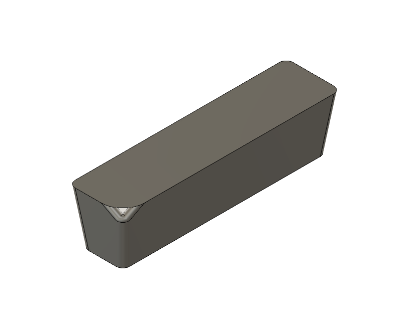
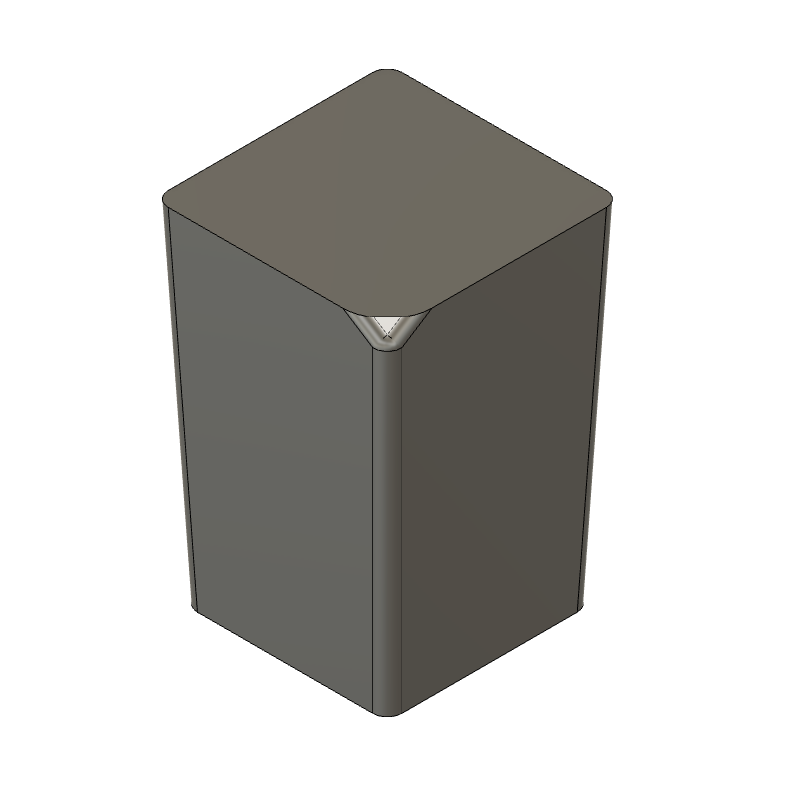
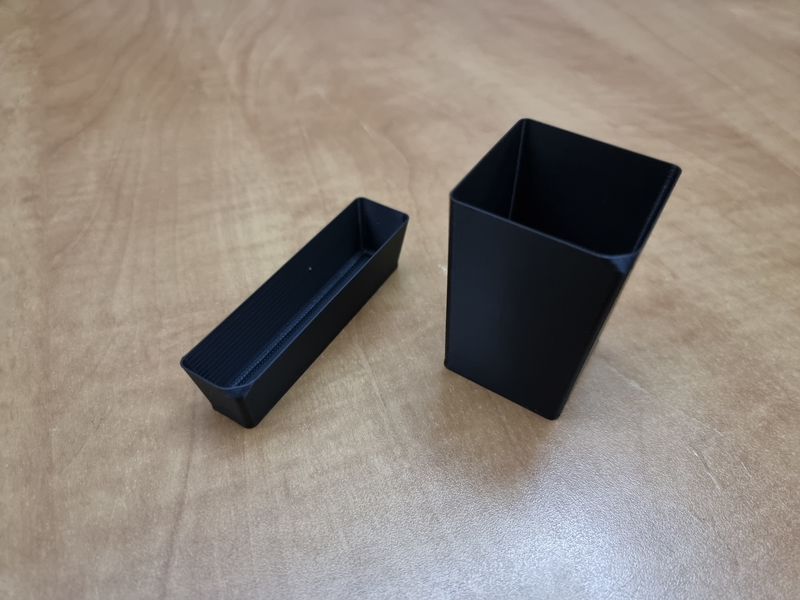
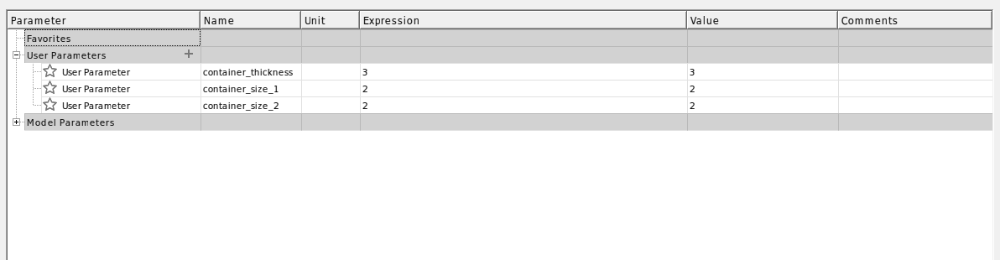
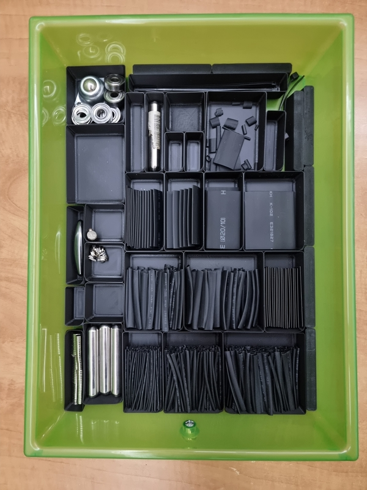
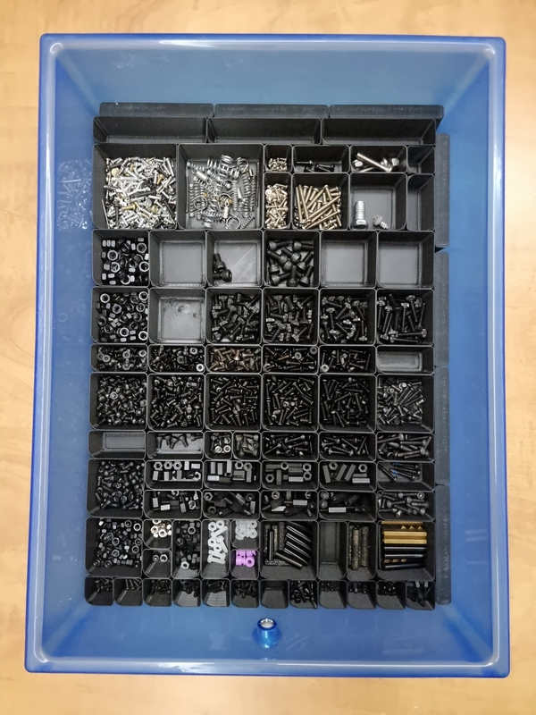
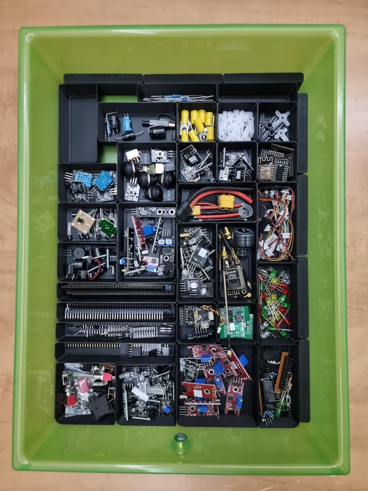
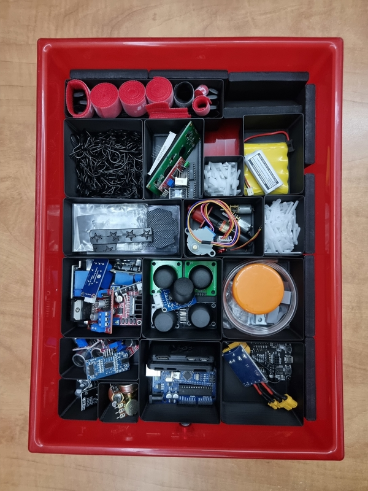
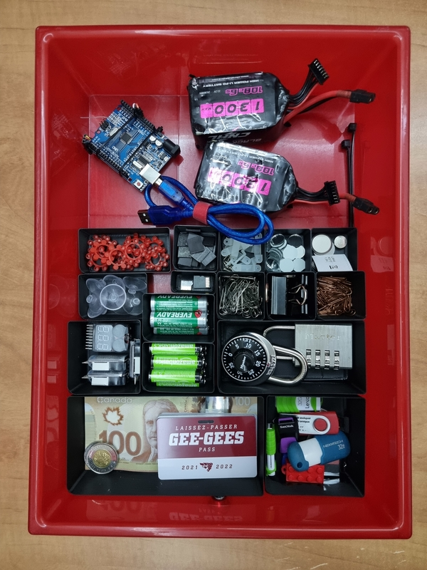

## Preface

For the last two years, I had been sorting all my electronic parts and hardware components in cheap low-quality [parts organizers](https://www.canac.ca/en/tool-storage-organizer-6130040) I had found at a hardware store. They were definitely a step in the right direction, but were still flawed in one main way: all drawers were identical in size. This meant that both tiny parts (screws, LEDs, transistors...) and relatively large parts (motor drivers, microcontrollers, joysticks...) had to fit in medium-sized drawers.

The initial solution I came up with was a system of [modular containers](../Modular-Containers) that would lock together to form a mosaic, which you can read more about [here](../Modular-Containers). However, this solution still had two main issues: the height of the containers was constant (too tall for small containers and too shallow for large ones), and the interlocking system I used was too effective (it was almost impossible to take one drawer without brigning half the mosaic along with it).

Because of the issues present in both systems, I had been using a hybrid of the [parts organizers](https://www.canac.ca/en/tool-storage-organizer-6130040) and of my [modular containers](../Modular-Containers) to store my supplies, until now. About two weeks ago, I decided I would go ahead and create the ideal all-in-one sorting system: [Modular Containers 2.0](./).

## Designing the Containers

My main design goals for version `2.0` of my modular containers were as follows:

- The ability to store both tiny and relatively large parts
- The ability to bring an individual container with me to the work bench
- Have the system be entirely modular and easily expandable
- Be able to print other modules relatively quickly

With those goals in mind, I started designing the containers using [Fusion 360](https://www.autodesk.ca/en/products/fusion-360/overview). As I knew I wanted to be able to print the containers quickly, I decided to use a setting known _Vase Mode_ on [Cura](https://ultimaker.com/software/ultimaker-cura). This meant that even though the 3D designs below are solid chunks of plastic, they would end up hollow after printing. Here are a few examples of the containers I designed:
#design

|                                                       |                                                       |
| ----------------------------------------------------- | ----------------------------------------------------- |
|  |  |

I designed the containers to have an angled edge in order to prevent then from catching on their neighbours when bringing individual ones with me. The bottom-left corner of each container is also chamfered to act as a handle once printed.

As I wanted this solution to be entirely modular, I had to come up with a system to determine what sizes of containers I would allow. The way I ended up solving this problem was very simple: I decided on a pseudo set of prime numbers which I then multiplied together to get a set of all possible container dimensions. In this case, I used the pseudo prime set `1, 2, 3`, which produces the following set of side lengths: `1, 2, 3, 4, 6, 8, 9, 12, 16, 18, 20...`. Using this approach meant that a good variety of container dimensions were available, all the while preventing any two containers from being too similar. I used parametric modelling in [Fusion 360](https://www.autodesk.ca/en/products/fusion-360/overview) to allow me to change the size of a container simply by modifying a single parameter, as can be seen below.

## Printing the Containers

Printing the containers was very time consuming and used up about `600 g` of black PLA, which is a surprising quantity. Even with my [Ender 3](https://www.creality3dofficial.com/products/official-creality-ender-3-3d-printer) running at `300%` print speed, it took me a few days of non-stop printing to complete the job.

If you would like to print those containers for yourself, you can download the STL files by clicking [here](Modular%20Containers%202.0.zip). Don't forget to print them using _Vase Mode_, as otherwise, you will end up with huge chunks of solid plastic.

Below are pictures of my current setup with the modular containers.
#img

|  |  |  |  |  |
| --------------------------------------------------------------------- | ---------------------------------------------------------------- | ------------------------------------------------------------------------------- | -------------------------------------------------------------------------- | ------------------------------------------------------------------------------- |
|                                                                       |                                                                  |                                                                                 |                                                                            |                                                                                 |

## Conclusion

[Modular Containers 2.0](./) seem to be the perfect solution to store my electronic parts and hardware components in an efficient and modular manner. After having used them for a few weeks, I noticed that they provide another major advantage: it is now way easier for me to find a specific part, as I have a direct line of sight to everything stored in the containers. This could seem like a minor side effect of the design, but it turns out to be a huge time-saver in the long run. All in all, I am stoked with the final result!
