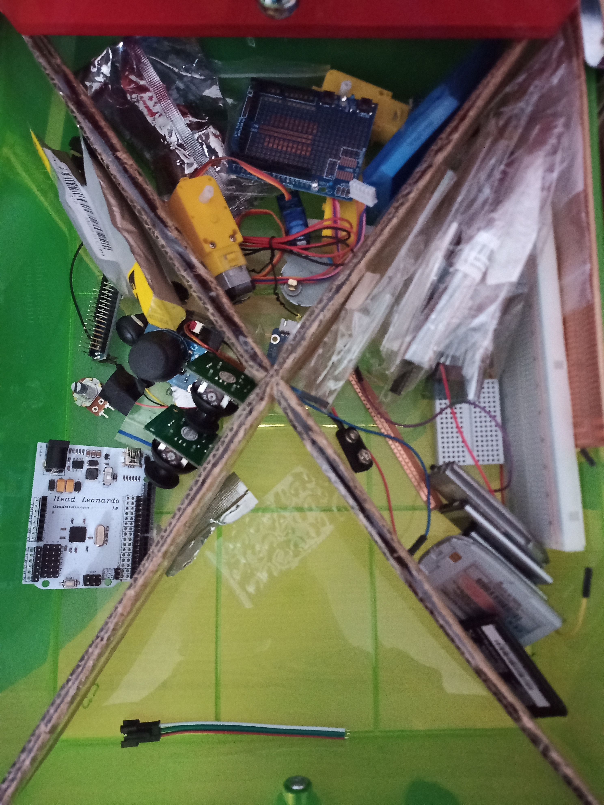

> **This post is outdated**
>
> This initial version of my modular containers has served me well, but I recently came up with an [updated design](../Modular-Containers-2-0). This post was preserved nonetheless.

## The Problem

My electronics drawer has been looking like this for way too long now:

And so recently, I wondered:

> Why wouldn't I find a way to use my 3D printer to fix this issue?

And this is when I began this project.

## The Solution

#img

After a few re-designs and many failed attempts due to incorrect tolerances, I finally managed to get them to fit together! Here's how they look when fully assembled:

If you want to know more about how they were made, you can watch [this video](https://www.youtube.com/watch?v=k7jLqC3cGUY) on my [YouTube Channel](https://www.youtube.com/channel/UCGj6pfxZ0XYJU29XNwXPPxg/featured).
#video

## Why Modular?

According to Wikipedia,

> Broadly speaking, modularity is the degree to which a system's components may be separated and recombined, often with the benefit of flexibility and variety in use.
>
> [Wikipedia](https://en.wikipedia.org/wiki/Modularity)

When I first had the idea to sort my electronics in a better way, I really wanted expandability to be at the heart of the design. Since these containers are modular, you can incredibly easily change how they are arranged to match your taste. Moreover, having them be 3D printed means that if you ever need a bigger container, you simply have to print a new one, and then you just slide it right in to instantly assemble them.

## How do I Get my Own?

A lot of work has gone into making these containers, but I figured I would still open the design up to the public. If you would like to print your own, you can [click here](./Modular%20Drawers%20STLs.zip) to download a `zip` file with every size of container. However, remember to print them using `Vase Mode`, otherwise you will be left with a bunch of blocks of solid plastic!
