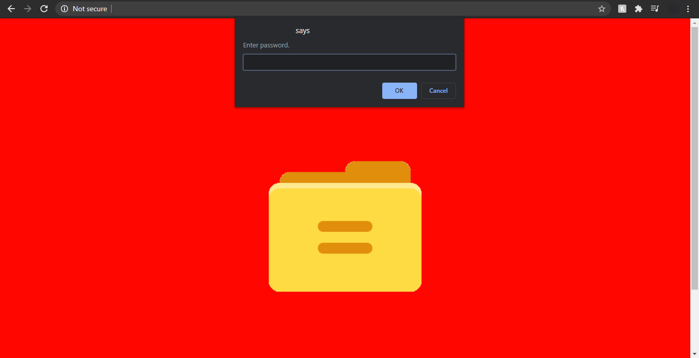

## TL;DR

[MultiToast](https://github.com/Bricktech2000/multiToast) is a highly customizale JavaScript toast library. It allows users to make entirely custom dialog boxes very easily, with only a little programming.

## The Idea

I first got the idea to create this library when my friend, Alexis, was programming his website. One of the pages of his website looked like this:

He wanted an easy way to make a login page, so he used the `prompt(...)` method, included in every browser. The only problem is that this method is blocking, which means that everything in the page stops the when the `prompt` is displayed: animations, videos, `JavaScript` code... Everything just halts until the user closes it. Moreover, `alert`, `prompt` and `confirm` dialogs are not customizable at all, so you are stuck with the browser's style. This is where [MultiToast.JS](https://github.com/Bricktech2000/multiToast) comes in: it is entirely customizable and it is based on `Promise`s, so the rest of the page continues to work even when a toast is displayed.

#demo

## Demo

I have programmed a small example page on [MultiToast's GitHub](https://github.com/Bricktech2000/multiToast), which you can visit by [clicking here](./example/example.html). It showcases the library in a more in-depth manner, with code examples that you can try using a _Try It!_ button.

## Final Words

This was a simple enough project to make. However, the goal of this project wasn't only to make a [toast library](https://github.com/Bricktech2000/multiToast), but also to learn to make a library by itself. I spent a lot of time thinking about the way programs would interface with the library, and it took me a few iterations before being happy with it. This library is also my first [GitHub project](https://github.com/Bricktech2000/), and the second time I used `Git`. It was way easier this way, so I will try use it again in future projects!
