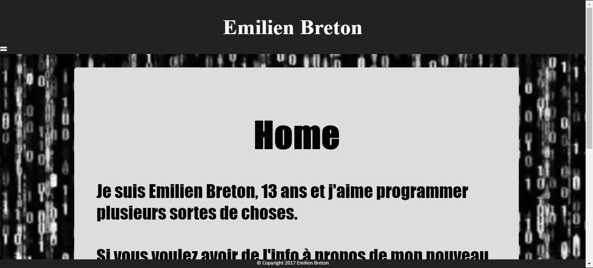

## My First Website

I started programming a few years ago, and one of the first things I made was [this website](./client/index.html). It looks something like this:
#img

I used to think that this website looked awesome, and that the design was great. However, when I look at it today, I see a **disgusting font** way too large for the screen, **ugly colors**, a **blury background image**... I remember showing it to my friends and they thought it was the most awesome thing ever. However, now that I'm looking at it, its design is about as horrible as it gets.

## The Page System

The system that handles the pages of the website is quite peculiar: when you request a page on the website, it is loaded and displayed in an `iframe`, which is normally used to embed a whole other webpage within another website. Using this technique caused many bugs that were hard to track down, partly due to my lack of knowledge of `CSS` and `HTML` quirks. Since I didn't know of any [backend frameworks](https://developer.mozilla.org/en-US/docs/Learn/Server-side/First_steps/Web_frameworks) at the time, this was the only way I could think of to create a header and footer that would persist throughout the website.

## Conclusion

A quote I really like goes as follows:

> Programs must be written for people to read, and only incidentally for machines to execute.
>
> &#8212; Harold Abelson

Despite that, my first website is just a jumbled mess of unreadable code. Looking back however, it was simply a stepping stone into the right direction. Who knows... maybe one day, I will look back at [this very website](https://github.com/Bricktech2000/Website) the same way I look back at [my first website](./client/index.html).
