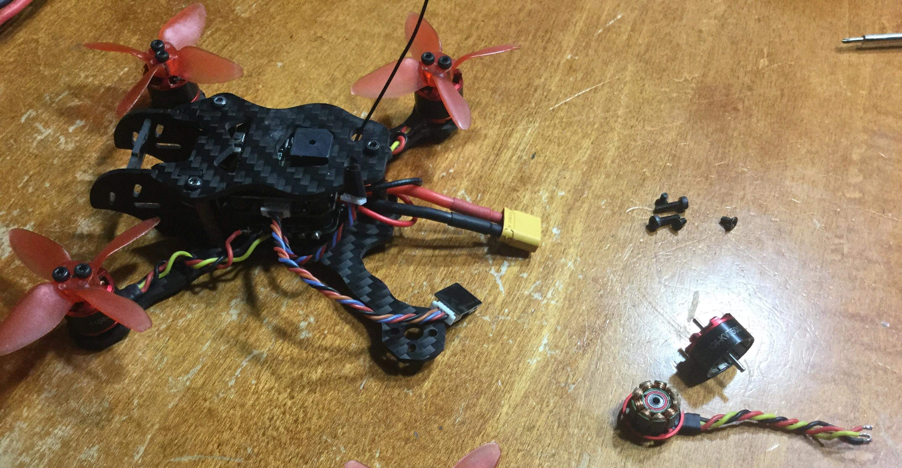

## Preface

About one year ago, I got interested in _racing drones_. Youtubers such as [UAVfutures](https://www.youtube.com/channel/UC3ioIOr3tH6Yz8qzr418R-g), [Joshua Bardwell](https://www.youtube.com/user/loraan), [Mr Steele](https://www.youtube.com/user/MrSteeledavis), [Rotor Riot](https://www.youtube.com/channel/UCemG3VoNCmjP8ucHR2YY7hw) and many more make videos about this kind of drones, and I got hooked into it. They are very powerful machines that can go faster than `200 km/h`... and so I wondered,

> Why wouldn't I make one myself?

And this is where everything began.

## Demo

Here's a demo video on my [youtube channel](https://www.youtube.com/channel/UCGj6pfxZ0XYJU29XNwXPPxg/featured) that shows how much power a 2-inch racing drone can have:

#demo

And here's a picture of it (even if one motor is missing):
#img

It actually flew, but one motor was defective, and so the inner windings melted together. This rendered it useless, so I am currently waiting on a spare. However, because of `COVID-19`, the shipping was delayed.

## How it was built

In order to build such a machine, _soldering_ and _problem-solving_ skills are a must. Since I had already tinkered with electronics before, building this quadcopter was not too hard to do. However, if you have never soldered or programmed before, I do not recommend try to build such a drone. Moreover, _Ready-to-Fly_ (or _RTF_) drones are now widely available, meaning that you do not have to build them from scratch.

#list
Here is a parts list of the components used:

- [Avan 2" Propellers](https://www.banggood.com/6-Pairs-Emax-AVAN-Micro-2-Inch-4-blade-RC-Drone-FPV-Racing-Propeller-Red-for-11XX-4500-6500KV-Motor-p-1277598.html?rmmds=search&ID=228&cur_warehouse=CN) &#8212; `6 pairs`
- [GepRC Hummingbird frame, 110mm](https://www.banggood.com/GEPRC-GEP-HX2-Hummingbird-110mm-Micro-FPV-Racing-X-Frame-Carbon-Fiber-Supports-Runcam-Micro-Swift-p-1200219.html?rmmds=search)
- [Eachine 7500kv 1104 brushless motors](https://www.banggood.com/4X-Eachine-1104-7500KV-2S-Brushless-Motor-For-Eachine-Aurora-90-100-Mini-FPV-Racer-p-1187167.html?rmmds=search&cur_warehouse=CN) &#8212; `4x`
- [Aniversary Special Eachine Minicube Flytower](https://www.banggood.com/Anniversary-Special-Edition-Eachine-Minicube-Flytower-20x20mm-Compatible-Frsky-Flysky-DSM-RX-F3-ESC-p-1179553.html?rmmds=search&ID=529570&cur_warehouse=CN) &#8212; which includes a _Flight Controller_, a _Receiver_ and a `4-in-1` _ESC_
- [Gaoneng 750mAh 2S Lipo Battery](https://www.banggood.com/Gaoneng-GNB-7_4V-750mAh-80C160C-2S-Lipo-Battery-XT30-Plug-for-RC-Model-p-1293407.html?rmmds=search&cur_warehouse=CN)

In the next post, we will make it fly for the first time on camera. See you there!
