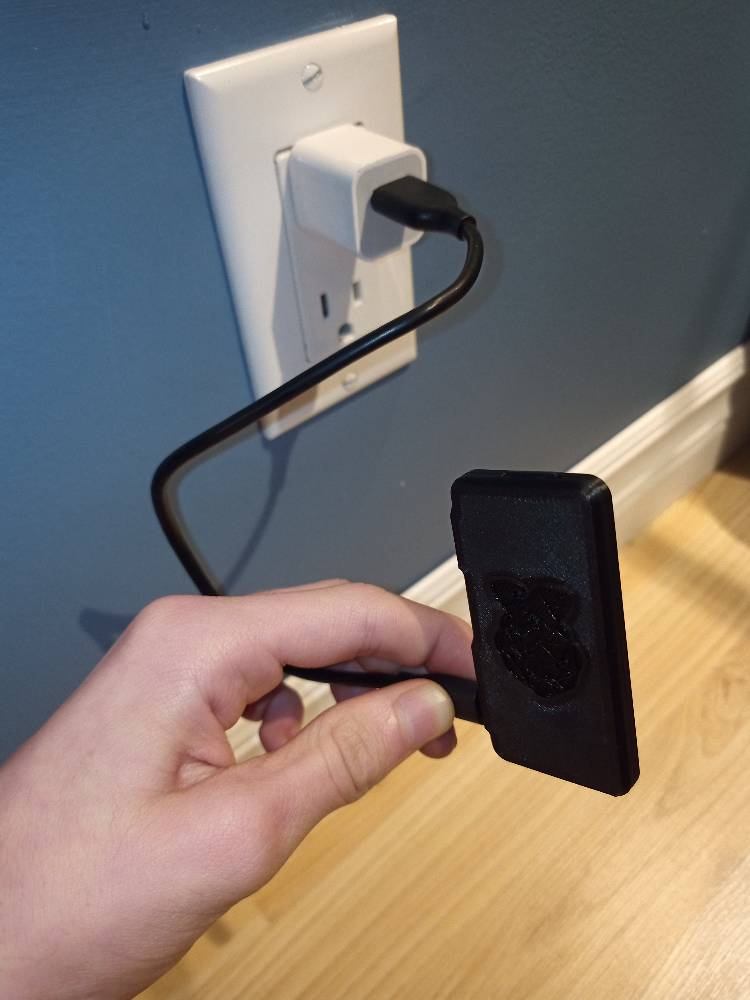

> **This post is outdated**
>
> This website is now hosted on an old HP laptop rather than on a Raspberry Pi and uses Next JS as a backend framework instead of NodeJS. This post was preserved nonetheless.

&nbsp;

&nbsp;

## What is a Raspberry Pi Server?

A Raspberry Pi server is simply a server running off of a Raspberry Pi.

> The Raspberry Pi is a series of small single-board computers developed in the United Kingdom `...`. It now is widely used even in research projects, such as for weather monitoring because of its low cost and portability. It does not include peripherals (such as keyboards and mice) or cases. However, some accessories have been included in several official and unofficial bundles.
>
> [Wikipedia](https://en.wikipedia.org/wiki/Raspberry_Pi)

For this server, I decided to use a _Raspberry Pi Zero W_ because it is cheap, small and portable. Here's a picture of me holding it while it is running:
#img

## A Bit More About it

Here's a picture of a Raspberry Pi Zero W without any case on:
.jpg>)

As you can see, it is a single-board computer, meaning that all the necessary components are on one PCB. It is 66mm long by 30.5mm wide. Impressively, it is only 5mm thick!

> And such a tiny computer can be used as a server?

Actually, it can do way more that what you might think. Obviously, it doesn't have a lot of computing power, but it is the server that is currently serving this very website to you! It uses NodeJS as its backend framework, which means that the back-end code is written in `Javascript`, the exact same language as the front-end. This makes server-side programming way easier.

I also wanted it to look a bit better than just a random PCB plugged into a power outlet, so I decided to print a case for it using my 3D printer, the [Ender 3](https://www.creality3d.shop/products/creality3d-ender-3-pro-high-precision-3d-printer). It is divided into two parts, which each take about half an hour to print. You can [click here](https://www.thingiverse.com/thing:2962386) if you would like to download the files for yourself! However, make sure to use `PiZeroCase_Bottom.STL` as the bottom piece and `PiZeroCase_Top_Pins.STL` (with or without a logo) for the top plate, otherwise you will need to supply your own screws to assemble the case.

## Final Words

I learned a lot about how [Linux](https://www.linux.org/) works in the making of this server because Raspberry Pi's run on Raspbian, which is based on Debian, a distribution of Linux. For the record, the first Linux command I learned is `ls`, which stands for _list_ (it is used to display the files in the current directory in the console). I am definitely going to try to learn more about Linux, because it seems to be an awesome operating system. Anyhow, I had a lot of fun making this project work!
