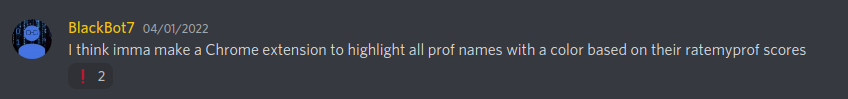
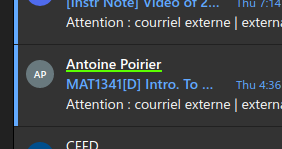
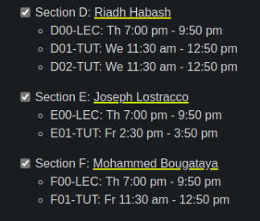
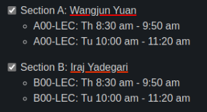
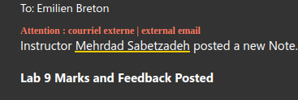
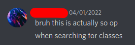

## The Idea

Everything started with a random idea I got a few days ago:

I had already thought about making such an extension, but I hadn't yet taken the time to actually do it. As it turns out, a bunch students complaining about [professor ratings](https://www.ratemyprofessors.com/) is exactly what I needed to push me to start the project.

## Technical Challenges

Making [this extension](https://github.com/Bricktech2000/RateMyProf-Extension) turned out to be about as easy as I was expecting. As it turns out, [Rate My Professors](https://www.ratemyprofessors.com/) has an open API endpoint that allows anyone to download data from their database, entirely for free. I used this endpoint to get all the scores for professor working for the [University of Ottawa](https://www2.uottawa.ca/en), which is the university I am attending.

One of the technical challenges I faced while designing this extension was page performance. As it turns out, running millions of `RegExp` matches every time the DOM gets updated isn't really feasible, even on a modern CPU. To solve this issue, I ended up using a `MutationObserver` to match on professor names only on DOM nodes that actually got modified since the last update, which greatly improved performance. This change along with a simple _debounce_ function implementation made it possible to keep the extension running in the background with only a minimal performance hit.

> Events such as scrolling, mouse movement, and keypress bring great overhead with them if they are captured every single time they fire. [Debouncing] aims to reduce overhead by preventing a function from being called several times in succession.
> &mdash; [educative](https://www.educative.io/edpresso/how-to-use-the-debounce-function-in-javascript)

A little `CSS` is all that was left to complete the extension!

## The Result

Below are some screenshots of professor names that were underlined by [the extension](https://github.com/Bricktech2000/RateMyProf-Extension) with a color corresponding to their [Rate My Professors](https://www.ratemyprofessors.com/) score, from green all the way to red. Professor names can also be clicked on to open their [Rate My Professors](https://www.ratemyprofessors.com/) page, which is incredibly useful to quickly get a more in-depth overview of student opinions on a specific professor.
#img

|  |  |  |  |
| ---------------------------------------------------------------- | ---------------------------------------------------------------- | ------------------------------------------------------------- | ----------------------------------------------------------------- |
|                                                                  |                                                                  |                                                               |                                                                   |

And, for the sake of completeness, here are some comments I received from fellow students:

|  |  |  |  |
| ------------------------------------------------ | ------------------------------------------------ | ------------------------------------------------ | ------------------------------------------------ |
|                                                  |                                                  |                                                  |                                                  |

## Final Words

This extension turned out to be very useful when enrolling to classes as it is usually too time consuming to look up the ratings of every professor that offers a specific course. It is also **very calming** to see a bright red underline accompanying the name of a professor who just sent out an email to hundreds of students for a last-minute radical modification to the course. If this sounds appealing to you, don't forget to [try the extension out](https://github.com/Bricktech2000/RateMyProf-Extension)!
