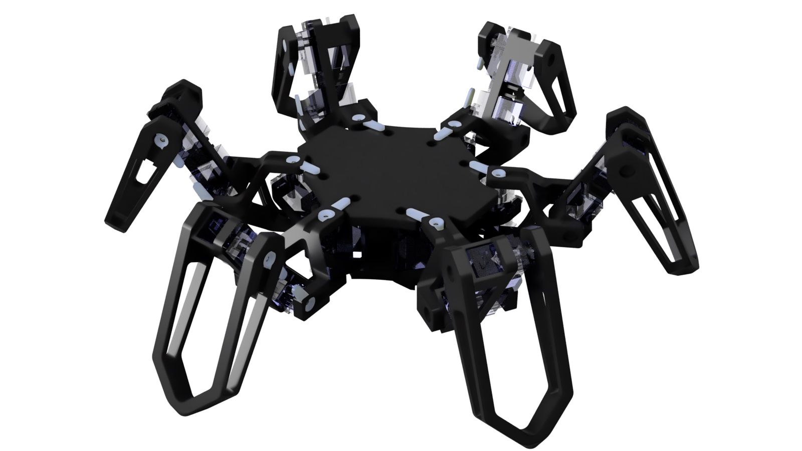
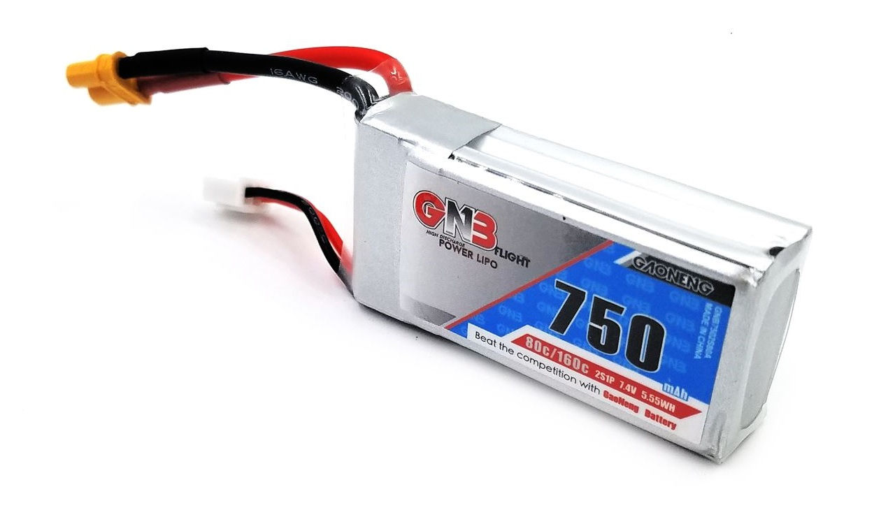
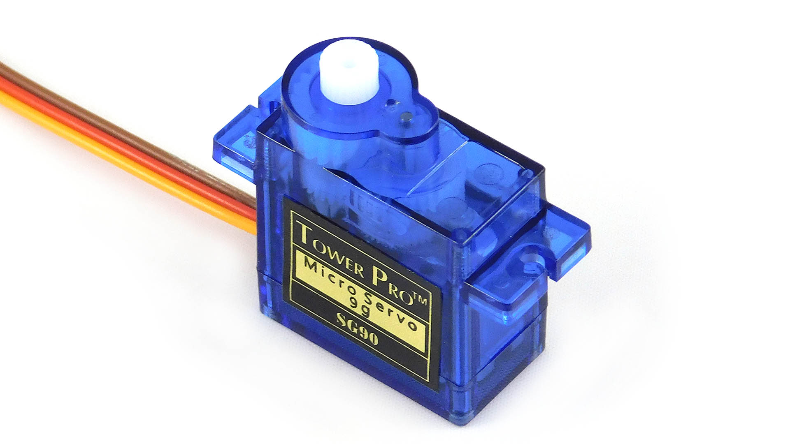

## Demo Video

Here's a demo video that shows the movements the spider can do:

#demo

## Inspiration

I got most of my inspiration from YouTube videos. Here are a few that have inspired me to create this hexapod robot:

- [Smallp Tsai](https://www.youtube.com/watch?v=To2Y6Mhu-CE) - a compact, micro-servo based hexapod
- [Zenta](https://www.youtube.com/watch?v=rAeQn5QnyXo) - an agile, organic-looking hexapod robot
- [Hari Wiguna](https://www.youtube.com/watch?v=9Pos9pE8xwU) - a simple, SG90-based spider robot

When making this hexapod robot, I had a few goals in mind which I wanted to respect: it needed to be cheap, compact and not move like a stereotyped robot. I think this robot is exactly that: its total cost is about `$50`, all the electronics have been chosen for maximum space efficiency and its movements are fairly organic-looking.

## How does it work?

This robot works in 4 stages.

Everything begins with the battery of the spider, which is used to give power to every component. It is a _LiPo battery_, which means that can deliver a lot of current without sagging too much.

> These batteries provide higher specific energy than other lithium battery types and are used in applications where weight is a critical feature, like mobile devices and radio-controlled aircraft.
>
> [Wikipedia](https://en.wikipedia.org/wiki/Lithium_polymer_battery)

This is ideal, but it means that a special _LiPo_ charger is necessary to charge up the battery. Since it packs so much power in such a small volume, it can catch on fire if it is punctured, so we need to be very careful with it.

The battery then sends power to the arduino board, in this case an _arduino nano_. I chose it because it has enough digital pins to interface with the _servomotors_, while also being compact enough to fit in the body of the spider. It acts like the brain of a real spider: it takes the input from the transmitter and tells the motors how to move in order to achieve the requested movement. It executes [the program](./13_sketch_mar04a.html), which is a total of `886` lines of code.

The servomotors are like muscles: their job is to transform the signals received from the _microcontroller_ into actual movements that allow the spider to move. They are cheap (about `$1` per motor), but still have an okay performance. These motors aren't like normal motors, they are _servomotors_. This means that when the _micrcontroller_ tells it to go to a specific angle (or _position_), it does so and tries to keep the same angle the whole time, until it is sent another command from the _microcontroller_.

> And How do I Make my Own?

This is a very good question. if you want to make your own spider robot, you need to know electronics, soldering and _arduino_ programming. Here are some links for the code and the 3D parts, which you need to 3D-print yourself:

- [The Program](./13_sketch_mar04a.html)
- [The Tibia Piece](Tibia%205%20v2.stl) - You need 6 of them
- [The Femur Piece](Femur%203%20v8.stl) - You need 6 of them
- [The Hip Piece](Hip%203%20v12.stl) - You guessed it, 6 of them
- [The Upper Body Piece](Body%20Cover%202%20v30.stl) - You only need 1
- [The Lower Body Piece](Body%206%20v22.stl) - You also only need 1

It is still recommended to contact me if you want to build an exact replica of my robot, since no schematics or wiring diagrams are available yet.

## Conclusion

This project is one of the most advanced I have ever done to date. It has thought me many essential skills in _programming_, _3d design_ and _electronics_. I strongly recommend you try to make such projects, because it will also teach you essential skills such as _problem solving_, which will be useful during your entire life.
