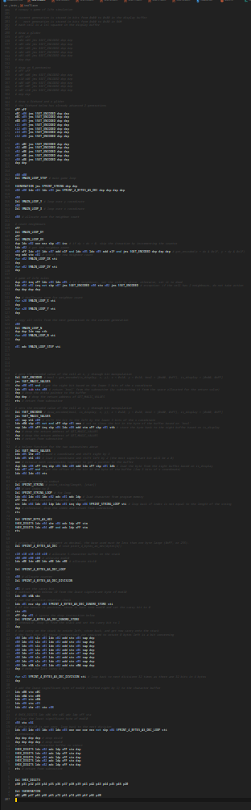
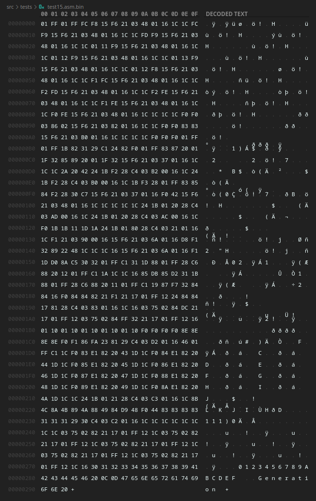
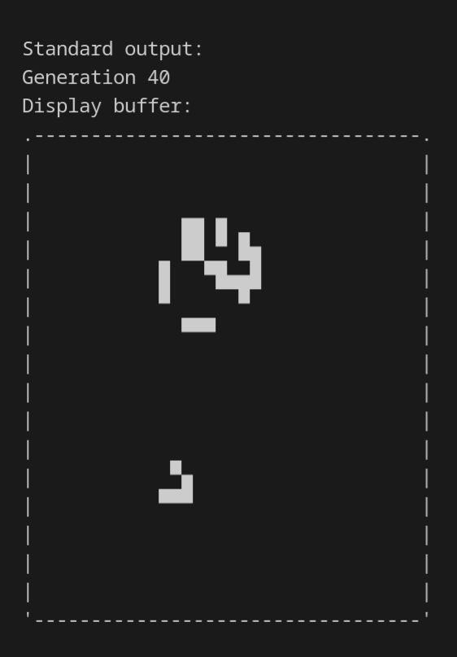

## The Goal

Usually, when I want to learn a new programming language, I prefer naturally using that language in a project that needs it over coming up with a project that could be a good fit for that language. I have been wanting to learn [Rust](https://www.rust-lang.org/) for a little while now, but didn't have any projects I could use it in.

About a month ago, I helped [a friend](https://github.com/exclusive-and/) work on an assembler in Python for an [educational CPU](https://github.com/exclusive-and/epu) he wrote.

> An assembler program creates object code by translating combinations of mnemonics and syntax for operations and addressing modes into their numerical equivalents. This representation typically includes an operation code ("opcode") as well as other control bits and data. The assembler also calculates constant expressions and resolves symbolic names for memory locations and other entities.
>
> &mdash; [Wikipedia](https://en.wikipedia.org/wiki/Assembly_language#Assembler)

Oddly enough, I ended up enjoying understanding how his CPU worked, and I figured I could try to build my own.

As soon as I got the idea of creating a custom CPU architecture, I thought I'd use [Rust](https://www.rust-lang.org/) instead of the usual low-level suspects, [C](<https://en.wikipedia.org/wiki/C_(programming_language)>) or [C++](https://en.wikipedia.org/wiki/C%2B%2B).

## A Rough Overview

The project is divided into two main parts: the **assembler** and the **emulator**. The assembler is responsible for translating assembly code into machine code and resolving labels and macros, and the emulator is responsible for emulating the CPU and printing the output of the program. Below are screenshots of the assembly code, the generated binary code, and the output of a program for [Conway's Game of Life](../Game-of-Life/).

#demo

|                                                                    |                                                         |
| ------------------------------------------------------------------ | ------------------------------------------------------- |
|  |  |



Even though it runs at approximately 1 frame per second, it still proves that the CPU is [Turing Complete](https://en.wikipedia.org/wiki/Turing_completeness). Moreover, this test program implements a few fairly complex subroutines:

- A function to print a string of dynamic length from program memory to standard output
- A binary-to-decimal converter that supports 32-bit integers and can run binary long division
- A pair of functions to address the display buffer one pixel at a time through bit shifting

## The Stack

This CPU is [stack](https://en.wikipedia.org/wiki/Stack_(abstract_data_type) based. To better understand what this means, below a set of assembly instructions that run the following calculation: `9 - (2 + 3)`.

```python
x09 # push 9 onto the stack
x02 x03 add # push 2 + 3 onto the stack
sub # subtract (2 + 3) from 9
```

As can be seen above, the `add` instruction pops two values from the top of the stack, adds them, and pushes the result back onto the stack. Apart from the _load 8-bit immediate_ and _load 16-bit immediate_ instructions, all operations operate on operands directly on the stack. For this reason, no registers or flags are required.

Even though raw access to memmory are allowed through specific instructions (`ldo`, `sto`, `lda`, `sta`, `ldb`, `stb`, `ldp`), those memory regions are not intended to store temporary data. However, those instructions are still available for accessing I/O, program ROM, the display buffer, the heap, and so on.

Granted, this type of architecture is not very practical for a real-world CPU, but it is an interesting challenge nontheless.

## Bitwise and Logical Operators

As `true` is represented as `1` in most programming languages, [bitwise operators](https://en.wikipedia.org/wiki/Bitwise_operation) are fundementally different from [logical operators](https://press.rebus.community/programmingfundamentals/chapter/logical-operators/). In this CPU, however, [bitwise operators](https://en.wikipedia.org/wiki/Bitwise_operation) and [logical operators](https://press.rebus.community/programmingfundamentals/chapter/logical-operators/) are one and the same. This is possible as the boolean `true` is represented as the two's complement of the integer `1` (aka unsigned `-1`, `0xFF`, or `0b11111111`).

Unfortunately, this system can be a pain to deal with, which is why two of the CPU instructions can be used to convert back and forth between conventional booleans and booleans that the CPU will understand. The `nez` instruction (_not equal to zero_ or _is non-zero_) can be used to convert a value to a boolean. Conversely, the `neg` instruction (_negate_) can be used to convert a boolean to a `0` or a `1`.

## Branching

The branching system on my CPU is very different from typical ones. Only a single branch instruction exists: `skp x??`. This instruction is used to skip the next `x??` bytes in program memory if the value on the top of the stack is `true` (`0xFF`), and continue normal execution if it is `false` (`0x00`). This is a very simple instruction, but it is very powerful. For example, a conditional branch can be created as follows:

```python
xFF # push a boolean onto the stack (true in this case)
skp x04 # skip 4 bytes if the value on the top of the stack is true
$LABEL sti # if false, store the address of a label to the instruction pointer (equivalent to `jmp $LABEL`)
# else, if true, continue execution here
```

## What I Learned

Contrary to what most people would think, the most challenging part of this project was creating the architecture of the CPU and writing assembly programs for it. As I was discovering its limitations, I kept tweaking the architecture to make it more efficient.

I also learned a lot while implementing [Conway's Game of Life](../Game-of-Life/) in assembly language, such as the way computers convert between binary and decimal through [an algorithm](https://youtu.be/v3-a-zqKfgA) involving long division. Most importantly though, I finally learned the basics of the [Rust language](https://www.rust-lang.org/), which I am very excited about.
