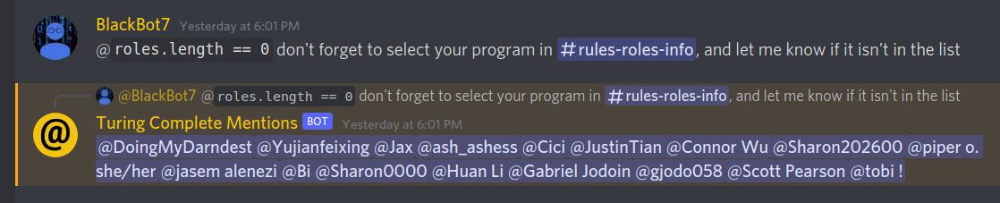
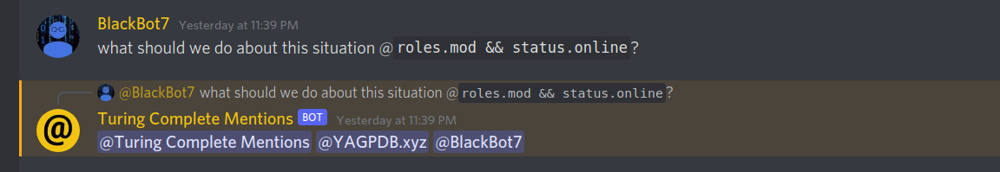

## The Idea

A few weeks ago, I had the idea to create a way to mention people in a more precise way on Discord. Then, yesterday morning, I figured I would try to build [a bot](https://github.com/Bricktech2000/Turing-Complete-Mentions) that would do just that.

[Turing Complete Mentions](https://github.com/Bricktech2000/Turing-Complete-Mentions) is a bot that uses JavaScript to create complex criteria for mentions. This way, only the people you want mentioned are actually mentioned.

#demo
Here are some screenshots of some real-world use cases of this bot:

## How it Works

The way this bot works is pretty simple. After a message is received and a mention is detected using a [RegExp](https://developer.mozilla.org/en-US/docs/Web/JavaScript/Reference/Global_Objects/RegExp), the bot will use a JavaScript `Function` to create a private scope to run the criteria over every server member. This way, the JavaScript code is executed in a sandboxed environment and ensures optimal performance on the _V8 engine_, which NodeJS is based on.

A key set of arguments from the [Discord API](https://discord.com/developers/docs/intro) are passed to the function automatically (namely `server`, `member`, `user`, `status`, `activities` and `roles`), which you can read more about on [the project's GitHub](https://github.com/Bricktech2000/Turing-Complete-Mentions#argument-structure). These arguments constitute the interface available to the JavaScript criteria code, which you can then use when mentioning members on a Discord server.

Initially, the bot would add a special role to the right members of a server and only mention this one role. However, because of the [rate limit](https://discord.com/developers/docs/topics/rate-limits) Discord imposes on all requests, the bot was limited to adding less than `2` roles per second. This is an obvious issue, as it would take a good few minutes to mention all members of a reasonably large server. To work around this limitation, the bot now mentions all members individually through a `2000-character` buffered reply. This way, it can mention any number of members with practically no delay, which is essential given the fact that this bot is most useful in large servers.
#try

## Adding This Bot to Your Server

If all of that sounds interesting, you can [click here](https://discord.com/api/oauth2/authorize?client_id=930143352370921532&permissions=8&scope=bot) to invite Discord Assistant to one of your servers. However, if you wish to host the bot yourself to have complete control over its functionality, you should take a look at the `README.md` in [the project's GitHub](https://github.com/Bricktech2000/Turing-Complete-Mentions).

## What I Learned

Before starting this project, I had already built a [Discord bot](../Discord-Assistant/) using JavaScript and NodeJS, which you can learn more about [here](../Discord-Assistant/). With that said, I still learned a lot about the [Discord API](https://discord.com/developers/docs/intro) and about how to deal with [Discord's rate limit](https://discord.com/developers/docs/topics/rate-limits) imposed on adding and removing server roles. I am currently using [_Turing Complete Mentions_](https://github.com/Bricktech2000/Turing-Complete-Mentions) in the servers I set up for some of the classes I have at [uOttawa](https://uottawa.ca/), and it proves to be a great tool for those who want to mention people in a more precise way.
