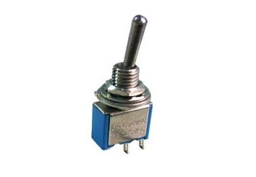
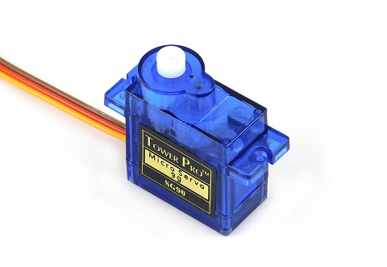
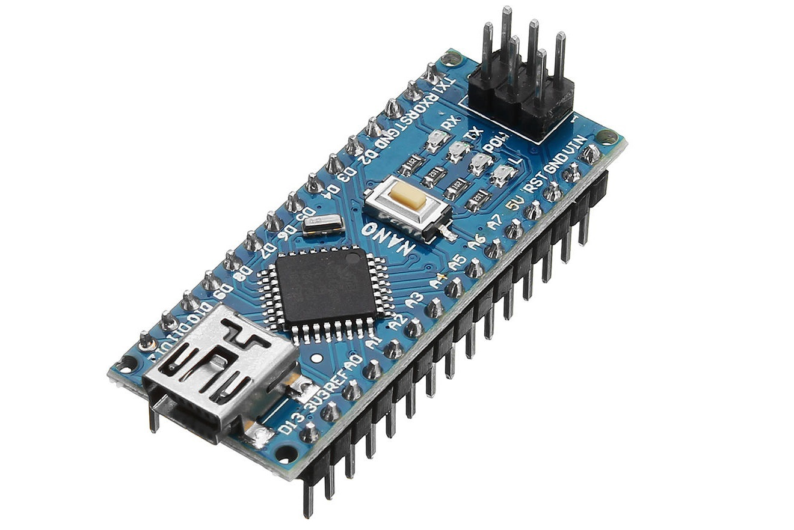
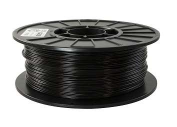
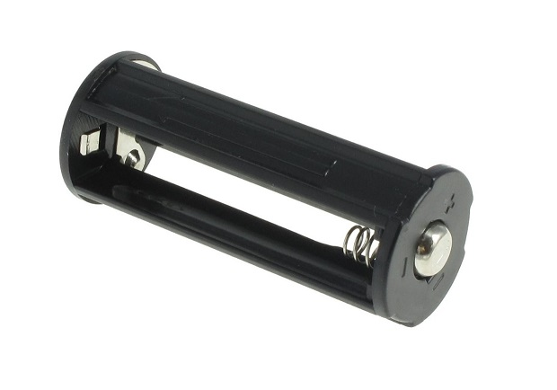

## The idea

Many years ago, I wanted to make a machine called a [Useles Box](https://en.wikipedia.org/wiki/Useless_machine).

> A _useless machine_ consists of a switch and an arm hidden behind a lid. Whenever someone flips the switch, the mechanical arm comes out of the box and flips it back off.

To better understand, here is a video showcasing such a machine:


I wanted to use a wooden box and metal hinges to make it work, but I quickly realised that it would be way too complicated to make, so I abandoned the project. However, recently, a friend of mine showed me a video of such a machine, and I told him about my faild attempt at creating one. He then told me something along the lines of:

> Hey, why wouldn't you use 3D printing to make it work?

I hadn't realised how easy it would be to make such a box using a 3D printer, since I didn't know 3D printing was a thing when I initially wanted to build a [useles box](https://en.wikipedia.org/wiki/Useless_machine). That night, I quickly got to work

## Demo

Here is a demo video of the [useless machine](https://en.wikipedia.org/wiki/Useless_machine) I made:

#demo


Through clever code, it has **60 different ways** to turn the switch back off once someone flips it on!

## How it works

In order to work, this machine uses 2 [servo motors](https://en.wikipedia.org/wiki/Servomotor). They allow an [arduino](https://en.wikipedia.org/wiki/Arduino) board to precicely control the position of both the arm and of the lid, which allows the machine to have a complex behaviour. You can [click here](./Useless_Box_1.zip) to download the code for yourself! It also uses some paper clips as metal rods, which is a simple but effective way to actuate the joints. Finally, all of those pieces get installed into a _3D-printed_ box, which keeps everything tidy ([click here](./Useless%20Box%20STLs.zip) to download the STLs!). Here are some pictures of the parts used to make it work:

[//]: # '...'
[//]: # 'servos'
[//]: # 'arduino'
[//]: # 'jumpers'
[//]: # 'box, cover, lid'
[//]: # 'battery'

|  |  |  |  |  |  |
| ----------------- | ---------------- | ------------------ | ---------------- | ------------------------- | ------------------------- |
|                   |                  |                    |                  |                           |                           |

The software side of this box is pretty simple, but very clever (in my opinion at least). When the program detects that the switch was flipped, it runs the following code:

```C++
beforeFlip()
actualFlip()
aterFlip()
```

Each one of these three functions chooses a random action from a list of them. To start off, `beforeFlip` runs an action without flipping the switch, for example when the lid opens and closes immediately, as if the box was having a peek on the switch. Then, `actualFlip` runs an action to flip the switch with different speeds, to simulate different "emotions". Finally, `afterFlip` retracts the arm and closes the lid in an original way, sometimes very slowly, or sometimes very quickly, as if the box was scared. After all of this, the box simply waits until another flip is detected!

## Final words

This project is an awesome example on how useful 3D printing can be. It has allowed me to design and produce parts way quicker and way cheaper than I could before. Furthermore, I am really proud of the way [the program](./Useless_Box_1.zip) works, since programming 12 _actions_ allows the [useless box](https://en.wikipedia.org/wiki/Useless_machine) to flip the switch in more than **60 different ways**. The box is really heavy for some reason, weighing more than `152 g`, which makes it feel very premium in your hands. All in all, I am stoked with the result!
