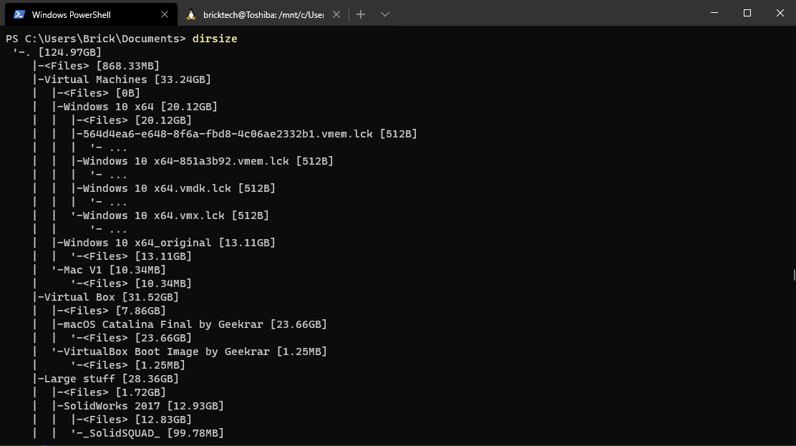

## The Idea

Yesterday, I opened up the properties of my `Documents` folder to see how large it was. When I saw it had exceeded the `100 GB` mark, I wasn't even impressed. However, figured I should still try to remove some of the larger folders in order to save a few gigabytes... And this is when I remembered that windows can't sort folders by size. This is why I created the `dirsize` command: it sorts folders by size and shows you how large each one is. Here is an example of the output of the command:



As you can see, it is very easy to see which folders take up alot of space. My `Documents` folder (represented by a `.`) is `124.97 GB` is size, and it contains other folders such as `Virtual Machies` and `Virtual Box`, which take up `33.24 GB` and `31.52 GB` respectively. With this command, it is way easier to remove unnecessarily large files or folders to save disk space. If you want to download the source code, simply [click here](./dirsize.py)!

## How it Works

In order to work, this program uses a feature called [recursion](<https://en.wikipedia.org/wiki/Recursion_(computer_science)>).

> In computer science, recursion is a method of solving a problem where the solution depends on solutions to smaller instances of the same problem `...`. Recursion solves such recursive problems by using functions that call themselves from within their own code. The approach can be applied to many types of problems, and recursion is one of the central ideas of computer science.
>
> [Wikipedia](<https://en.wikipedia.org/wiki/Recursion_(computer_science)>)

As stated by the definition, [recursion](<https://en.wikipedia.org/wiki/Recursion_(computer_science)>) solves problems that consist of smaller versions of themselves, which also need to be solved. This is necessary for this program because when calculating the size of a folder, `dirsize` needs to calculate the size of all the subfolders and subsubfolders, and subsubsubfolders, and so on in order to get the size of the original folder.

#code
Here is a extremely simplified version of the code:

```python
def walk(folder):
  for every file in folder:
    calculate the file size
  for every subfolder in folder:
    calculate the subfolder size with walk(subfolder)
  return the total size
```

The most important line is the 5th one, where `walk` calls `walk(subfolder)`. This is the part when the [recursion](<https://en.wikipedia.org/wiki/Recursion_(computer_science)>) is performed, since the function `walk` calls itself with a smaller version of the problem, in this case a `subfolder` in the parent `folder`. If you would like to see how the recursion actually works, you can [download the source code here](./dirsize.py)!

## Final Words

This project is very simple, and only took about `2 hours` to program. However, I figured I would still share it with the world because it saved me alot of time when freeing up space on my computer. Can you imagine if I had to go through more than **200 folders** to see which ones took up the most disk space? Thank god I learned programming...
