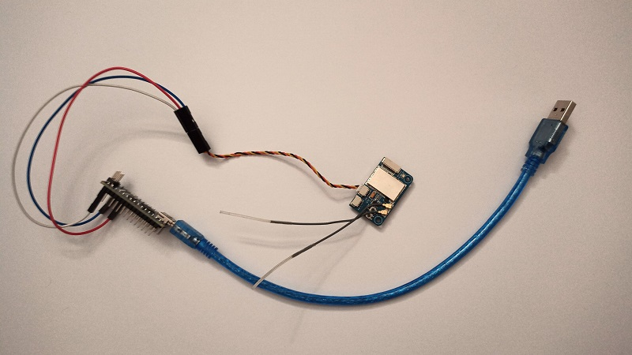

## Preface

Recently, I wanted to try FPV drone simulators, but my radio wouldn't connect to my computer. Then, I stumbled upon [a video](https://www.youtube.com/watch?v=TRnu2_TI9Vk) that showed how to take an `iBUS` receiver and an _arduino_ to make a simulator adapter. As I already had all the necessary components, I went right to building it.

Below is a video from my [YouTube Channel](https://www.youtube.com/channel/UCGj6pfxZ0XYJU29XNwXPPxg/featured) of me building and setting up the adapter:

#demo

And here's how the finished adapter looks:

#img

## How to build it

Here's a full tutorial on how to build this adapter!

First, the parts list. You will need the following:

- A FlySky Transmitter that supports `iBUS`
- Any _arduino_ board (using the _Arduino Nano_)
- Any `iBUS` receiver (using the _FS i6B_) with a servo adapter
- 3 _Male to Female_ Jumper cables (using one red, one blue and one white)
- A _USB to mini USB_ cable, to connect the _Arduino Nano_ to a PC

Making the connections is really easy. You need to connect the following things together:

> Receiver **red** wire > **red** Jumper cable > `5V` pin on the Arduino  
> Receiver **black** wire > **blue** Jumper cable > `GND` pin on the Arduino  
> Receiver **yellow** wire > **white** Jumper cable > `TX1` pin on the Arduino  
> Arduino `USB` port > _USB to mini USB_ cable > `USB` port on a PC

Then, upload the `Examples > Clear EEPROM` code onto the arduino using the [Arduino IDE](https://www.arduino.cc/en/Main/Donate).
After that, if not done already, bind the `iBUS` receiver to your _FlySky_ transmitter in order to secure the connection.
Finally, download the latest [vJoySerialFeeder Software](https://github.com/Cleric-K/vJoySerialFeeder/releases) for your operating system.
Once you have set up _vJoySerialFeeder_ with the `iBUS` protocol, your adapter will work flawlessly!

## Conclusion

This adapter is an awesome _hack_ because it allows anyone to use their FlySky `iBUS` transmitter to try out drone simulators without having to buy an annoying USB cable to connect it to a PC. It was a simple but effective project that is simply really useful!
