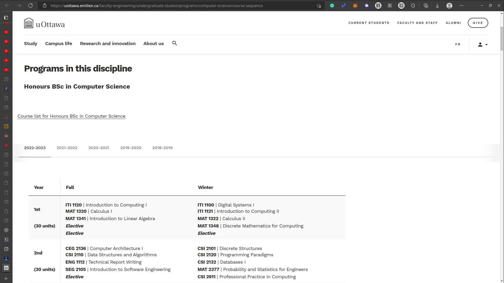
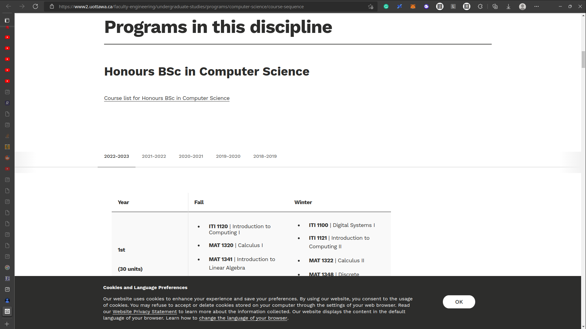

## The Idea

Recently, the University of Ottawa has offered their website a well-deserved style overhaul. Unfortunately, it turns out the [new uOttawa website](https://www2.uottawa.ca/en) is almost always **somehow worse** than their old one from a functional standpoint. It even got to the point of students sending links to the old website on [The Wayback Machine](https://web.archive.org/), from when it was still usable:


After discussing that situation with a friend, I decided I would find a way to fix it.

## The Result

After some thinking around, I ended up building [a proxy](https://uottawa.emilien.ca/) to the new website on my server, patching requests by injecting some custom JavaScript and CSS. You can check it out [here](hhttps://uottawa.emilien.ca/re). As an example, below is what a course sequence page looks like on [the patched website](https://uottawa.emilien.ca/faculty-engineering/undergraduate-studies/programs/computer-science/course-sequence) compared to [their new one](https://www2.uottawa.ca/faculty-engineering/undergraduate-studies/programs/computer-science/course-sequence). Among other changes, the headers are now reasonably sized, unnecessary padding has been removed and the course sequence table is now usable on mobile devices.
#img

|                                                                  |                                                                  |
| ---------------------------------------------------------------- | ---------------------------------------------------------------- |
|  |  |

## How it Works

This project consists of a _proxy_ built with [Node.js](https://nodejs.org/) and [Express](https://expressjs.com/) that automatically forwards all requests to it to the [uOttawa website](https://www2.uottawa.ca/en), applying patches to a few key responses.

> In computer networking, a proxy server is a server application that acts as an intermediary between a client requesting a resource and the server providing that resource.
>
> ```
>          |   ----->   |       |   ----->   |
> Internet |            | Proxy |            | Server
>          |   <-----   |       |   <-----   |
> ```
>
> [Wikipedia](https://en.wikipedia.org/wiki/Proxy_server)

Patches are entirely modular, each fully contained in their own file. When the proxy detects that the response `content-type` header is set to `text/html`, it will pipe the plaintext response to each patch, which must in turn return the full response along with the patched content. Here is an example of a patch that injects custom CSS into the response:

```js
export default (body) =>
  body + ` <style>.alert__wrapper { display: none; }</style> `;
```

The proxy also patches HTTP headers, as `HTTP 3XX Redirect` responses must be modified to redirect to the proxy's URL instead of redirecting to the proxied website.

## Final Words

This is another simple but effective project that I hope will be useful to others. It's a great example of using programming to solve a real-world problem, and I hope it can inspire others to do the same.
